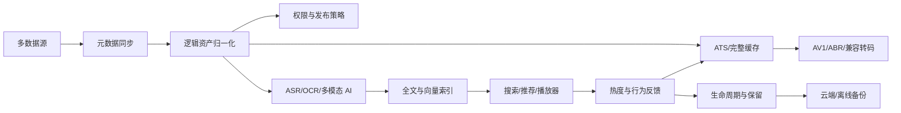

# 00. 执行摘要 / Executive Summary

## 1. 结论

归泽 V1 是一个以**统一媒体资产控制面**为核心、以**分布式 Worker**为执行面的生产级平台。它统一管理海量远程媒体来源、本地缓存、正式副本、转码结果、AI 衍生资产、搜索索引和播放状态。

平台不试图把 700TB 级远程数据全部复制到本地，而是采用：

```text
元数据优先
+ 按需 Range 回源
+ ATS 分片缓存
+ 完整文件缓存
+ 热度驱动提升
+ 长期保留副本
+ 云端与离线备份
```

归泽的关键价值不在于“能播放一个视频”，而在于把多来源文件转化为可追踪、可搜索、可加工、可恢复、可审计的逻辑资产。

## 2. 业务闭环



## 3. V1 核心对象

| 对象 | 含义 |
|---|---|
| `Asset` | 用户认知中的同一个逻辑内容 |
| `SourceObject` | 某数据源中的文件或对象 |
| `AssetVersion` | 内容发生变化后的版本 |
| `Rendition` | 原始、AV1、ABR、字幕、缩略图等表现 |
| `Replica` | 某版本或表现的实际物理副本 |
| `DerivedArtifact` | AI、OCR、ASR、Embedding 等衍生资产 |
| `Task` | 平台统一任务视图 |
| `WorkflowExecution` | Temporal 长任务执行实例 |
| `PolicyVersion` | 生命周期、公开、转码和 AI 规则版本 |
| `CredentialReference` | 指向 OpenBao/Vault 的凭据引用 |

## 4. 架构结论

### 控制面

采用 Java 17、Spring Boot 3 模块化单体。理由：

- 当前用户规模较小，核心复杂度来自后台任务和数据治理，而非 API 水平吞吐；
- 单人审查需要降低分布式事务和多仓库协调成本；
- 模块边界与 Schema 所有权预先建立，后续可按压力拆分；
- 核心权限、资产、策略、审计和配置需要统一事务边界。

### 执行面

采用独立 Python/FastAPI 能力服务和 Temporal Worker：

- 媒体处理；
- ASR；
- OCR；
- 多模态模型；
- Embedding/Reranker；
- 图像生成；
- 安全扫描；
- 数据源连接器。

### 边缘媒体

浪潮服务器上的 Arc A380 Media Worker 承担：

- AV1 离线编码；
- 源格式不兼容时的临时 H.264；
- 关键帧和缩略图；
- 媒体探测；
- 部分 VMAF/质量任务。

A380 与 ESXi 6.7 的直通兼容性属于阻断性 POC。

## 5. 关键非功能目标

| 项目 | 目标 |
|---|---|
| 核心恢复 | 单服务/单 VM 故障目标 1 小时内恢复 |
| 当前 HA | 单物理主机不承诺物理高可用 |
| 数据 RPO | 关键数据库尽量接近实时；按类型分级 |
| 缓存 RPO | ATS 和普通缓存可重建 |
| 安全水位 | TrueNAS 保留至少 500GB 绝对安全空间 |
| API | 版本化、幂等、契约测试、Trace ID |
| 任务 | 可暂停、恢复、取消、重试和追踪 |
| 权限 | 搜索召回前过滤，衍生资产继承 |
| 供应链 | SBOM、许可证、Digest、签名、验签 |
| 开发治理 | Agent 实现，自动化门禁，单人审查 |

## 6. V1 范围

V1 纳入：

- 8 类数据源；
- 全部配置中心页面；
- 完整播放器能力；
- 全部确认的 AI 流水线；
- OpenSearch、Milvus 和混合检索；
- LiteFlow、Temporal；
- GitOps、监控、告警、备份、恢复；
- 插件和部署 Profile；
- 中英文 API 与开发者文档。

V1 不设置对外 Beta。研发阶段可使用 POC、Alpha、RC 标签，但正式 V1 前所有能力必须通过生产门禁。

## 7. 最大风险

1. 目标范围远超单人传统开发容量；
2. ESXi 6.7 和 A380 的硬件兼容性未验证；
3. 百度云接入受官方能力、授权和配额限制；
4. 700TB 规模的文件数量可能导致元数据和扫描压力远超容量估计；
5. 所有 AI 能力生产级意味着需要长期样本集、评测和回归体系；
6. 单机 Temporal、PostgreSQL、TrueNAS 仍存在宿主机级单点；
7. 公网管理员密码登录增加安全风险；
8. 云盘不是天然可靠的备份故障域，需要验证和周期回读；
9. 全部能力一次性交付会使单人审查成为瓶颈。

## 8. 实施原则

必须按串行可验收里程碑推进：

```text
M0 POC
→ M1 资产与可播放闭环
→ M2 缓存和生命周期
→ M3 媒体与 AI
→ M4 检索与推荐
→ M5 配置中心与生产治理
→ V1 RC
→ V1 Production
```

任何后续里程碑不得以破坏前序生产闭环为代价。
