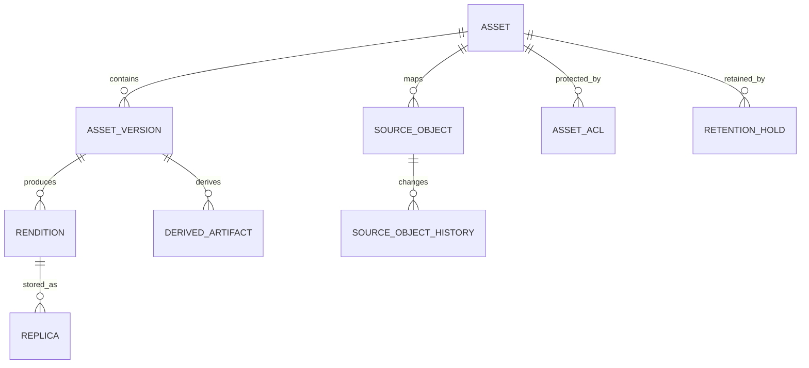
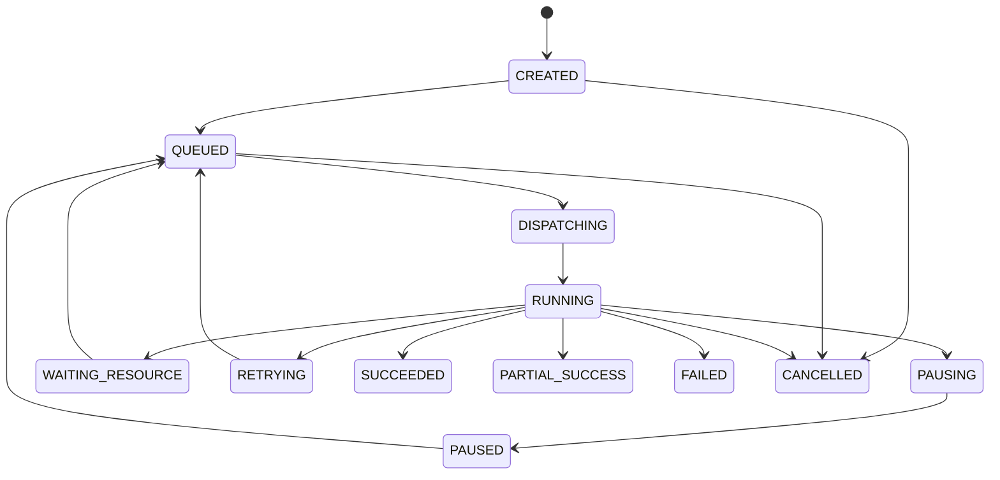
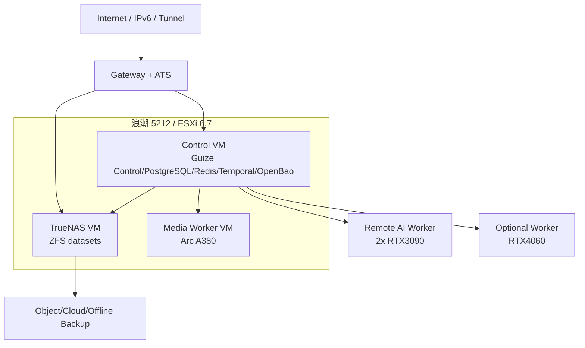

# 归泽・Guize V1——研发设计总基线

> 文档编号：GUIZE-ENGINEERING-DESIGN-V1
> 文档状态：研发设计基线（规划态，非实现完成证明）
> 整理日期：2026-08-29
> 任务编号：GZ-002
> 来源基线：Guize V1 冻结方案、ADR-0001～0013、`docs/00～23`、`docs/appendices`、机器契约与部署 Profile
> 代码状态：当前仓库以方案与治理为主；本文出现的 Class(类)、Interface(接口)、数据库表、Worker(工作器)除非特别注明，均为**研发规划基线**，不得理解为仓库中已经存在的实现。

## 1. 文档用途与阅读方式

本文是 Guize V1 面向产品、架构、研发、测试、运维和 Agent(智能研发代理)的统一研发入口。它采用 ePROHub 规则引擎研发文档的组织方式，把原本分散在需求、架构、LLD、接口、数据库、事件、中间件、状态机、部署和 WBS 中的信息串成一条可追踪链。

研发开工时优先阅读本文；原 `docs/00～23` 与 `docs/appendices/**` 继续保留，作为专题设计来源与历史背景。机器可执行契约仍以 `contracts/**`、正式 Flyway Migration、`deployment/**` Schema 和后续冻结的 OpenAPI/Event Schema 为准，本文不替代机器契约。

### 1.1 阅读顺序

```text
1 文档用途与编号
→ 2 产品范围与约束
→ 3 端到端总流程
→ 4 架构与模块边界
→ 5 领域模型与数据库
→ 6 API / Event / Plugin / Worker 契约
→ 7 LiteFlow / Temporal / Task
→ 8 状态机 / 幂等 / 一致性
→ 9 中间件与部署
→ 10 模块级 Class / Interface / Worker 设计
→ 11 安全、可观测与灾备
→ 12 测试、POC 与验收
→ 13 WBS 与研发顺序
→ 14 追踪矩阵
```

### 1.2 实现状态标记

- **冻结基线**：已经由现有方案、ADR 或机器契约明确。
- **规划基线**：用于指导后续研发，但仓库尚无对应实现。
- **POC 待验证**：硬件、性能、兼容性或第三方能力仍需实测。
- **实现完成**：只有真实代码、测试、Evidence 和 PR 门禁均存在时才能使用该标记。

## 2. 统一编号与追踪规则

| 标识 | 示例 | 用途 |
|---|---|---|
| `需求ID` | `需求V1-0001` | 产品或非功能需求 |
| `模块ID` | `模块V1-CTL-0001` | 物理或逻辑模块 |
| `领域模型ID` | `领域V1-AST-0001` | 核心领域对象 |
| `接口ID` | `接口V1-0101` | HTTP/SSE/WebSocket/内部服务接口 |
| `事件ID` | `事件V1-0001` | Domain Event(领域事件) |
| `工作流ID` | `工作流V1-0001` | Temporal Workflow(长任务工作流) |
| `数据库ID` | `数据库V1-0001` | 概念表/Schema；正式 DDL 冻结后映射 |
| `代码项ID` | `代码项V1-AST-0001` | 规划 Class/Interface/Worker/前端模块 |
| `工作包ID` | `WP-M1-01` | 可独立验收的研发工作包 |
| `验收ID` | `验收V1-0001` | 可验证验收项 |
| `POC ID` | `POC-01` | 阻断性实机验证 |

### 2.1 权威来源优先级

```text
已批准 Task Spec / ADR
→ 机器契约 contracts/** / Migration / Deployment Schema
→ 本研发设计总基线
→ 专题设计 docs/00～23
→ README / MANIFEST
→ 历史讨论和旧草稿
```

出现冲突时禁止研发自行选择。需要建立新的 Task/ADR 明确变更，并同步文档、契约、测试与 Evidence。

## 3. 产品定位、范围与硬约束

### 3.1 产品定位

归泽是面向海量多媒体资产的统一控制面与执行平台。核心目标不是“保存一个文件”或“播放一个视频”，而是把多来源、异构、远程媒体统一映射为可治理、可搜索、可加工、可恢复、可审计的逻辑资产。

### 3.2 V1 核心需求

| 需求ID | 名称 | 说明 | 主要模块 |
|---|---|---|---|
| `需求V1-0001` | 统一接入 | WebDAV、本地、百度云、Google Drive、HTTP/S、S3、SMB/NFS、OneDrive | Source |
| `需求V1-0002` | 统一资产 | 多来源、移动/改名、版本、Rendition、Replica 统一治理 | Asset |
| `需求V1-0003` | 按需访问 | Range、ATS、完整缓存、兼容转码、低等待播放 | Playback/Storage/Media |
| `需求V1-0004` | 智能理解 | ASR、OCR、多模态、翻译、摘要、标签、Embedding | AI |
| `需求V1-0005` | 统一检索 | PostgreSQL FTS + OpenSearch + Milvus + Reranker | Search |
| `需求V1-0006` | 生命周期 | 热温冷超冷、500GB 安全水位、正式副本、多云/离线备份 | Storage |
| `需求V1-0007` | 规则与长任务 | LiteFlow 同步决策、Temporal 长任务 | Policy/Task |
| `需求V1-0008` | 安全与权限 | IAM、ACL、Passkey、匿名访问、Secrets、审计 | IAM/Security |
| `需求V1-0009` | 配置与发布 | Schema、草稿、模拟、审批、灰度、发布、回滚 | Config |
| `需求V1-0010` | 生产治理 | 可观测、GitOps、供应链、备份恢复、Evidence | Ops/Governance |

### 3.3 当前规模与环境约束

- 远程数据总量约 700TB，真实文件数、目录数和变更频率仍需 POC 探测。
- 活跃用户预计少于 10 人，匿名访问可能产生额外播放流量。
- 主宿主机：浪潮 5212；虚拟化：ESXi 6.7。
- TrueNAS VM 提供正式副本、完整缓存、Workspace 和备份暂存数据集。
- Intel Arc A380 作为边缘媒体 GPU，PCI Passthrough(直通)属于阻断性 POC。
- AI 算力以远程双 RTX 3090 为主，并允许 RTX 4060/CPU Worker。
- 本地存储必须保留至少 500GB 绝对安全空间。
- 当前工程模式为 Agent 主开发 + 人工审查/批准/部署。

### 3.4 明确非目标

V1 不：

- 全量搬迁 700TB 远程正文；
- 把 OpenSearch/Milvus 当作权威业务数据库；
- 让插件或 Worker 直接修改核心数据库；
- 用 Temporal 代替同步业务规则；
- 用 LiteFlow 执行 FFmpeg、ASR、备份等长时间任务；
- 允许 AI 绕过硬预算、安全水位、权限或审批；
- 把 POC 结论或未验证性能写成生产承诺；
- 通过中文 URL/中文字段建立第二套机器契约；
- 把缓存等同于正式副本或灾备副本。

## 4. 端到端全链路

```mermaid
flowchart LR
  S[01 数据源\nWebDAV/Cloud/Local/S3] --> SY[02 同步与探测\n元数据优先]
  SY --> A[03 Asset\n逻辑资产归一]
  A --> V[04 AssetVersion\n内容版本]
  V --> P[05 Policy\nLiteFlow 同步决策]
  P -->|直接访问| PB[06 Playback Plan\n鉴权/签名]
  PB --> ATS[07 ATS\nRange/Slice 缓存]
  ATS --> O[08 Origin/Replica\n来源或本地副本]
  P -->|需要完整正文| C[09 Complete Cache\n完整缓存]
  C --> T[10 Temporal\n长任务]
  T --> M[11 Media\nProbe/AV1/ABR]
  T --> AI[12 AI\nASR/OCR/多模态]
  M --> R[13 Rendition/Artifact\n正式衍生物]
  AI --> R
  R --> IX[14 Index\nOpenSearch/Milvus]
  IX --> Q[15 Search/Recommend\n混合检索]
  Q --> PB
  PB --> H[16 Heat/Progress\n行为反馈]
  H --> L[17 Lifecycle\n热温冷超冷]
  L --> RP[18 Replica/Backup\n正式副本/灾备]
  RP --> O
  A --> AU[19 ACL/Audit\n权限与审计]
  P --> TK[20 Task\n统一任务视图]
  TK --> T
```



### 4.1 数据源同步主流程

```text
创建 DataSource
→ CredentialReference 校验
→ Connector Probe
→ 能力/配额/Range/稳定ID报告
→ 创建 SyncPolicy
→ Temporal/调度器拉取目录或 Change Cursor
→ Normalize SourceObservation
→ AssetCatalog 识别新建/移动/改名/内容变化
→ 写 PostgreSQL + Outbox
→ 后续索引/缓存/AI/生命周期异步消费
```

### 4.2 播放主流程

```text
用户请求资产
→ IAM + ACL + 发布状态校验
→ MediaControl 选择可播放 Rendition
→ 生成短期 SignedAccessGrant
→ Player 请求 ATS/Gateway
→ ATS 命中则返回
→ 未命中通过 Origin Resolver Range 回源
→ 客户端不兼容时创建临时 H.264 Workflow
→ 播放进度与热度反馈进入控制面
```

### 4.3 AI 加工主流程

```text
AssetVersion 事件
→ LiteFlow 判断是否需要加工/选择策略
→ Task 创建幂等键
→ Temporal EnrichAssetWorkflow
→ Ensure Complete Cache
→ ASR/OCR/关键帧/多模态/翻译/摘要/标签
→ Quality Gate
→ DerivedArtifact 版本化发布
→ OpenSearch/Milvus 索引
```

### 4.4 一句话职责

> PostgreSQL 保存“事实”，LiteFlow 决定“该做什么”，Temporal 保证“长任务可恢复”，Worker 执行“重活”，ATS 解决“在线播放回源”，OpenSearch/Milvus 解决“找得到”，OpenBao 解决“Secret 不落业务库”，Audit/Evidence 解决“做过什么可证明”。

## 5. 系统架构与模块边界

### 5.1 技术基线

| 领域 | V1 基线 |
|---|---|
| 控制面 | Java 17 + Spring Boot 3 + 模块化单体 |
| 执行面 | Python/FastAPI 能力服务 + Temporal Worker |
| CLI | Go `guizectl` |
| 权威数据库 | PostgreSQL + Flyway |
| 短期状态 | Redis |
| 规则 | LiteFlow + 决策表 + JSON/YAML DSL |
| 长任务 | Self-hosted Temporal + PostgreSQL |
| HTTP 缓存 | Apache Traffic Server |
| 搜索 | PostgreSQL FTS + OpenSearch + Milvus + Reranker |
| Secrets | OpenBao/Vault 抽象 |
| 可观测 | Prometheus + Grafana + Loki + OpenTelemetry + Alertmanager |
| 供应链 | SWR + Digest + SBOM + Cosign |

### 5.2 物理模块索引

| 模块ID | 模块 | 主要职责 | 禁止事项 |
|---|---|---|---|
| `模块V1-CTL-0001` | `guize-control` | Java 控制面、权威业务决策、REST API | 不执行长媒体/AI任务 |
| `模块V1-WEB-0001` | `guize-console` | 管理与用户 Web UI | 不直接访问数据库 |
| `模块V1-PLY-0001` | `guize-player` | HLS/DASH/Range 播放 SDK | 不接触源站 Secret |
| `模块V1-MED-0001` | `guize-media-service` | ffprobe/FFmpeg/AV1/ABR/临时 H.264 | 不修改核心业务表 |
| `模块V1-AI-0001` | `guize-ai-services` | ASR/OCR/VLM/Embedding/Reranker/Image | 不直接扩大资产权限 |
| `模块V1-CON-0001` | `guize-connectors` | Probe/List/Range/Changes | 不决定 Asset 身份 |
| `模块V1-WRK-0001` | `guize-worker-agent` | Worker 注册、能力、资源、租约 | 不伪造任务成功 |
| `模块V1-CLI-0001` | `guizectl` | 探测、Bundle、部署、验证、回滚 | 不绕过生产审批 |
| `模块V1-EDG-0001` | ATS/Gateway | 公网入口、签名、Range/Slice | 不保存权威业务状态 |
| `模块V1-DAT-0001` | Data Plane | PostgreSQL/Redis/OpenBao/OpenSearch/Milvus | 不直接暴露公网 |
| `模块V1-OPS-0001` | Observability | 指标、日志、Trace、告警 | 不记录 Secret 正文 |

### 5.3 Java 控制面逻辑模块

```text
backend/
├── guize-bootstrap
├── guize-common
├── guize-platform-api
├── guize-identity-access
├── guize-source-management
├── guize-asset-catalog
├── guize-storage-lifecycle
├── guize-media-control
├── guize-ai-control
├── guize-search-control
├── guize-task-workflow
├── guize-rule-policy
├── guize-configuration-center
├── guize-notification
├── guize-audit
└── guize-observability
```

模块依赖原则：

1. 跨模块只调用公开 Application Service/Facade；
2. 禁止跨模块访问 Repository；
3. 禁止跨模块依赖 JPA Entity；
4. 跨模块写操作通过命令接口或领域事件；
5. 只读聚合通过显式 Query API；
6. 每个模块拥有自己的表、Migration 和事件；
7. Shared/Common 只承载技术能力，不承载业务规则。

## 6. 领域模型与数据库规划

### 6.1 核心资产模型



| 领域模型ID | 模型 | 定义 | 核心规则 |
|---|---|---|---|
| `领域V1-AST-0001` | `Asset` | 用户认知中的逻辑内容 | 路径/来源不是唯一身份 |
| `领域V1-AST-0002` | `SourceObject` | 某来源中的实际对象 | 优先 `(dataSourceId, providerObjectId)` 唯一 |
| `领域V1-AST-0003` | `AssetVersion` | 内容变化后的版本 | 移动/改名不产生内容版本 |
| `领域V1-AST-0004` | `Rendition` | 原始/AV1/ABR/字幕/缩略图等表现 | 必须关联具体 Version |
| `领域V1-AST-0005` | `Replica` | Rendition 的物理副本 | 只有 VERIFIED 正式副本计入恢复能力 |
| `领域V1-AST-0006` | `DerivedArtifact` | ASR/OCR/摘要/Embedding 等结构化衍生物 | AI 原始输出不可被人工修订覆盖 |
| `领域V1-TSK-0001` | `Task` | 用户看到的统一任务 | Temporal 是执行细节 |
| `领域V1-POL-0001` | `PolicyVersion` | 已发布不可变策略版本 | 历史执行引用原版本 |
| `领域V1-SEC-0001` | `CredentialReference` | Secret 的业务引用 | Secret 正文只在 OpenBao/Vault |

### 6.2 PostgreSQL Schema 所有权

```text
iam
source
asset
storage
media
ai
search
task
policy
config
audit
outbox
```

### 6.3 概念数据库清单

> 以下为规划表。正式编码前必须按工作包生成 Flyway DDL、字段字典、索引、约束、迁移策略与恢复说明。

#### IAM

- `数据库V1-0001 iam_user`：用户主体。
- `数据库V1-0002 iam_role`：平台角色。
- `数据库V1-0003 iam_user_role`：用户角色关系。
- `数据库V1-0004 iam_group`：用户组。
- `数据库V1-0005 iam_group_member`：组成员。
- `数据库V1-0006 iam_asset_acl`：资产 ACL。
- `数据库V1-0007 iam_passkey_credential`：WebAuthn/Passkey 公共凭据元数据。
- `数据库V1-0008 iam_session`：会话。
- `数据库V1-0009 iam_login_event`：登录事件。

#### Source

- `数据库V1-0101 source_data_source`：数据源定义。
- `数据库V1-0102 source_capability`：能力探测结果。
- `数据库V1-0103 source_sync_policy`：同步策略。
- `数据库V1-0104 source_sync_job`：同步任务。
- `数据库V1-0105 source_sync_checkpoint`：游标/检查点。
- `数据库V1-0106 source_object`：来源对象。
- `数据库V1-0107 source_object_history`：路径/名称/删除变化历史。
- `数据库V1-0108 source_credential_reference`：Secret 引用。

#### Asset

- `数据库V1-0201 asset_asset`：逻辑资产。
- `数据库V1-0202 asset_alias`：历史名称/搜索别名。
- `数据库V1-0203 asset_version`：内容版本。
- `数据库V1-0204 asset_content_hash`：SHA-256/BLAKE3/抽样哈希。
- `数据库V1-0205 asset_duplicate_group`：重复候选组。
- `数据库V1-0206 asset_merge_decision`：合并/拆分决策。
- `数据库V1-0207 asset_tag`：标签。
- `数据库V1-0208 asset_tag_assignment`：标签归属。

#### Media / Storage

- `数据库V1-0301 media_rendition`：媒体表现。
- `数据库V1-0302 media_track`：音视频/字幕轨。
- `数据库V1-0303 media_profile`：转码 Profile。
- `数据库V1-0304 media_quality_result`：VMAF/质量结果。
- `数据库V1-0311 storage_backend`：存储后端。
- `数据库V1-0312 storage_replica`：物理副本。
- `数据库V1-0313 storage_cache_entry`：完整缓存条目。
- `数据库V1-0314 storage_retention_policy`：保留策略。
- `数据库V1-0315 storage_retention_hold`：人工/合规 Hold。
- `数据库V1-0316 storage_migration`：生命周期迁移记录。
- `数据库V1-0317 storage_watermark_event`：水位事件。

#### AI / Search

- `数据库V1-0401 ai_provider`：Provider。
- `数据库V1-0402 ai_model`：模型与版本。
- `数据库V1-0403 ai_prompt`：Prompt 版本。
- `数据库V1-0404 ai_pipeline`：AI 流水线版本。
- `数据库V1-0405 ai_derived_artifact`：结构化 AI 衍生物。
- `数据库V1-0406 ai_quality_evaluation`：质量评测。
- `数据库V1-0411 search_index_record`：索引状态。
- `数据库V1-0412 search_embedding_record`：向量元数据。
- `数据库V1-0413 search_rebuild_job`：索引重建任务。

#### Task / Policy / Config

- `数据库V1-0501 task_task`：统一任务。
- `数据库V1-0502 task_execution`：Workflow 执行映射。
- `数据库V1-0503 task_worker`：Worker。
- `数据库V1-0504 task_worker_capability`：Worker 能力。
- `数据库V1-0505 task_lease`：租约。
- `数据库V1-0511 policy_definition`：策略定义。
- `数据库V1-0512 policy_version`：不可变发布版本。
- `数据库V1-0513 policy_test_case`：策略测试样本。
- `数据库V1-0514 policy_deployment`：灰度/发布记录。
- `数据库V1-0521 config_definition`：配置定义。
- `数据库V1-0522 config_version`：配置版本。
- `数据库V1-0523 config_approval`：审批。

#### Audit / Outbox

- `数据库V1-0601 audit_event`：业务审计。
- `数据库V1-0602 audit_security_event`：安全审计。
- `数据库V1-0611 outbox_event`：可靠事件 Outbox。
- `数据库V1-0612 outbox_consumer_offset`：消费者进度/去重辅助。

### 6.4 关键数据库约束

```text
source_object(data_source_id, provider_object_id) UNIQUE
asset_version(asset_id, version_number) UNIQUE
storage_replica(rendition_id, storage_backend_id, object_key) UNIQUE
task_task(idempotency_scope, idempotency_key) UNIQUE
```

- Outbox 与业务写入同一 PostgreSQL 事务。
- Redis 锁只用于性能/短期协调，不作为唯一正确性保障。
- 关键聚合使用乐观锁 `version`。
- 大文件正文、字幕全文、二进制模型产物不进入业务关系表正文列。

## 7. API、事件与扩展契约

### 7.1 API 通用约束

- 统一 `/api/v1`。
- URL、字段、枚举、错误码使用英文机器标识。
- OpenAPI 描述提供中英文说明。
- 写操作支持 `Idempotency-Key`。
- 长任务立即返回 `taskId`。
- 响应携带 `traceId`。
- 客户端不得通过本地化 `message` 判断错误类型。

### 7.2 核心 HTTP 接口索引

| 接口ID | Method/Path | 用途 | 主要模块 |
|---|---|---|---|
| `接口V1-0101` | `POST /api/v1/data-sources` | 创建数据源 | Source |
| `接口V1-0102` | `POST /api/v1/data-sources/{id}:probe` | 探测来源能力 | Source/Connector |
| `接口V1-0103` | `POST /api/v1/data-sources/{id}:sync` | 创建同步任务 | Source/Task |
| `接口V1-0201` | `GET /api/v1/assets/{assetId}` | 查询资产 | Asset/IAM |
| `接口V1-0202` | `GET /api/v1/assets/{assetId}/versions` | 查询版本 | Asset |
| `接口V1-0203` | `POST /api/v1/assets/{assetId}:merge` | 确认合并 | Asset/Audit |
| `接口V1-0301` | `POST /api/v1/assets/{assetId}/playback-plan` | 生成播放计划 | IAM/Media |
| `接口V1-0302` | `POST /api/v1/assets/{assetId}/transcode` | 创建转码任务 | Media/Task |
| `接口V1-0401` | `POST /api/v1/assets/{assetId}/enrich` | 创建 AI 加工任务 | AI/Task |
| `接口V1-0501` | `GET /api/v1/search` | 统一搜索 | Search/IAM |
| `接口V1-0601` | `GET /api/v1/tasks/{taskId}` | 任务详情 | Task |
| `接口V1-0602` | `POST /api/v1/tasks/{taskId}:pause` | 暂停任务 | Task |
| `接口V1-0603` | `POST /api/v1/tasks/{taskId}:resume` | 恢复任务 | Task |
| `接口V1-0604` | `POST /api/v1/tasks/{taskId}:cancel` | 取消任务 | Task |
| `接口V1-0701` | `POST /api/v1/workers/register` | Worker 注册 | Worker |
| `接口V1-0702` | `POST /api/v1/workers/heartbeat` | Worker 心跳 | Worker |
| `接口V1-0801` | `POST /api/v1/policies/{id}:simulate` | 策略模拟 | Policy |
| `接口V1-0802` | `POST /api/v1/policies/{id}:publish` | 策略发布 | Policy/Approval |

### 7.3 HTTP 请求/响应示例

创建转码任务：

```http
POST /api/v1/assets/ast_01/transcode
Idempotency-Key: 8c9d2b2c-...
Content-Type: application/json

{
  "profileId": "av1-standard-v1",
  "priority": "USER_REQUEST"
}
```

响应：

```json
{
  "code": "ACCEPTED",
  "message": "任务已创建。",
  "data": {
    "taskId": "tsk_01",
    "status": "QUEUED",
    "statusUrl": "/api/v1/tasks/tsk_01"
  },
  "traceId": "01J..."
}
```

### 7.4 Domain Event

事件 Envelope：

```json
{
  "eventId": "evt_01",
  "eventType": "asset.version.created",
  "eventVersion": 1,
  "aggregateType": "Asset",
  "aggregateId": "ast_01",
  "occurredAt": "2026-08-29T00:00:00Z",
  "producer": "guize-control",
  "traceId": "01J...",
  "payload": {}
}
```

核心事件：

| 事件ID | eventType | 触发 |
|---|---|---|
| `事件V1-0001` | `source.object.observed` | Connector 发现对象 |
| `事件V1-0002` | `source.object.deleted` | 来源对象不可见 |
| `事件V1-0011` | `asset.created` | 新 Asset |
| `事件V1-0012` | `asset.version.created` | 内容版本变化 |
| `事件V1-0021` | `cache.complete.verified` | 完整缓存校验完成 |
| `事件V1-0022` | `replica.verified` | 正式副本验证完成 |
| `事件V1-0031` | `rendition.published` | 媒体表现发布 |
| `事件V1-0041` | `artifact.published` | AI 衍生物发布 |
| `事件V1-0051` | `task.status.changed` | Task 状态变化 |
| `事件V1-0061` | `policy.published` | Policy 发布 |

事件消费者按 `eventId` 幂等处理，不假设 exactly-once。

### 7.5 SSE / WebSocket

SSE：

```text
event: task.progress
id: 284
data: {"taskId":"tsk_01","progress":42,"stage":"TRANSCODING"}
```

用于 AI 流式结果、ASR 分段、任务事件、配置助手。支持 `Last-Event-ID`，不承载媒体正文。

WebSocket 用于管理端任务状态、Worker 在线状态、告警推送和临时转码会话；必须鉴权、心跳、限流和断线恢复。

### 7.6 Connector Plugin 契约

核心能力：

```text
PROBE
AUTHENTICATE
LIST
STAT
RANGE_READ
FULL_READ
DOWNLOAD_URL
CHANGE_CURSOR
CHANGE_LIST
EVENT_SUBSCRIPTION
PROVIDER_HASH
VERSION
```

Connector 不得：

- 直连核心数据库；
- 自行决定 Asset 身份；
- 保存 Secret 明文；
- 无限重试；
- 绕过数据源预算和权限。

### 7.7 Worker 契约

Worker 注册上报：

```text
workerId
hardware
GPU/codecs/models
disk/memory
capabilities
softwareVersions
workingHours
dataClassification
budget
```

控制面返回短期凭据和允许执行能力。Worker 离线后 Lease 到期可重新调度，但不能把未知执行状态直接标记成功。

## 8. LiteFlow、Temporal 与 Task

### 8.1 LiteFlow 职责

LiteFlow 用于同步、快速、可解释的决策：

- 是否缓存、TTL、优先级；
- 是否转 AV1、选择 Profile；
- 是否长期保留；
- AI Provider/模型路由；
- 商业 API 是否允许；
- 数据源扫描频率；
- 流量预算；
- 公开策略。

概念关系：

```text
Node = 单一可测试决策组件
Chain = 可执行规则链
EL = Node/Chain 之间的执行关系表达
PolicyVersion = 可审计、可发布、不可变的规则版本
```

### 8.2 Temporal 职责

Temporal 用于长时间、可重试、可恢复执行：

- 下载、冷恢复；
- 哈希、安全扫描；
- AV1/ABR/临时 H.264；
- ASR/OCR/多模态/翻译；
- Embedding/索引；
- 正式副本迁移；
- 备份、恢复、对账。

### 8.3 关键 Workflow

| 工作流ID | Workflow | 主要 Activities |
|---|---|---|
| `工作流V1-0001` | `SyncDataSourceWorkflow` | probe/list/normalize/upsert/checkpoint |
| `工作流V1-0002` | `EnsureCompleteCacheWorkflow` | reserve/download/hash/scan/publish |
| `工作流V1-0003` | `StandardizeMediaWorkflow` | probe/select/transcode/quality/store/publish |
| `工作流V1-0004` | `TemporaryTranscodeSessionWorkflow` | transcode segment/heartbeat/cleanup |
| `工作流V1-0005` | `EnrichAssetWorkflow` | ASR/OCR/VLM/translate/summarize/embed |
| `工作流V1-0006` | `IndexAssetWorkflow` | build document/vector/publish index |
| `工作流V1-0007` | `PromoteReplicaWorkflow` | verify/reserve/copy/readback/publish |
| `工作流V1-0008` | `BackupReplicaWorkflow` | encrypt/upload/verify/readback |
| `工作流V1-0009` | `RestoreReplicaWorkflow` | plan/download/verify/promote |
| `工作流V1-0010` | `ReconcilePlatformWorkflow` | source/cache/replica/task/index 对账 |

### 8.4 Task 与 Workflow 的关系

```text
Task = 用户/控制面的统一业务任务视图
WorkflowExecution = Temporal 执行实例映射
Activity = 真实外部副作用
Worker = Activity 执行者
```

Task 不暴露 Temporal 的全部内部历史；运维页面可以通过权限查看 Workflow/Activity 细节。

## 9. 状态机、幂等与一致性

### 9.1 Task 状态机



### 9.2 完整缓存状态

```text
REMOTE_ONLY
→ DOWNLOAD_QUEUED
→ DOWNLOADING
→ VALIDATING
→ COMPLETE_CACHE
→ PINNED_CACHE / PROMOTING
→ FORMAL_REPLICA
→ EVICTING
→ EVICTED
```

### 9.3 Replica 状态

```text
PLANNED
→ COPYING
→ UPLOADED_UNVERIFIED
→ VERIFYING
→ VERIFIED
→ DEGRADED / UNAVAILABLE / CORRUPTED
→ REPAIRING
→ VERIFIED
→ DELETING
→ DELETED
```

只有 `VERIFIED` 可以计入正式恢复副本数量。

### 9.4 Policy 发布状态

```text
DRAFT
→ VALIDATING
→ TESTED
→ APPROVED
→ CANARY
→ PUBLISHED
→ DEPRECATED / ROLLED_BACK
```

### 9.5 Search 索引状态

```text
PENDING
→ INDEXING
→ INDEXED
→ STALE / FAILED
→ REBUILD_REQUIRED
```

### 9.6 幂等键

建议：

```text
Source sync      = dataSourceId + policyVersion + checkpoint/cursor
Complete cache  = assetVersion + sourceChoice + cacheClass
Transcode       = assetVersion + profileVersion + parameterHash
AI artifact     = assetVersion + artifactType + pipelineVersion + modelVersion + promptVersion + language + parameterHash
Index           = assetVersion + indexVersion + artifactVersion
Backup          = replica/contentHash + backupTarget + encryptionProfile
```

数据库唯一约束是最终幂等保障；Redis 锁、Worker Lease 只做并发协调。

### 9.7 Outbox 一致性

```text
业务事务
→ 写业务表
→ 同事务写 outbox_event
→ Dispatcher 发布
→ Consumer 按 eventId 去重
→ 成功更新消费状态
```

不承诺 exactly-once；通过 at-least-once + 幂等实现业务正确性。

### 9.8 周期对账

必须覆盖：

- SourceObject ↔ 真实来源；
- CacheEntry ↔ 文件；
- Replica ↔ 存储对象；
- Task ↔ Temporal；
- Outbox ↔ Consumer；
- PostgreSQL ↔ OpenSearch/Milvus；
- Backup ↔ 云端/离线介质；
- CredentialReference ↔ OpenBao。

未知状态优先标记和告警，不自动删除无法证明安全的对象。

## 10. 中间件与部署

### 10.1 中间件职责

| 组件 | 责任 | 不承担 |
|---|---|---|
| PostgreSQL | 权威关系、状态、Outbox、审计 | 大媒体正文 |
| Redis | Session、限流、短锁、进度缓存 | 最终一致性来源 |
| Temporal | 长任务状态、重试、恢复 | 同步业务规则 |
| LiteFlow | 同步策略和轻量编排 | 长时间外部任务 |
| ATS | HTTP Range/Slice 缓存 | 正式副本治理 |
| OpenBao | Secret/密钥 | 业务实体状态 |
| OpenSearch | 全文、聚合、关键词/混合搜索 | 权威 ACL/资产数据 |
| Milvus | 文本/图像/多模态向量 | 权威资产数据 |
| Prometheus | 指标 | 日志正文 |
| Loki | 日志 | 业务权威数据 |
| OpenTelemetry | Trace | 大文件逐块采样 |
| Alertmanager | 告警路由/聚合/静默 | 根因自动修复 |

### 10.2 当前部署拓扑



### 10.3 TrueNAS 数据集

```text
guize/
├── formal/
├── cache/complete/
├── workspace/media/
├── workspace/ai/
├── derivatives/
├── database-backup/
├── backup-staging/
└── quarantine/
```

水位：

```text
NORMAL → 正常调度
WARNING → 降低 P6～P8
CRITICAL → 停止普通离线任务并淘汰缓存
SAFETY_FLOOR → 仅核心播放、清理、恢复
```

绝对安全水位 500GB，不允许 AI 或普通策略突破。

### 10.4 Deployment Profile

- `single-node-demo`
- `control-plane`
- `edge-media-a380`
- `ai-worker-nvidia`
- `av1-worker-ada`
- `cpu-worker`
- `search-node`
- `observability-node`
- `single-site-full`
- `distributed-full`
- `custom`

`guizectl` 与 Console 共用 Deployment Profile Schema。

## 11. 模块级代码设计（规划基线）

### 11.1 IdentityAccessFacade

`代码项V1-IAM-0001`

```java
public interface IdentityAccessFacade {
    AuthorizationDecision authorize(
        SubjectRef subject,
        ResourceRef resource,
        Action action,
        RequestContext context
    );

    SignedAccessGrant issueMediaGrant(
        SubjectRef subject,
        AssetVersionRef version,
        RenditionRef rendition,
        Duration ttl
    );
}
```

职责：统一 IAM、角色、ACL、公开状态、高风险操作策略；不直接处理媒体正文。

### 11.2 SourceManagementFacade

`代码项V1-SRC-0001`

```java
public interface SourceManagementFacade {
    DataSourceView create(CreateDataSourceCommand command);
    ProbeReport probe(DataSourceId id);
    TaskRef requestSync(DataSourceId id, SyncRequest request);
    SourceObjectView getSourceObject(SourceObjectId id);
}
```

### 11.3 SourceConnector

`代码项V1-SRC-0002`

```java
public interface SourceConnector {
    ProbeResult probe(ConnectorContext context);
    Page<RemoteObject> list(ListRequest request);
    RemoteObject stat(ObjectRef ref);
    InputStream readRange(ObjectRef ref, long offset, long length);
    ChangePage listChanges(ChangeCursor cursor);
}
```

Provider 差异停留在 Adapter/Connector 层，禁止泄漏到 Asset 核心。

### 11.4 AssetCatalogFacade

`代码项V1-AST-0001`

```java
public interface AssetCatalogFacade {
    AssetView getAsset(AssetId id, SubjectRef subject);
    AssetVersionRef registerSourceObservation(SourceObservation observation);
    MergeCandidateResult evaluateMerge(MergeCandidate candidate);
    void confirmSourceDeletion(SourceObjectId id, SourceDeletionEvidence evidence);
}
```

### 11.5 Asset 归一算法

```text
稳定 providerObjectId 相同
→ 同 SourceObject
→ fingerprint 变化则新 AssetVersion

否则完整 hash 与已知版本相同
→ 高置信重复/移动候选

否则 sample hash + size 相同
→ 中置信候选并排队完整 hash

否则
→ 新 Asset 或低置信候选
```

移动/改名不等于内容版本变化；来源删除不等于逻辑资产删除。

### 11.6 StorageLifecycleFacade

`代码项V1-STO-0001`

```java
public interface StorageLifecycleFacade {
    CacheDecision evaluateCache(CacheDecisionInput input);
    TaskRef requestCompleteCache(CacheRequest request);
    PromotionResult promoteReplica(PromotionCommand command);
    EvictionPlan planEviction(StoragePressure pressure);
}
```

完整缓存流程：

```text
创建 Task/CacheEntry
→ 预留空间
→ Range/断点下载到临时路径
→ BLAKE3/SHA-256
→ 安全扫描
→ 原子移动
→ COMPLETE_CACHE
→ Outbox 事件
```

### 11.7 MediaControlFacade

`代码项V1-MED-0001`

```java
public interface MediaControlFacade {
    PlaybackPlan createPlaybackPlan(PlaybackRequest request);
    TaskRef requestStandardization(AssetVersionId versionId, MediaProfileId profileId);
    TaskRef requestTemporaryTranscode(PlaybackSessionRequest request);
}
```

播放选择顺序：

```text
浏览器直接支持已有 Rendition
→ AV1
→ 已有 HLS/DASH ABR
→ A380 临时 H.264
→ 其他 Worker
→ 明确失败与修复建议
```

### 11.8 TaskWorkflowFacade

`代码项V1-TSK-0001`

```java
public interface TaskWorkflowFacade {
    TaskRef create(TaskCommand command, IdempotencyKey key);
    void pause(TaskId id);
    void resume(TaskId id);
    void cancel(TaskId id);
    void retry(TaskId id);
    TaskView get(TaskId id);
}
```

### 11.9 RulePolicyFacade

`代码项V1-POL-0001`

```java
public interface RulePolicyFacade {
    PolicyDecision evaluate(PolicyType type, PolicyInput input);
    SimulationResult simulate(PolicyVersionId version, SimulationInput input);
    PublishResult publish(PolicyVersionId version, ApprovalRef approval);
}
```

发布前必须执行 Schema 校验、语义校验、测试样本、冲突检测、模拟和审批。

### 11.10 AI Control / Gateway

`代码项V1-AI-0001`

```java
public interface AiControlFacade {
    TaskRef requestEnrichment(EnrichmentCommand command);
    AiRouteDecision resolveRoute(AiRouteInput input);
    DerivedArtifactView publishArtifact(PublishArtifactCommand command);
}
```

Python Provider Gateway 规划：

```python
class AiProviderGateway:
    async def infer(self, request: InferenceRequest) -> InferenceResult:
        provider = self.router.select(request)
        self.policy.assert_data_egress_allowed(request, provider)
        self.budget.reserve(request, provider)
        result = await provider.infer(request)
        return self.validator.validate(result)
```

AI 输出必须记录模型、模型版本、Prompt、Pipeline、参数、输入版本、质量和人工修订版本。

### 11.11 SearchControlFacade

`代码项V1-SEA-0001`

```java
public interface SearchControlFacade {
    SearchResult search(SearchQuery query, SubjectRef subject);
    TaskRef rebuildIndex(IndexRebuildCommand command);
    RecommendationResult recommend(RecommendationQuery query, SubjectRef subject);
}
```

统一搜索：

```text
Query Understanding
→ ACL Scope
→ PostgreSQL/OpenSearch Keyword
→ Milvus Vector
→ Fusion/RRF
→ Reranker
→ PostgreSQL Hydrate
→ Final ACL Check
```

### 11.12 Configuration Center

`代码项V1-CFG-0001`

配置对象统一生命周期：

```text
Schema
→ Draft
→ Validate
→ Simulate
→ Approval
→ Canary
→ Publish
→ Observe
→ Confirm / Rollback
→ Audit
```

页面域：总览、数据源、资产、缓存/存储、媒体、AI、搜索、编排/任务、安全、运维、部署。

## 12. 安全、可观测与灾难恢复

### 12.1 安全边界

- 默认拒绝、最小权限。
- PostgreSQL/Redis/Temporal/OpenBao 不暴露公网。
- Secret 正文只存在 OpenBao/Vault；业务数据库保存引用。
- 衍生内容默认继承原资产 ACL。
- 匿名访问只能访问明确公开且安全状态允许的内容。
- HTTP Connector 必须防 SSRF、DNS Rebinding、协议绕过和无限重定向。
- FFmpeg/解析器运行在受限目录、资源和协议白名单中。
- 高风险操作必须再次认证、审批或显式确认。

### 12.2 审计

审计至少记录：

```text
actor
source
action
resource
reason
before/after summary
result
traceId
taskId
approval
occurredAt
```

普通业务用户不能修改历史审计。

### 12.3 可观测关联键

```text
traceId
requestId
taskId
workflowId
assetId
versionId
workerId
```

指标域：API、数据源、ATS、存储、播放、媒体、AI、任务、搜索、备份、安全。

### 12.4 SLO 与告警

初期 SLO：核心 API、播放授权、ATS、首帧、数据源同步、任务排队、数据库备份、安全扫描。

告警级别：Info / Warning / High / Critical / Emergency；高等级告警必须有 Runbook 和确认闭环。

### 12.5 RPO / 恢复顺序

RPO 基线：

- 用户/角色/ACL：≤15 分钟。
- 资产/来源：15 分钟～1 小时。
- 配置/审批/Secrets：每次变更。
- 正式正文：副本确认后不得静默丢失。
- OpenSearch/Milvus/ATS/普通缓存：可重建。

恢复顺序：

```text
R0 基础设施
→ R1 PostgreSQL / Secrets / 配置 / 用户 / Asset
→ R2 Gateway / ATS / 基础搜索 / 播放
→ R3 Media Worker
→ R4 AI
→ R5 OpenSearch / Milvus / 推荐
→ R6 后台扫描与维护
```

## 13. 测试、POC 与验收

### 13.1 测试分层

**单元测试**：领域规则、状态机、权限、幂等、预算、LiteFlow Node、DTO/Schema。

**集成测试**：PostgreSQL/Flyway、Redis、OpenBao Stub、Connector Mock、Temporal、ATS、OpenSearch、Milvus、文件系统。

**契约测试**：OpenAPI、Event Schema、Plugin Manifest、Deployment Profile、Provider API、Webhook。

**E2E**：

```text
数据源 → Asset → 权限 → Range 播放
数据源 → 完整缓存 → AI → Search
删除 → 保护 → 恢复
Policy → Workflow → Replica
权限 → Search → Playback
部署 → 升级 → 回滚
```

### 13.2 关键验收项

| 验收ID | 能力 | 必须验证 |
|---|---|---|
| `验收V1-0001` | Asset | 移动、改名、版本、重复、合并、拆分 |
| `验收V1-0002` | 权限 | 无标题/摘要/缩略图越权泄漏 |
| `验收V1-0003` | ATS | Range 命中、源更新、权限隔离 |
| `验收V1-0004` | Cache | 断点、Hash、水位、淘汰、原子发布 |
| `验收V1-0005` | Media | AV1/ABR、质量、重试、产物追踪 |
| `验收V1-0006` | 临时转码 | 首分片、取消、清理、优先级 |
| `验收V1-0007` | AI | 固定样本、模型版本、质量、人工抽检 |
| `验收V1-0008` | Search | 相关性、权限、重建、降级 |
| `验收V1-0009` | Policy | 模拟、冲突、灰度、回滚 |
| `验收V1-0010` | Temporal | 幂等、重试、取消、Worker 离线恢复 |
| `验收V1-0011` | Backup | 实际恢复与回读，不只检查文件存在 |
| `验收V1-0012` | Deployment | Bundle、验签、回滚、离线部署 |

### 13.3 阻断性 POC

| POC ID | 目标 | 退出条件 |
|---|---|---|
| `POC-01` | A380 + ESXi 6.7 直通 | VM 可稳定识别、重启/重置可恢复 |
| `POC-02` | AV1/H.264 编码 | 质量、并发、首分片、长任务稳定有实测 |
| `POC-03` | ATS Range/Slice | 206/ETag/If-Range/超大文件/权限键验证 |
| `POC-04` | TrueNAS | iSCSI、吞吐、延迟、故障恢复验证 |
| `POC-05` | 700TB 元数据 | 文件数/目录/变更/扫描成本有实测 |
| `POC-06` | 百度云 | 合法、稳定、可维护生产接入路径明确 |
| `POC-07` | 公网 | IPv6/TLS/Tunnel/CDN/Range 可用性验证 |
| `POC-08` | 前端框架 | Vue 3 / React 通过同一场景对比 |
| `POC-09` | AI | 质量、成本、隐私、许可证、吞吐基线 |
| `POC-10` | 恢复 | PostgreSQL/OpenBao/文件/Bundle 实际恢复 |

每个 POC 必须保留环境、配置、命令、原始结果、失败、限制、结论、ADR 与可复现脚本。

## 14. WBS 与研发顺序

### M0 规格、Harness 与 POC

- `WP-M0-01` Governance/Harness 基线：已由 GZ-001 建立。
- `WP-M0-02` GZ-002 研发设计总基线：本文。
- `WP-M0-03` OpenAPI/Event/DDL 机器契约冻结。
- `WP-M0-04` A380/ATS/TrueNAS/700TB/百度云 POC。

退出条件：阻断性 POC 有明确结论，核心契约可执行校验，后续工作包可独立建立 Task。

### M1 Asset 与可播放闭环

| 工作包 | 内容 | 主要依赖 |
|---|---|---|
| `WP-M1-01` | IAM / User / Role / ACL | M0 |
| `WP-M1-02` | Asset / SourceObject / AssetVersion | M0 Contract |
| `WP-M1-03` | Connector SDK + WebDAV | M0 / Source Model |
| `WP-M1-04` | Incremental Sync / Checkpoint | M1-02/03 |
| `WP-M1-05` | Playback Authorization | IAM/Asset |
| `WP-M1-06` | ATS Range/Slice Integration | POC-03/M1-05 |
| `WP-M1-07` | Guize Player 基础播放 | M1-05/06 |
| `WP-M1-08` | Task/Audit 基础 | M0 |

M1 退出闭环：

```text
WebDAV 接入
→ 浏览
→ Asset 归一
→ 鉴权
→ Range 播放
→ 播放进度
→ 监控/审计
```

### M2 缓存与生命周期

- `WP-M2-01` Complete Cache。
- `WP-M2-02` Hash / Security Scan。
- `WP-M2-03` Replica / Promotion。
- `WP-M2-04` Watermark / Eviction。
- `WP-M2-05` Retention / Hold / Delete Protection。
- `WP-M2-06` Backup / Restore / Traffic Budget。
- `WP-M2-07` Local/S3/HTTP Connector。

### M3 Media 与 AI

- `WP-M3-01` Media Service + A380。
- `WP-M3-02` AV1 Master / ABR。
- `WP-M3-03` Temporary H.264。
- `WP-M3-04` ASR / Alignment / Diarization。
- `WP-M3-05` OCR / Keyframe / VLM。
- `WP-M3-06` Translation / Summary / Tag。
- `WP-M3-07` Thumbnail / Artifact Quality。

### M4 Search 与推荐

- `WP-M4-01` PostgreSQL FTS。
- `WP-M4-02` OpenSearch。
- `WP-M4-03` Milvus / Embedding。
- `WP-M4-04` Fusion / Reranker。
- `WP-M4-05` Permission-safe Search。
- `WP-M4-06` Recommendation / Evaluation / Rebuild。

### M5 控制面与生产治理

- `WP-M5-01` Configuration Center。
- `WP-M5-02` LiteFlow Policy UI/Runtime。
- `WP-M5-03` Temporal Ops / Worker Management。
- `WP-M5-04` `guizectl` / Bundle / Ansible。
- `WP-M5-05` Observability / Alert / Runbook。
- `WP-M5-06` GitOps / SWR / SBOM / Cosign。
- `WP-M5-07` Secrets / Backup / DR。
- `WP-M5-08` 剩余 Connector。

### M6 RC / Production

全量 E2E、性能、故障注入、安全、恢复、供应链、文档、运行观察与人工发布签署。

## 15. 研发任务拆分规则

每个工作包必须进一步拆成单独 Task，且至少包含：

```text
Task ID
背景 / 目标 / 非目标
Allowed / Forbidden Scope
Requirement / Design / ADR 链接
OpenAPI/Event/DDL 契约
Class/Interface/DTO 规划
状态机/幂等/错误处理
Given/When/Then 验收
必须执行的测试
Evidence Contract
回滚
```

不允许一个 PR 同时实现十多个模块；高风险工作包一次只推进一个。

## 16. 端到端追踪矩阵

| 需求ID | 模块 | 领域模型 | 主要接口/事件 | 工作流 | 工作包 | 关键验收 |
|---|---|---|---|---|---|---|
| `需求V1-0001` | Source/Connector | DataSource/SourceObject | `接口V1-0101～0103` / `事件V1-0001` | `工作流V1-0001` | M1-03/04 | Source 同步完整性 |
| `需求V1-0002` | Asset | Asset/Version | `接口V1-0201～0203` / `事件V1-0011～0012` | - | M1-02 | `验收V1-0001` |
| `需求V1-0003` | IAM/Media/ATS | Rendition | `接口V1-0301～0302` | `工作流V1-0003/0004` | M1-05～07/M3 | `验收V1-0003/0005/0006` |
| `需求V1-0004` | AI | DerivedArtifact | `接口V1-0401` / `事件V1-0041` | `工作流V1-0005` | M3-04～07 | `验收V1-0007` |
| `需求V1-0005` | Search | Index/Embedding | `接口V1-0501` | `工作流V1-0006` | M4 | `验收V1-0008` |
| `需求V1-0006` | Storage | Cache/Replica/Hold | `事件V1-0021/0022` | `工作流V1-0002/0007～0009` | M2 | `验收V1-0004/0011` |
| `需求V1-0007` | Policy/Task | Task/PolicyVersion | `接口V1-0601～0802` | 全部 Workflow | M1-08/M5-02/03 | `验收V1-0009/0010` |
| `需求V1-0008` | IAM/Security | ACL/CredentialReference | Playback/Search 前置授权 | - | M1-01/M5-07 | `验收V1-0002` |
| `需求V1-0009` | Config | ConfigVersion/Approval | Config API 待正式 OpenAPI 冻结 | Deploy Workflow | M5-01 | 发布/回滚验收 |
| `需求V1-0010` | Ops/Governance | Audit/Evidence | Health/Metrics/Audit | Reconcile/Backup | M5/M6 | `验收V1-0011/0012` |

## 17. 实施前仍需冻结的机器契约

本文件不能替代以下后续任务：

1. 完整 `openapi.json`：所有 HTTP 接口、请求/响应、错误码、双语说明和示例。
2. Event Schema：每个 `eventType` 的 payload Schema、版本和兼容策略。
3. Flyway DDL：表字段、类型、索引、唯一约束、外键策略、迁移与回滚/恢复。
4. Java 包/类级设计：每个工作包所有 Class/Interface/Enum/DTO/Repository/Service/Controller 的字段和方法。
5. Temporal Workflow/Activity Contract：输入输出、Retry、Timeout、Heartbeat、Cancellation、Compensation。
6. LiteFlow Node/Chain/EL Contract：Node 输入输出、Context、错误行为、规则样本与版本发布。
7. Plugin/Worker Contract：Manifest、能力、权限、网络/文件/Secret 边界。
8. 前端页面与 API 映射：页面、Action、API、权限、状态、错误与验收。

这些内容应按里程碑分批冻结，而不是在没有实现上下文时一次性虚构所有细节。

## 18. 强制研发与发布门禁

```text
Issue
→ Task Spec
→ Requirement/Design/ADR
→ Machine Contract
→ 独立 Branch
→ Implement
→ Unit/Integration/Contract/E2E
→ Evidence
→ Agent Self Review
→ Governance Gate
→ Human Review
→ Merge
→ Staging
→ Production Approval
```

禁止：

- 直接修改 `main`；
- 无 Task/Scope 的代码变更；
- 无 Evidence 声称测试通过；
- 无 ADR 改变长期架构决策；
- 无 Migration 改数据库行为；
- 无 OpenAPI/Event Schema 改机器契约；
- 无回滚/恢复路径发布高风险变更；
- 把 Agent 生成说明当成执行证据。

## 19. 当前结论

Guize V1 的设计核心已经可以归结为：

```text
多来源媒体
→ 统一逻辑资产
→ 权限安全控制
→ ATS/完整缓存/正式副本分层
→ LiteFlow 做同步决策
→ Temporal 做长任务
→ Media/AI Worker 做重计算
→ OpenSearch/Milvus 做可重建检索
→ PostgreSQL 保持业务事实
→ OpenBao 管理 Secret
→ GitOps/Observability/Backup/Evidence 保证生产治理
```

本文件从 GZ-002 开始作为研发设计主入口；原专题文档继续保留，但后续需求、模块、接口、数据、代码项、工作包和验收应优先沿本文编号体系演进。任何实际实现状态仍以 Git 仓库中的真实代码、机器契约、测试、Evidence 和合并记录为准。
