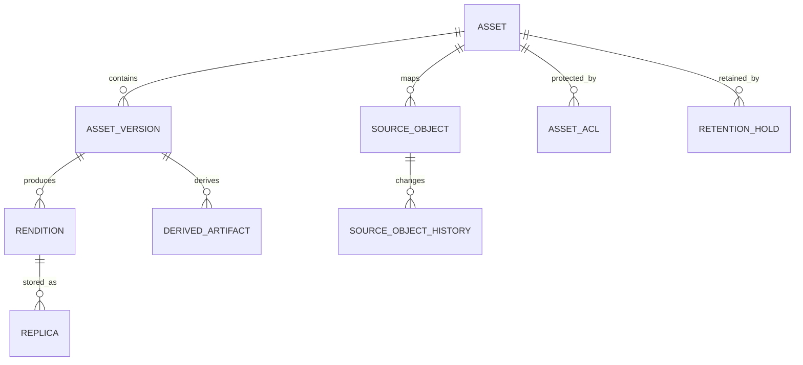

# 归泽・Guize V1——研发设计总基线

> 文档编号：GUIZE-ENGINEERING-DESIGN-V1  
> 文档状态：研发设计基线（规划态，非实现完成证明）  
> 整理日期：2026-08-28  
> 任务编号：GZ-002  
> 来源基线：Guize V1 冻结方案、ADR-0001～0013、`docs/00～23`、`docs/appendices`、机器契约与部署 Profile  
> 代码状态：当前仓库以方案与治理为主；本文出现的 Class(类)、Interface(接口)、表、Worker(工作器)除非特别注明，均为**研发规划基线**，不得理解为仓库中已经存在的实现。

## 1. 文档用途

本文是 Guize V1 面向研发、测试、运维和 Agent(智能研发代理)的统一阅读入口，按 ePROHub 规则引擎研发文档的组织方式，将原本分散的需求、架构、数据、接口、事件、工作流、中间件、状态机、部署、测试和 WBS(工作分解结构)串成一条可追踪链。

研发开工时优先阅读本文；原 `docs/00～23` 继续保留，作为专题设计来源和历史背景。机器可执行契约仍以 `contracts/**`、`deployment/**` 和正式 Migration(数据库迁移)文件为准，本文不替代机器契约。

### 1.1 阅读顺序

```text
1 文档用途与编号
→ 2 产品范围与约束
→ 3 全链路总览
→ 4 架构与模块边界
→ 5 领域与数据模型
→ 6 API / Event / Plugin 契约
→ 7 LiteFlow / Temporal / Task
→ 8 状态机与幂等
→ 9 中间件与部署
→ 10 模块级研发设计
→ 11 测试、POC 与验收
→ 12 WBS 与研发顺序
→ 13 追踪矩阵
```

## 2. 编号与追踪规则

| 标识 | 示例 | 用途 |
|---|---|---|
| `需求ID` | `需求V1-0001` | 产品/非功能需求 |
| `模块ID` | `模块V1-CTL-0001` | 物理或逻辑模块 |
| `领域模型ID` | `领域V1-AST-0001` | 核心领域对象 |
| `接口ID` | `接口V1-0001` | HTTP/SSE/WebSocket/内部服务接口 |
| `事件ID` | `事件V1-0001` | Domain Event(领域事件) |
| `工作流ID` | `工作流V1-0001` | Temporal Workflow(长任务工作流) |
| `数据库ID` | `数据库V1-0001` | 概念表/Schema；正式 DDL 冻结后映射 |
| `代码项ID` | `代码项V1-AST-0001` | 规划 Class/Interface/Worker/前端模块 |
| `工作包ID` | `WP-M1-01` | 研发交付工作包 |
| `验收ID` | `验收V1-0001` | 可验证验收项 |
| `POC ID` | `POC-01` | 尚需实机验证的阻断性假设 |

### 2.1 权威来源优先级

出现冲突时按以下顺序处理：

```text
已批准 Task Spec / ADR
→ 机器契约 contracts/** / Migration / Deployment Schema
→ 本研发设计总基线
→ 专题设计 docs/00～23
→ README / MANIFEST
→ 历史讨论和旧草稿
```

若高优先级来源之间仍冲突，停止实现并建立 ADR/任务澄清，不由研发自行选择。

## 3. 产品定位、范围与硬约束

### 3.1 产品定位

归泽是面向海量多媒体的统一媒体资产控制面与执行平台，不是单一网盘、播放器、转码器或 AI 工具。

核心闭环：

```text
多来源接入
→ 元数据同步
→ 逻辑资产归一
→ 权限与安全判断
→ Range/缓存/完整缓存
→ 媒体与 AI 加工
→ 全文/向量索引
→ 搜索/推荐/播放
→ 热度反馈
→ 生命周期/正式副本/备份
→ 审计与恢复
```

### 3.2 V1 核心需求

| 需求ID | 名称 | 说明 | 主要模块 |
|---|---|---|---|
| `需求V1-0001` | 统一接入 | WebDAV、本地、百度云、Google Drive、HTTP/S、S3、SMB/NFS、OneDrive | Source |
| `需求V1-0002` | 统一资产 | 多来源、移动/改名、版本、Rendition、Replica 统一治理 | Asset |
| `需求V1-0003` | 按需访问 | Range、ATS、完整缓存、兼容转码、低等待播放 | Playback/Storage/Media |
| `需求V1-0004` | 智能理解 | ASR、OCR、多模态、翻译、摘要、标签、Embedding | AI |
| `需求V1-0005` | 统一检索 | PostgreSQL FTS + OpenSearch + Milvus + Reranker | Search |
| `需求V1-0006` | 生命周期 | 热温冷超冷、500GB 安全水位、正式副本、多云/离线备份 | Storage |
| `需求V1-0007` | 规则与长任务 | LiteFlow 同步决策、Temporal 长任务 | Policy/Task |
| `需求V1-0008` | 安全与权限 | IAM、ACL、Passkey、匿名访问、Secrets、审计 | IAM/Security |
| `需求V1-0009` | 配置与发布 | Schema、草稿、模拟、审批、灰度、发布、回滚 | Config |
| `需求V1-0010` | 生产治理 | 可观测、GitOps、供应链、备份恢复、Evidence | Ops/Governance |

### 3.3 当前规模与环境

- 远程数据总量约 700TB；真实文件数仍需探测。
- 活跃用户预计少于 10 人，但匿名播放可能产生额外流量。
- 主宿主机：浪潮 5212；虚拟化：ESXi 6.7。
- TrueNAS VM 提供核心存储数据集。
- Intel Arc A380 作为边缘媒体 GPU，PCI Passthrough(直通)尚需 POC。
- AI 算力以远程双 RTX 3090 为主，并可使用 RTX 4060/CPU Worker。
- 本地存储必须保留至少 500GB 绝对安全空间。
- 当前工程模式为 Agent 主开发 + 人工审查/批准/部署。

### 3.4 明确非目标

V1 不：

- 全量搬迁 700TB 远程正文；
- 把搜索索引作为权威数据；
- 让插件直接写核心数据库；
- 用 Temporal 代替同步业务规则；
- 用 LiteFlow 执行 FFmpeg/ASR/备份等长任务；
- 允许 AI 绕过硬预算、安全水位、权限或审批；
- 把 POC 结论或未验证性能写成生产承诺；
- 通过中文字段/中文 URL 建立第二套机器契约。

## 4. 全链路总览

```mermaid
flowchart LR
  S[01 数据源\nWebDAV/Cloud/Local/S3] --> SY[02 同步与探测\n元数据优先]
  SY --> A[03 Asset\n逻辑资产归一]
  A --> V[04 AssetVersion\n内容版本]
  V --> P[05 Policy\nLiteFlow同步决策]
  P -->|直接访问| PB[06 Playback Plan\n鉴权/签名]
  PB --> ATS[07 ATS\nRange/Slice缓存]
  ATS --> O[08 Origin/Replica\n来源或本地副本]
  P -->|需要完整正文| C[09 Complete Cache\n完整缓存]
  C --> T[10 Temporal\n长任务]
  T --> M[11 Media\nProbe/AV1/ABR]
  T --> AI[12 AI\nASR/OCR/多模态]
  M --> R[13 Rendition/Artifact\n正式衍生物]
  AI --> R
  R --> IX[14 Index\nOpenSearch/Milvus]
  IX --> Q[15 Search/Recommend\n混合检索]
  Q --> PB
  PB --> H[16 Heat/Progress\n行为反馈]
  H --> L[17 Lifecycle\n热温冷超冷]
  L --> RP[18 Replica/Backup\n正式副本/灾备]
  RP --> O
  A --> AU[19 ACL/Audit\n权限与审计]
  P --> TK[20 Task\n统一任务视图]
  TK --> T
```



### 4.1 一句话理解

> PostgreSQL 保存“事实”，LiteFlow 决定“该做什么”，Temporal 保证“长任务做到可恢复”，Worker 执行“重活”，ATS 解决“在线播放回源”，OpenSearch/Milvus 解决“找得到”，OpenBao 解决“Secret 不落业务库”，Evidence/审计解决“做过什么可证明”。

## 5. 架构与模块边界

### 5.1 技术基线

| 领域 | V1 基线 |
|---|---|
| 控制面 | Java 17 + Spring Boot 3 + 模块化单体 |
| 执行面 | Python/FastAPI 能力服务 + Temporal Worker |
| CLI | Go `guizectl` |
| 权威数据库 | PostgreSQL + Flyway |
| 短期状态 | Redis |
| 规则 | LiteFlow + 决策表 + JSON/YAML DSL |
| 长任务 | Self-hosted Temporal + PostgreSQL |
| HTTP 缓存 | Apache Traffic Server |
| 搜索 | PostgreSQL FTS + OpenSearch + Milvus + Reranker |
| Secrets | OpenBao/Vault 抽象 |
| 可观测 | Prometheus + Grafana + Loki + OpenTelemetry + Alertmanager |
| 供应链 | SWR + Digest + SBOM + Cosign |

### 5.2 物理模块索引

| 模块ID | 模块 | 主要职责 | 允许依赖 | 禁止事项 |
|---|---|---|---|---|
| `模块V1-CTL-0001` | `guize-control` | Java 控制面、权威业务决策、REST API | PostgreSQL/Redis/OpenBao/Temporal Client | 不执行长媒体/AI任务 |
| `模块V1-WEB-0001` | `guize-console` | 管理与用户 Web UI | OpenAPI/SSE/WebSocket | 不直接访问数据库 |
| `模块V1-PLY-0001` | `guize-player` | HLS/DASH/Range 播放 SDK | Gateway/ATS | 不接触源站 Secret |
| `模块V1-MED-0001` | `guize-media-service` | ffprobe/FFmpeg/AV1/ABR/临时 H264 | Task/Storage API | 不修改核心业务表 |
| `模块V1-AI-0001` | `guize-ai-services` | ASR/OCR/VLM/Embedding/Reranker/Image | AI Gateway/Task/Artifact API | 不直接扩大资产权限 |
| `模块V1-CON-0001` | `guize-connectors` | 数据源 Probe/List/Range/Changes | Source API/Secret Ref | 不决定 Asset 身份 |
| `模块V1-WRK-0001` | `guize-worker-agent` | Worker 注册、能力、资源、租约 | Task API/Temporal | 不伪造任务成功 |
| `模块V1-CLI-0001` | `guizectl` | 探测、Bundle、部署、验证、回滚 | Deployment Schema | 不绕过生产审批 |
| `模块V1-EDG-0001` | ATS/Gateway | 公网入口、签名、Range/Slice | Control/Origin | 不保存权威业务状态 |
| `模块V1-DAT-0001` | Data Plane | PostgreSQL/Redis/OpenBao/OpenSearch/Milvus | 内部网络 | 不直接暴露公网 |
| `模块V1-OPS-0001` | Observability | 指标、日志、Trace、告警 | OTLP/Prometheus | 不记录 Secret 正文 |

### 5.3 Java 控制面逻辑模块

```text
backend/
├── guize-bootstrap
├── guize-common
├── guize-platform-api
├── guize-identity-access
├── guize-source-management
├── guize-asset-catalog
├── guize-storage-lifecycle
├── guize-media-control
├── guize-ai-control
├── guize-search-control
├── guize-task-workflow
├── guize-rule-policy
├── guize-configuration-center
├── guize-notification
├── guize-audit
└── guize-observability
```

模块依赖原则：

1. 跨模块只调用公开 Application Service/Facade；
2. 禁止跨模块访问 Repository；
3. 禁止跨模块依赖 JPA Entity；
4. 跨模块写操作通过命令接口或领域事件；
5. 只读聚合通过显式 Query API；
6. 每个模块拥有自己的表、Migration 和事件；
7. Shared/Common 只承载技术能力，不承载业务规则。

## 6. 领域模型与数据库规划

### 6.1 核心资产模型



| 领域模型ID | 模型 | 定义 | 核心规则 |
|---|---|---|---|
| `领域V1-AST-0001` | `Asset` | 用户认知中的逻辑内容 | 路径/来源不是唯一身份 |
| `领域V1-AST-0002` | `SourceObject` | 某来源中的实际对象 | 优先 `(dataSourceId, providerObjectId)` 唯一 |
| `领域V1-AST-0003` | `AssetVersion` | 内容变化后的版本 | 移动/改名不产生内容版本 |
| `领域V1-AST-0004` | `Rendition` | 原始/AV1/ABR/字幕/缩略图等表现 | 必须关联具体 Version |
| `领域V1-AST-0005` | `Replica` | Rendition 的物理副本 | 只有 VERIFIED 正式副本计入恢复能力 |
| `领域V1-AST-0006` | `DerivedArtifact` | ASR/OCR/摘要/Embedding 等结构化衍生物 | AI 原始输出不可被人工修订覆盖 |
| `领域V1-TSK-0001` | `Task` | 用户看到的统一任务 | Temporal 是执行细节 |
| `领域V1-POL-0001` | `PolicyVersion` | 已发布不可变策略版本 | 历史执行引用原版本 |
| `领域V1-SEC-0001` | `CredentialReference` | Secret 的业务引用 | Secret 正文只在 OpenBao/Vault |

### 6.2 概念数据库清单

> 以下是 LLD 规划表，不代表 Migration 已冻结。正式编码前必须为每个工作包生成 Flyway DDL、字段字典、索引与回滚/恢复说明。

#### IAM

- `数据库V1-0001 iam_user`
- `数据库V1-0002 iam_role`
- `数据库V1-0003 iam_user_role`
- `数据库V1-0004 iam_group`
- `数据库V1-0005 iam_group_member`
- `数据库V1-0006 iam_asset_acl`
- `数据库V1