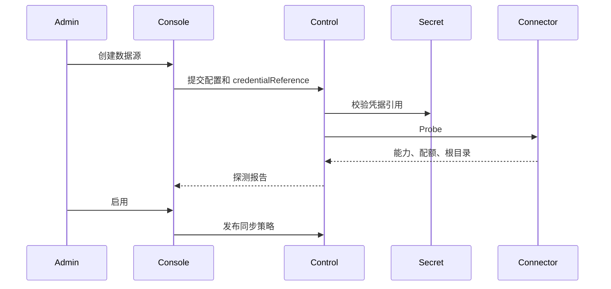
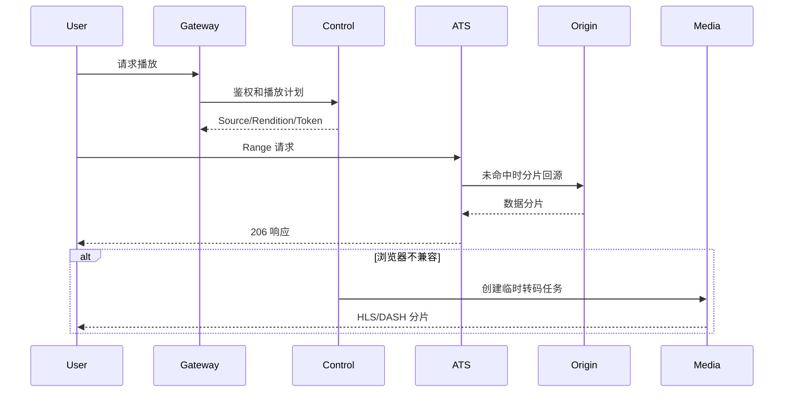
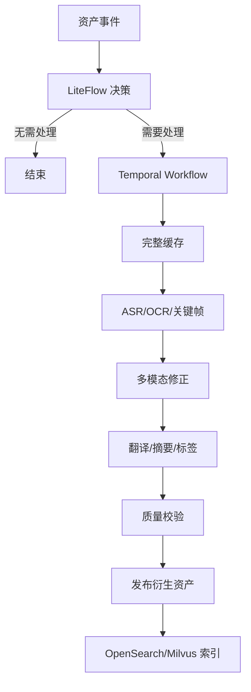

# 01. 总体解决方案 / Overall Solution

## 1. 平台定义

归泽是一套面向海量多媒体的统一内容资产平台。它将分散在 WebDAV、本地文件系统、百度云、Google Drive、HTTP/HTTPS、S3、SMB/NFS、OneDrive 等来源中的文件，转换为统一的逻辑资产，并围绕这些资产提供：

- 多来源身份归一；
- 版本和副本管理；
- 按需播放与缓存；
- 标准化媒体编码；
- AI 内容理解；
- 统一检索和推荐；
- 权限、审计与治理；
- 生命周期、备份与恢复；
- 可视化配置和自动化部署。

## 2. 设计原则

### 2.1 元数据优先，不全量搬迁

远程内容首先建立元数据索引。只有在播放、AI、转码、固定缓存、长期保留或备份需要时，才读取完整内容。

### 2.2 逻辑身份与物理位置解耦

同一个内容可以存在多个来源、版本、表现和副本。路径、文件名和来源都不是资产唯一身份。

### 2.3 缓存与保留解耦

- ATS：可重建 HTTP 分片缓存；
- 完整文件缓存：可淘汰的完整文件；
- 正式副本：经过校验的长期保留；
- 备份：用于灾难恢复的独立故障域副本。

### 2.4 在线链路优先

用户在线播放、首帧和必要回源为最高优先级。离线 AI、索引、转码和维护不得影响在线播放。

### 2.5 AI 是可治理能力

所有 AI 结果必须关联：

- 输入资产和版本；
- 模型和模型版本；
- Prompt/处理模板；
- 参数；
- 执行节点；
- 质量指标；
- 人工修订；
- 发布时间和权限。

### 2.6 配置即受控资产

生命周期规则、公开策略、模型路由、转码参数和部署 Profile 都必须版本化、测试、审批、灰度和回滚。

## 3. 用户角色

| 角色 | 主要能力 |
|---|---|
| 匿名用户 | 访问管理员公开且符合安全策略的媒体 |
| 普通用户 | 浏览授权资产、播放、搜索、保存进度 |
| 数据源所有者 | 管理自己的私人数据源和授权 |
| 内容管理员 | 管理资产、标签、版本、公开和保留 |
| AI/媒体管理员 | 管理模型、Prompt、转码和流水线 |
| 运维管理员 | 管理 Worker、部署、监控、备份和恢复 |
| 安全管理员 | 管理权限、安全策略、Secrets 引用和审计 |
| 超级管理员 | 灾难恢复和平台根级操作 |

## 4. 端到端场景

### 4.1 数据源接入

### 4.2 播放

### 4.3 AI 加工

## 5. 核心能力域

### 5.1 身份与权限

- 用户、角色、组、ACL；
- 本地账号、Passkey；
- 管理员公网密码登录及补偿控制；
- 匿名与登录访问隔离；
- 高风险操作二次确认；
- 权限前置检索过滤。

### 5.2 数据源与同步

- 连接器注册；
- 凭据引用；
- 能力探测；
- 增量同步；
- Webhook/事件；
- 按需刷新；
- 自适应频率；
- 递归扫描、检查点和限速。

### 5.3 资产目录

- 资产归一；
- 来源映射；
- 内容版本；
- 重复组；
- 路径历史；
- 人工合并和拆分；
- 来源删除与可恢复状态。

### 5.4 缓存与存储

- ATS Range/Slice；
- 完整文件缓存；
- 固定缓存；
- 正式副本；
- 热温冷超冷；
- 500GB 安全水位；
- 流量预算；
- 云恢复成本控制。

### 5.5 媒体

- ffprobe；
- 源格式直接播放；
- AV1 Master；
- AV1 ABR；
- HLS/DASH；
- 临时 H.264；
- 字幕、多音轨、章节；
- 关键帧和缩略图；
- 质量验证。

### 5.6 AI

- ASR；
- WhisperX；
- 说话人分离；
- OCR；
- 多模态字幕修正；
- 翻译；
- 文件名翻译；
- 摘要和标签；
- 文本/图像/多模态 Embedding；
- 真实和生成式缩略图；
- 本地与商业 API 混合路由。

### 5.7 搜索与推荐

- PostgreSQL FTS 和 `pg_trgm`；
- OpenSearch 关键词、聚合和混合检索；
- Milvus 多向量检索；
- Reranker；
- 以文搜视频；
- 以图搜图；
- 相关内容和行为推荐。

### 5.8 规则与任务

- 决策表；
- JSON/YAML DSL；
- LiteFlow Chain；
- Temporal Workflow；
- 任务优先级 P0～P8；
- 预算、暂停、恢复、取消；
- 模拟、灰度、审批和回滚。

## 6. 系统成功标准

归泽 V1 只有在以下闭环全部成立时才能正式发布：

1. 至少全部确认数据源通过生产验收；
2. 逻辑资产模型在移动、重命名、版本和重复场景下稳定；
3. 在线观看在缓存命中、未命中和转码回退下可用；
4. 500GB 水位和流量预算可阻止后台任务；
5. AI 流水线有固定样本、指标和人工抽检；
6. 搜索权限不泄露无权资产；
7. 规则、配置和部署均可回滚；
8. PostgreSQL、Secrets、长期保留资产完成恢复演练；
9. SWR 镜像、离线包和部署过程可验签；
10. 所有 Agent 修改具备测试和证据。
