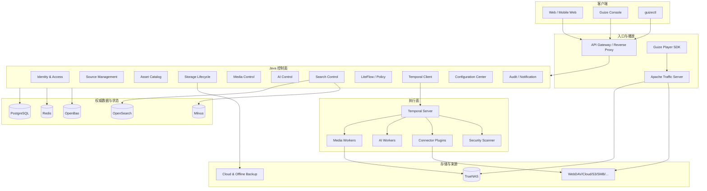
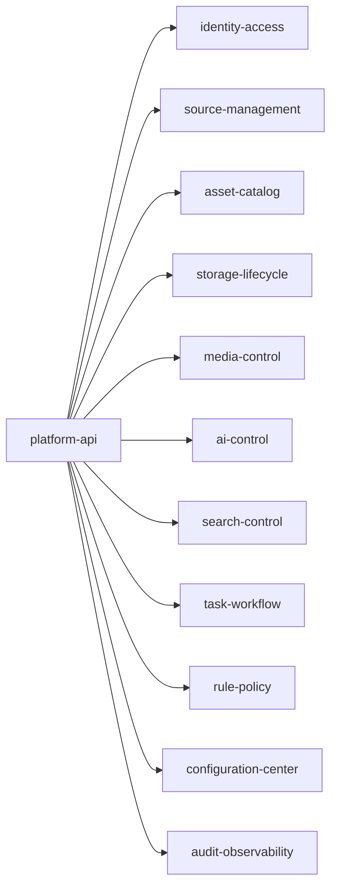

# 03. 系统架构设计 / System Architecture

## 1. 架构总览

## 2. 分层

### 接入层

- API Gateway；
- Web/API 反向代理；
- 独立管理域名；
- ATS；
- 速率限制；
- WAF；
- 媒体签名 URL；
- SSE/WebSocket 入口。

### 控制层

权威业务决策，负责：

- 身份和权限；
- 资产归一；
- 版本和副本状态；
- 生命周期；
- 任务和策略；
- 配置发布；
- 审计；
- 对外 API。

### 编排层

- LiteFlow：同步决策与轻量编排；
- Temporal：长时间、可重试、可恢复 Workflow；
- PostgreSQL Outbox：业务事件可靠发布。

### 执行层

无权直接修改核心数据库，执行：

- 数据源读取；
- 下载；
- 转码；
- ASR/OCR；
- AI；
- 搜索索引；
- 安全扫描；
- 备份和恢复。

### 数据层

- PostgreSQL：权威关系和业务状态；
- Redis：短期锁、会话、限流和进度缓冲；
- OpenSearch：关键词、聚合、全文和混合搜索；
- Milvus：向量和多向量相似检索；
- OpenBao：Secrets 和密钥；
- TrueNAS：本地文件、副本、缓存和工作空间。

## 3. Java 模块化单体

### 模块通信规则

- 只能调用公开 Application Service；
- 不能访问其他模块 Repository；
- 不能直接依赖其他模块 JPA Entity；
- 跨模块写操作通过公开命令接口或领域事件；
- 跨模块只读可使用显式 Query API；
- 每个模块拥有表、迁移和事件定义；
- 共享基础设施只提供技术能力，不承载业务规则。

## 4. Python 服务

逻辑服务：

| 服务 | 职责 |
|---|---|
| `guize-media-service` | ffprobe、FFmpeg、AV1、ABR、转码 |
| `guize-asr-service` | ASR、WhisperX、说话人分离 |
| `guize-vision-language-service` | 多模态理解、字幕修正、摘要 |
| `guize-ocr-service` | 图片、文档、帧 OCR |
| `guize-embedding-service` | 文本、图像、多模态 Embedding |
| `guize-reranker-service` | 检索重排 |
| `guize-image-service` | 真实/生成式缩略图 |
| `guize-ai-gateway` | Provider 路由、预算、协议归一 |
| `guize-worker-agent` | Worker 注册、资源和任务租约 |

部署时可根据 GPU 和依赖合并，但 API 和代码边界保持独立。

## 5. 通信

| 场景 | 协议 |
|---|---|
| 外部业务 API | REST |
| 内部同步调用 | REST |
| AI 流式输出 | SSE |
| 管理端实时状态 | WebSocket |
| 媒体数据 | HTTP Range、HLS、DASH |
| 长任务 | Temporal |
| 业务事件 | PostgreSQL Outbox |
| 监控 | Prometheus scrape / OTLP |
| Secrets | OpenBao API，经服务身份访问 |

## 6. 故障隔离

### 控制面故障

- 已签名播放 URL 在有效期内继续工作；
- ATS 已缓存内容继续服务；
- 新任务、权限变化和进度同步暂停；
- 恢复后根据任务和事件状态继续。

### Temporal 故障

- 浏览、搜索和已缓存播放不受影响；
- 新长任务暂停；
- 已登记 Workflow 在恢复后继续或重试；
- 不允许绕过 Temporal 直接运行不可追踪长任务。

### OpenSearch/Milvus 故障

- 资产目录和直接访问仍可用；
- 搜索降级到 PostgreSQL 基础检索；
- 索引通过 Outbox 和重建任务恢复。

### Worker 故障

- Lease 到期后重新调度；
- 临时文件由清理任务处理；
- 任务必须依据幂等键复用已完成产物；
- 不得因 Worker 离线把结果标记成功。

## 7. 后续拆分条件

只有当出现独立扩容、故障隔离、发布周期、合规边界或团队边界需求时，才从模块化单体拆出服务。首批候选：

- 搜索控制；
- 任务聚合；
- 公网播放授权；
- 通知；
- 数据源同步调度。

拆分前必须新增 ADR，明确数据所有权、事务、事件一致性和回滚。
