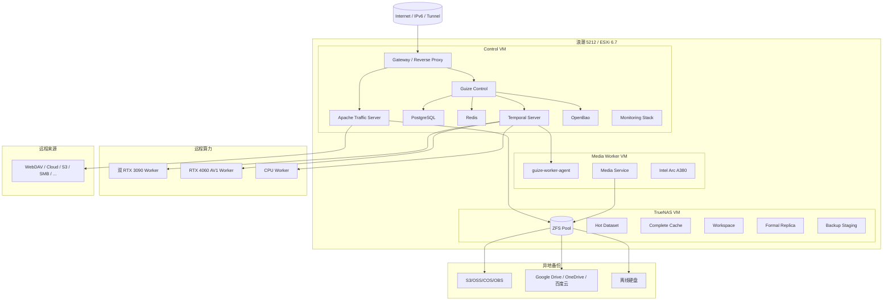

# 04. 部署拓扑设计 / Deployment Topology

## 1. 当前物理拓扑



## 2. 网络分区

| 网络 | 允许内容 |
|---|---|
| Public Edge | Gateway、ATS 必需端口 |
| Management | 管理域名、SSH/Ansible、监控 |
| Control Internal | Java、PostgreSQL、Redis、Temporal、OpenBao |
| Storage | TrueNAS iSCSI/NFS/SMB，仅内部 |
| Worker Overlay | Worker 主动连接、TLS 或加密覆盖网络 |
| Backup Egress | 指定云存储和对象存储出口 |

PostgreSQL、Redis、Temporal 和 OpenBao不得暴露到公网。

## 3. VM 资源建议

以下为起始估算，必须由 POC 和实际负载修订。

### Control VM

- 8～16 vCPU；
- 24～48GB RAM；
- 系统盘与数据库盘分离；
- PostgreSQL 使用低延迟持久盘；
- ATS 缓存目录根据内存和磁盘评估；
- 预留 OpenSearch/Milvus 独立节点迁移路径。

### TrueNAS VM

- 内存优先；
- HBA/磁盘直通按 TrueNAS 推荐；
- 数据集按用途独立；
- 快照、配额和保留策略分开；
- 禁止让 ATS 原始缓存语义污染正式 ZFS 数据集。

### Media Worker VM

- 8～16 vCPU；
- 16～32GB RAM；
- A380 PCIe 直通；
- 本地临时工作盘或 TrueNAS 专用工作数据集；
- Intel 驱动、oneVPL/VAAPI/QSV 组合由 POC 固化；
- GPU 重置失败必须能重启 VM 并恢复任务。

## 4. TrueNAS 数据集

```text
guize/
├── formal/              正式副本
├── cache/complete/      普通完整缓存
├── workspace/media/     媒体临时工作区
├── workspace/ai/        AI 临时工作区
├── derivatives/         字幕、缩略图等正式衍生文件
├── database-backup/     数据库备份暂存
├── backup-staging/      云端上传暂存
└── quarantine/          安全隔离
```

### 强制水位

- 绝对安全水位：500GB；
- 预警水位：建议 1TB 或容量百分比，取更严格者；
- 达到预警：暂停 P6～P8；
- 接近绝对水位：停止非必要下载和转码；
- 低于绝对水位：只允许清理、恢复和核心播放。

## 5. 部署 Profile

| Profile | 部署位置 |
|---|---|
| `single-node-demo` | 开发/演示机 |
| `control-plane` | Control VM |
| `edge-media-a380` | Media Worker VM |
| `ai-worker-nvidia` | 双 3090 |
| `av1-worker-ada` | RTX 4060 |
| `cpu-worker` | 低成本 CPU 节点 |
| `search-node` | 后续独立搜索节点 |
| `observability-node` | 可观测性节点 |
| `single-site-full` | 单站点整合 |
| `distributed-full` | 多站点完整部署 |
| `custom` | 配置中心生成 |

## 6. 一键部署

`guizectl` 和 Guize Console 共用 Profile Schema：

```text
配置选择
→ 主机探测
→ 依赖检查
→ 风险解释
→ Bundle 生成
→ 签名和哈希验证
→ Ansible 部署或仅导出
→ 健康检查
→ 观察窗口
→ 确认或回滚
```

部署前检查：

- CPU、内存、磁盘；
- GPU、驱动和编码能力；
- 网络、DNS、端口；
- TrueNAS/iSCSI；
- Secrets；
- 镜像 Digest 和签名；
- PostgreSQL/Flyway；
- 许可证和 SBOM；
- 资源估算；
- AI 中文修复建议。

## 7. 当前单点

V1 当前存在：

- 浪潮物理主机；
- TrueNAS 存储池；
- Control VM；
- 单节点 PostgreSQL；
- 单节点 Temporal；
- OpenBao；
- 主公网链路。

这些单点通过自动恢复、备份和恢复手册治理，不伪装为高可用。后续新增第二宿主机后，再规划：

- PostgreSQL 主备；
- Temporal 多服务节点；
- OpenBao HA；
- ATS 多节点；
- TrueNAS 复制；
- Gateway 浮动入口。
