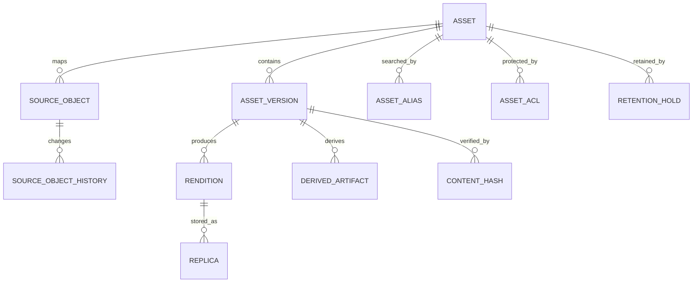

# 05. 领域与数据模型 / Domain and Data Model

## 1. 模型目标

数据模型必须支持：

- 同一内容分布在多个来源；
- 路径移动和重命名；
- 内容变更形成版本；
- 不同编码和清晰度属于不同 Rendition；
- 同一 Rendition 存在多个物理副本；
- 来源删除不等于资产删除；
- 缓存、保留和备份状态分离；
- 权限、审计和 AI 结果可追溯；
- 700TB 级远程数据只保存元数据也能运行。

## 2. 资产聚合模型



## 3. 核心实体

### 3.1 Asset

表示用户认知中的同一内容。

关键字段：

```text
id
asset_type
canonical_title
description
current_version_id
duplicate_group_id
visibility_status
lifecycle_status
security_status
created_at
updated_at
version
```

`Asset` 不保存某个来源的路径作为身份。

### 3.2 SourceObject

表示数据源中的实际对象。

```text
id
asset_id
data_source_id
provider_object_id
parent_provider_object_id
current_path
current_filename
size_bytes
mime_declared
mime_detected
etag
provider_hash
modified_at
last_seen_at
sync_status
availability_status
metadata_json
```

唯一约束优先使用：

```text
(data_source_id, provider_object_id)
```

当来源不提供稳定 ID 时，使用内部生成 ID，并通过路径、元数据、抽样哈希和完整哈希推断变化。

### 3.3 SourceObjectHistory

记录：

- 创建；
- 重命名；
- 移动；
- 内容更新；
- 删除；
- 恢复；
- 合并；
- 拆分。

历史名称和路径进入搜索别名，但不作为当前展示名称。

### 3.4 AssetVersion

内容实际发生变化时创建。

```text
id
asset_id
version_number
origin_source_object_id
content_length
mime_type
hash_status
created_reason
supersedes_version_id
created_at
published_at
```

只移动或改名不创建新内容版本。

### 3.5 ContentHash

支持多个算法：

```text
id
asset_version_id
algorithm       SHA256 / BLAKE3 / SAMPLE_V1 / PROVIDER
hash_value
scope           FULL / SAMPLE / PROVIDER
verified_at
verified_by
```

完整哈希必须用于：

- 长期保留；
- 正式备份；
- 合并确认；
- 源文件删除前；
- 完整缓存后；
- 转码输入和输出确认。

### 3.6 Rendition

媒体或文档表现。

```text
id
asset_version_id
rendition_type
container
video_codec
audio_codec
width
height
bitrate
duration_ms
language
channel_layout
generation_profile_id
quality_status
publication_status
metadata_json
```

`rendition_type` 示例：

```text
SOURCE_ORIGINAL
AV1_MASTER
AV1_ABR
H264_TEMPORARY
AUDIO_TRACK
SUBTITLE
BILINGUAL_SUBTITLE
DOCUMENT_PREVIEW
THUMBNAIL_REAL
THUMBNAIL_GENERATED
```

### 3.7 Replica

表示某 Rendition 的物理副本。

```text
id
rendition_id
storage_backend_id
object_key
replica_class
replica_status
size_bytes
hash_algorithm
hash_value
verified_at
retention_until
last_accessed_at
```

分类：

```text
SOURCE
COMPLETE_CACHE
PINNED_CACHE
HOT_FORMAL
COLD_CLOUD
ARCHIVE
OFFLINE_BACKUP
QUARANTINE
```

### 3.8 DerivedArtifact

用于结构化 AI 结果。

```text
id
asset_version_id
artifact_type
model_id
model_version
prompt_version
pipeline_version
language
confidence
quality_status
publication_status
content_reference
structured_payload
created_at
```

人工修订必须创建修订版本，不覆盖原始 AI 输出。

## 4. 其他实体

### DataSource

- 类型；
- 所有者；
- 公共/私人；
- CredentialReference；
- 同步策略；
- 能力；
- 限流和预算；
- 健康状态。

### StorageBackend

- TrueNAS 数据集；
- S3/OSS/COS/OBS；
- Google Drive；
- OneDrive；
- 百度云；
- 离线介质；
- 存储等级；
- 成本和恢复特征。

### RetentionPolicy / RetentionHold

策略决定自动生命周期，Hold 是高优先级人工或合规固定。Hold 不被普通淘汰策略覆盖。

### Task / WorkflowExecution

`Task` 是用户和控制面的统一状态；`WorkflowExecution` 保存 Temporal 标识和运行历史映射。

### PolicyDefinition / PolicyVersion

规则定义和发布版本分离。执行结果记录使用的具体版本。

## 5. 资产归一化

### 候选生成

```text
相同提供方 ID
或
相同完整哈希
或
大小 + MIME + 文件名 + 时间相似
或
相同抽样哈希
```

### 合并规则

完整哈希相同仅证明内容一致，不自动覆盖：

- 来源；
- 路径；
- 名称；
- ACL；
- 标签；
- 生命周期；
- 所有者。

用户可以拒绝逻辑合并，但系统保留 `duplicate_group_id` 以复用存储和加工结果。

### 移动/重命名置信度

| 条件 | 置信度 |
|---|---|
| 稳定 ID 相同、哈希相同 | 高 |
| 完整哈希相同、旧对象消失、新对象出现 | 高 |
| 抽样哈希相同、大小相同 | 中 |
| 名称和大小相似 | 低，人工确认 |

## 6. 删除状态

```text
SOURCE_OBJECT_DELETED
ALL_SOURCES_UNAVAILABLE
SOURCE_DELETED_BUT_RECOVERABLE
METADATA_ONLY_LOST_CONTENT
```

只有所有来源和所有正式副本均不可用时，才可判定正文无法恢复。

## 7. Schema 所有权

建议按 PostgreSQL Schema 划分：

```text
iam
source
asset
storage
media
ai
search
task
policy
config
audit
outbox
```

模块只拥有自己的表和迁移。跨域外键可谨慎使用；跨域行为必须经过模块接口。

## 8. 乐观锁与审计

关键聚合使用版本号：

```text
version bigint
```

所有高风险变化写入不可变审计：

- 操作者；
- 请求来源；
- 旧值摘要；
- 新值摘要；
- 原因；
- Trace ID；
- 关联任务；
- 审批记录。

## 9. 索引策略

必须索引：

- 来源稳定 ID；
- 当前路径；
- 文件名；
- 哈希；
- `asset_id`；
- `current_version_id`；
- 副本状态；
- 生命周期状态；
- `last_seen_at`；
- 任务状态和优先级；
- ACL 主体。

大表按实际规模评估时间或来源分区，不能在未测量文件数量前过早固定分区方案。
