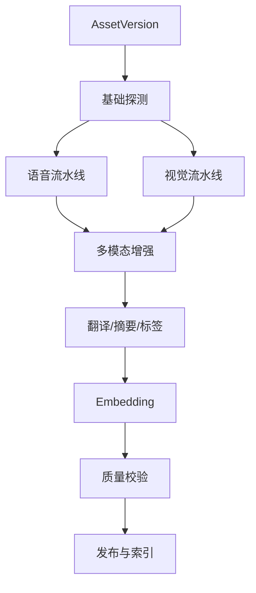

# 10. AI 与多模态流水线 / AI and Multimodal Pipeline

## 1. 总体原则

AI 能力全部纳入 V1，但不意味着每个资产执行全部模型。通过策略选择 Pipeline，并记录完整可追溯信息。



## 2. 统一 AI Provider

`guize-ai-gateway` 统一：

- 本地 OpenAI-compatible；
- 专用 FastAPI 服务；
- 商业 OpenAI-compatible；
- Provider 能力探测；
- 模型路由；
- Token/费用；
- 数据策略；
- 限流；
- 回退；
- 审计。

## 3. 语音流水线

### ASR

输出：

- 文字；
- 时间段；
- 语言；
- 置信度；
- 模型；
- 音频版本。

### WhisperX/对齐

修正词级或句级时间轴，保存原 ASR 与对齐结果。

### 说话人分离

输出 Speaker Segment，不直接把说话人身份写成真实姓名，除非有经过授权的身份映射。

## 4. 视觉流水线

- 场景切分；
- 关键帧；
- OCR；
- 人物/物体/场景描述；
- 真实缩略图评分；
- 多模态章节。

OCR 结果保留坐标、帧时间、置信度和模型版本。

## 5. 多模态字幕修正

输入：

- ASR；
- 关键帧；
- OCR；
- 文件名；
-已有标签；
- 专有词典。

输出必须区分：

- 原始识别；
- 模型建议；
- 已发布修订；
- 人工修订。

禁止无版本覆盖。

## 6. 翻译

- 文件名翻译；
- 字幕翻译；
- 双语字幕；
- 摘要翻译；
- 标签本地化。

翻译保留源语言、目标语言、模型、术语表、分段和版本。

## 7. 摘要和标签

摘要类型：

- 一句话；
- 短摘要；
- 长摘要；
- 章节摘要；
- 时间轴摘要。

标签来源：

- 规则；
- AI；
- 文件名；
- OCR；
- 人工。

标签必须标识来源和置信度，避免把推测当成事实。

## 8. 缩略图

### 真实关键帧

依据：

- 清晰度；
- 人脸/主体；
- 场景代表性；
- 文本遮挡；
- 重复度；
- 安全策略。

### 生成式

用于封面设计，不得替代真实缩略图。UI 必须明确“AI 生成”。

## 9. Embedding

类型：

- 文本；
- 字幕分块；
- 图片；
- 视频关键帧；
- 多模态；
- 标签/摘要。

记录：

```text
embeddingModel
modelVersion
dimension
normalization
chunkStrategy
sourceArtifactVersion
createdAt
```

模型版本不同的向量不应无标识混用。

## 10. AI 路由

决策输入：

- 内容类型；
- 语言；
-时长；
- 敏感级别；
- 本地资源；
- 队列；
- 预算；
-质量要求；
-数据能否外发。

输出：

- Provider；
- 模型；
- 参数；
- 并发；
-回退；
-是否人工抽检。

## 11. 任务幂等

AI 结果唯一键建议：

```text
assetVersion
artifactType
pipelineVersion
modelVersion
promptVersion
language
parameterHash
```

相同输入和配置不得重复产生昂贵任务，除非显式强制重跑。

## 12. 质量门禁

| 能力 | 指标 |
|---|---|
| ASR | WER、CER、时间轴偏移 |
| 分离 | DER |
| 翻译 | COMET、BLEU、人工评分 |
| OCR | 字符/字段准确率 |
| 摘要 | 事实一致性、覆盖率 |
| 标签 | Precision、Recall、F1 |
| Embedding | Recall@K、MRR、NDCG |
| Reranker | NDCG、MRR |
| 缩略图 | 代表性、清晰度、选择率 |
| 多模态修正 | 修正准确率、错误引入率 |

固定样本按语言、媒体类型和质量分层。模型、Prompt、分块或参数变更必须回归。

## 13. 人工修订

人工修订：

- 新建版本；
- 记录操作者；
- 记录差异；
- 防止 AI 自动覆盖；
- 可回退；
- 作为后续评测样本。

## 14. 安全和预算

- 商业 API 前执行数据策略；
- Token 和费用硬预算；
- 敏感资产默认本地处理；
- AI 不得扩大公开范围；
- 低置信度标记；
- 模型许可证审查；
- Prompt 注入和内容攻击防护；
- 输出 Schema 校验；
- 日志脱敏。
