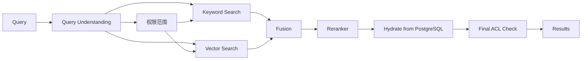

# 11. 搜索与推荐设计 / Search and Recommendation

## 1. 目标

归泽需要同时满足：

- 精确文件名和路径搜索；
- 模糊匹配；
- 字幕全文；
- OCR 文本；
- 标签和摘要；
- 条件筛选和聚合；
- 语义搜索；
- 以图搜图；
- 多模态相似；
- 相关内容推荐；
- 权限安全。

## 2. 三层检索

### PostgreSQL

承担：

- 权威资产查询；
- 精确 ID；
- 基础文件名；
- `pg_trgm` 模糊；
- 系统降级搜索；
- 权限关联。

### OpenSearch

承担：

- 多字段全文；
- 中文/英文分析；
- 路径和别名；
- 字幕、OCR、摘要；
- 标签；
- 聚合；
- 高亮；
- 关键词与语义混合搜索。

### Milvus

承担：

- 文本向量；
- 关键帧向量；
- 图像向量；
- 多模态向量；
- 多向量混合和相似度搜索。

## 3. 统一搜索流程



权限过滤尽可能在召回前生效，最终返回前再次校验。不得先返回无权资产标题或缩略图。

## 4. 索引文档

OpenSearch 文档示例：

```json
{
  "assetId": "ast_...",
  "versionId": "ver_...",
  "title": "...",
  "aliases": [],
  "paths": [],
  "description": "...",
  "subtitles": "...",
  "ocr": "...",
  "summary": "...",
  "tags": [],
  "languages": [],
  "media": {},
  "visibilityScope": [],
  "updatedAt": "..."
}
```

权威数据仍在 PostgreSQL。索引文档可重建。

## 5. 向量模型

每条向量必须记录：

```text
assetId
versionId
artifactId
vectorType
embeddingModel
modelVersion
dimension
chunkId/frameTime
permissionScopeVersion
```

模型升级时建立新索引/Collection 或显式版本字段，不能静默混合。

## 6. 混合检索

候选来源：

- BM25/关键词；
- dense vector；
- sparse vector；
- 图像向量；
- 标签；
- 行为热门；
- 最近访问。

融合：

- 加权归一；
- RRF；
- Reranker；
- 业务规则调整。

最终权重通过固定评测集和在线指标调整，不由 AI 未审批地直接发布。

## 7. Query Understanding

支持：

- 中英文；
- 文件类型；
- 时间；
- 分辨率；
- 人物/场景；
- 语言；
- 来源；
- 路径；
- 标签；
- “类似这个”；
- 图片查询。

LLM 可生成结构化查询草案，但必须经过 Schema 校验，不得直接拼接底层查询 DSL。

## 8. 索引同步

```text
业务事务
→ Outbox
→ 索引任务
→ OpenSearch/Milvus
→ 写入索引状态
```

状态：

```text
PENDING
INDEXING
INDEXED
STALE
FAILED
REBUILD_REQUIRED
```

删除资产访问权时，权限索引更新必须高优先级；必要时查询层回到 PostgreSQL 实时鉴权。

## 9. 重建

OpenSearch/Milvus 可重建。重建流程：

1. 创建新版本索引；
2. 从 PostgreSQL 和衍生资产读取；
3. 批量写入；
4. 运行完整性和权限抽检；
5. 切换 Alias；
6. 保留旧索引回滚；
7. 延迟删除。

## 10. 推荐

候选：

- 内容相似；
- 同目录/同系列；
- 标签；
- 用户历史；
- 热门；
- 未完成；
- 章节相关；
- 人工精选。

约束：

- 匿名与登录行为分离；
- 权限前置；
- 可关闭个性化；
- 不把敏感资产行为用于不当推断；
- 推荐解释可展示“相似内容”“同系列”等；
- 推荐失败不影响搜索和播放。

## 11. 评估

离线指标：

- Recall@K；
- Precision@K；
- MRR；
- NDCG；
- 权限泄漏率必须为 0；
- 无结果率；
- 查询延迟。

在线指标：

- 点击；
- 播放开始；
- 完成率；
- 搜索后退出；
- 结果改写；
- 推荐跳过。

所有质量趋势按模型、索引和权重版本保存。
