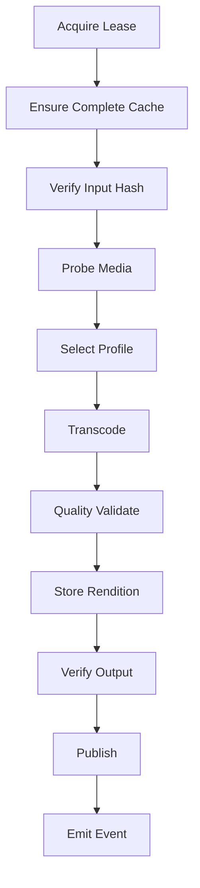

# 14. 规则、LiteFlow 与 Temporal / Rules and Workflows

## 1. 职责分离

### LiteFlow

负责同步、快速、可解释的业务决策：

- 是否缓存；
- 缓存 TTL；
- 是否 AV1；
- Profile；
- 是否长期保留；
- AI 模型路由；
- 商业 API 允许；
- 优先级；
- 扫描频率；
- 流量策略；
- 公开策略。

### Temporal

负责长时间、可重试、可恢复执行：

- 下载；
- 冷恢复；
- 转码；
- ASR；
- OCR；
- 多模态；
- 翻译；
- Embedding；
- 索引；
- 备份；
- 哈希；
- 生命周期迁移；
- 灾难恢复操作。

LiteFlow 不直接运行长任务，Temporal 不替代业务决策表。

## 2. 规则定义

支持：

- JSON/YAML DSL；
- 决策表；
- LiteFlow EL；
- 可视化流程图；
- AI 草案。

规则对象：

```text
PolicyDefinition
PolicyVersion
PolicyTestCase
PolicyApproval
PolicyDeployment
PolicyExecutionTrace
```

## 3. 发布状态

```text
DRAFT
VALIDATING
TESTED
APPROVED
CANARY
PUBLISHED
DEPRECATED
ROLLED_BACK
```

## 4. 模拟

模拟不产生真实副作用，输出：

- 匹配资产数；
- 下载量；
- AV1 容量；
- GPU 时间；
- Token；
- 源站流量；
- 迁移；
- 删除候选；
- 权限变化；
- 冲突；
- 风险。

## 5. 灰度

维度：

- 数据源；
- 目录；
- 用户；
- 角色；
- 文件类型；
- 大小；
- 热度；
- Worker；
- 时间；
- 百分比。

## 6. 高风险规则

必须审批：

- 删除；
- 修改长期保留；
- 公开私人内容；
- 商业 API；
- 大规模恢复；
- 修改水位；
- 批量转码；
- 重建索引；
- 匿名访问。

## 7. LiteFlow 模型

### Node

单一、可测试、同步组件。输入输出明确，不保存隐式全局状态。

### Chain

由 EL 编排 Node 的可执行规则链。

### EL

描述执行关系，不承载 Node 内部业务实现。

配置中心以“Node 资源、Chain 资源、EL 版本、测试样本、发布状态”管理。

## 8. Temporal Workflow

示例：媒体标准化



### Workflow 规则

- 确定性；
- 外部调用放 Activity；
- Activity 幂等；
- 心跳；
- 超时；
- 重试；
- 取消；
- 补偿；
- Search Attributes；
- 版本升级策略。

## 9. Task 与 Workflow

用户看到 `Task`，Temporal 是执行细节。

```text
Task
├── taskId
├── type
├── owner
├── priority
├── budget
├── status
└── workflowExecutionId
```

Temporal 故障时 Task 保持等待/未知执行状态，不伪造失败或成功。

## 10. Worker

Worker 主动拉取/连接：

- 独立身份；
- 短期令牌；
- TLS 可配置但公网强制；
- 能力；
- 时间窗口；
- 流量预算；
- 数据敏感级别；
- 资源；
- 租约。

普通用户只看到抽象执行位置；运维权限可查看具体节点。

## 11. Outbox 与 Workflow

领域事件可以触发 Workflow，但必须防止：

- 同一事件重复启动；
- Workflow 成功但业务发布失败；
- 业务已取消仍继续外部副作用。

使用业务幂等键、Workflow ID、状态对账任务和补偿策略。

## 12. 规则冲突

冲突类型：

- 同一条件不同动作；
- 生命周期与 Hold；
- 公共和私人策略；
- 预算与强制任务；
- 删除与备份；
- AI 路由与数据外发限制；
- 优先级循环。

冲突检测必须在发布前执行，并提供规则来源、优先级和解决建议。
