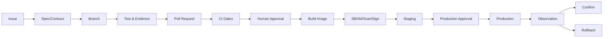

# 17. DevOps、GitOps 与软件供应链 / DevOps, GitOps and Supply Chain

## 1. 仓库策略

- GitHub 私有仓库；
- 核心平台 Monorepo；
- 大型模型服务和特殊 Worker 可独立仓库；
- 统一模板、CI、版本和发布策略；
- 定期生成加密 `git bundle`；
- 上传云存储并写入离线硬盘；
- Git 中禁止任何 Secrets 明文。

## 2. 三态模型

```text
Git Desired State
配置中心审批状态
Runtime Observed State
```

任何漂移必须可见。运行时修改不得长期脱离 Git。

## 3. 变更流程



## 4. 环境

- Local；
- Staging：测试与预发布共享基础设施但逻辑隔离；
- Production。

同一发布候选从 Staging 晋升生产，不重新构建。

## 5. SWR

华为云 SWR 为主仓库。

生产部署依据：

```text
repository
tag for display
digest for identity
signature
SBOM
vulnerability result
```

固定 Digest，不依赖可变 Tag。

## 6. Cosign/签名

流程：

- CI 构建；
- 生成 SBOM；
- 漏洞扫描；
- 推送 SWR；
- 获取 Digest；
- 签名；
- 生成 `images.lock`；
- 发布审批；
- 部署验签；
- 离线包携带签名和哈希。

高危漏洞阻止生产部署，例外必须审批、限定期限和补偿措施。

## 7. SBOM 和许可证

每个版本记录：

- 组件；
- 版本；
- 许可证；
- 来源；
- 哈希；
- 漏洞；
- 模型许可证；
- 数据集许可证；
- 商业 API 条款；
- 容器基础镜像。

允许优先使用 Apache-2.0、MIT、BSD。未来可能商业化，所有依赖必须审查。

## 8. 发布审批

分别审批：

- 代码；
- 配置；
- 数据库迁移；
- 高风险插件；
- 权限策略；
- Secrets；
- 模型；
- Prompt；
- 部署 Profile。

CI 构建镜像，生产发布人工审批。

## 9. 数据库发布

- 迁移前备份；
- Flyway 校验；
- 在 Staging 执行；
- 回滚/恢复演练；
- Expand/Migrate/Contract；
- 应用与 Schema 兼容窗口；
- 观察指标；
- 失败自动停止发布。

## 10. Bundle Builder

`guizectl` 和 Console 生成：

```text
docker-compose.yml
Ansible
configs
schemas
migration
health-check
rollback
images.lock
SBOM
licenses
checksums
install scripts
```

支持离线包和远程 Ansible。

## 11. 升级

- 只提示，不自动升级所有组件；
- 固定版本；
- 测试环境验证；
- 蓝绿或滚动；
- 数据库备份；
- 自动回滚；
- AI 解释版本变化和风险；
- Temporal 升级遵循官方兼容和 Schema 顺序；
- 组件升级必须查看 ADR 和兼容矩阵。

## 12. 证据

每次发布保留：

- Git SHA；
- PR；
- Issue；
- 镜像 Digest；
- 签名验证；
- SBOM；
- 漏洞报告；
- 测试；
- 迁移；
- 配置 Diff；
- 审批；
- 观察；
- 回滚验证。

## 13. 供应链风险

- 依赖投毒；
- 被接管镜像；
- 可变 Tag；
- 未审查模型；
- 非商业许可证；
- 外部脚本；
- GitHub Action；
- 基础镜像；
- 插件；
- AI 生成依赖。

控制：

- 依赖锁；
- Digest；
- 签名；
- 最小权限 CI；
- Renovate/Dependabot 仅生成 PR；
- 可信构建；
- Secrets 隔离；
- 审批。
