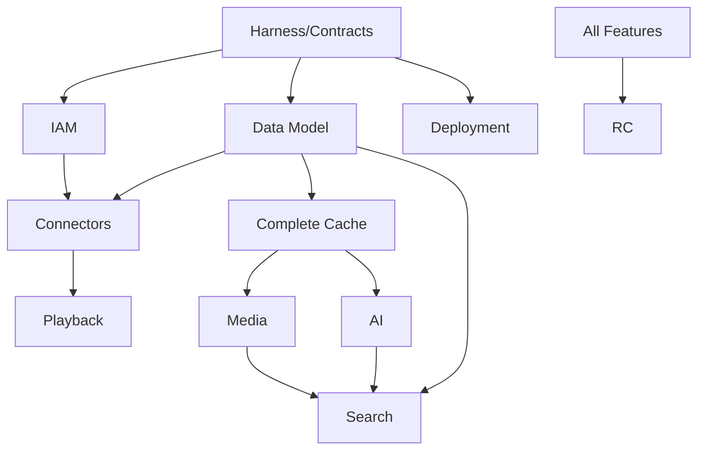

# 20. 路线图与 WBS / Roadmap and Work Breakdown Structure

## 1. 实施模式

开发由 Codex、Trae Solo/Work 等 Agent 完成，一人审查、部署和发布。必须限制同时进行的工作包。

建议：

- 同时最多 1 个高风险工作包；
- 或最多 2～3 个完全独立低风险工作包；
- 每个工作包 1～5 天内形成可审查增量；
- 不以日期替代门禁；
- 未完成前序基础设施，不并行铺开上层能力。

## 2. 阶段

### M0 规格、Harness 与 POC

交付：

- 仓库；
- AGENTS；
- Never Rules；
- CI；
- 契约校验；
- Testcontainers；
- POC；
- ADR；
- 样本和证据框架。

退出条件：

- A380、ATS、TrueNAS、百度云路径有明确结论；
- 核心契约可生成；
- Agent 任务模板可运行；
- CI 门禁可阻止违规。

### M1 资产与可播放闭环

工作包：

1. IAM；
2. Source Connector SDK；
3. WebDAV；
4. Asset/Source/Version；
5. 权限；
6. ATS；
7. 播放授权；
8. Guize Player 原型；
9. 任务；
10. 审计。

退出：

```text
接入 WebDAV
→ 浏览
→ 资产归一
→ 鉴权
→ Range 播放
→ 进度
→ 监控
```

### M2 缓存和生命周期

- 完整缓存；
- 哈希；
- Replica；
- 水位；
- 淘汰；
- 保留；
- 多云副本；
- 删除保护；
- 流量预算；
- 本地/S3/HTTP Connector。

### M3 媒体与 AI

- Media Service；
- A380；
- AV1；
- ABR；
- 临时 H.264；
- ASR；
- WhisperX；
- 分离；
- OCR；
- 关键帧；
- 多模态；
- 翻译；
- 摘要；
- 标签；
- 缩略图。

### M4 搜索与推荐

- PostgreSQL FTS；
- OpenSearch；
- Milvus；
- Embedding；
- Reranker；
- 混合；
- 权限；
- 推荐；
- 评测；
- 重建。

### M5 完整控制面和运维

- 全配置中心；
- LiteFlow；
- Temporal UI；
- Deployment Builder；
- Worker；
- GitOps；
- 可观测性；
- 告警；
- Secrets；
- 备份；
- 恢复；
- 供应链；
- 全连接器。

### M6 RC 与生产

- 全量回归；
- 性能；
- 故障；
- 安全；
- 恢复；
- 文档；
- 培训；
- 运行观察；
- 发布签署。

## 3. 关键依赖



## 4. WBS 示例

| WBS | 工作包 | 输出 | 依赖 |
|---|---|---|---|
| 0.1 | 仓库初始化 | Monorepo、模板 | 无 |
| 0.2 | Harness | 测试/证据框架 | 0.1 |
| 0.3 | API/事件基线 | Schema | 0.1 |
| 0.4 | A380 POC | ADR | 无 |
| 0.5 | ATS POC | 配置/结果 | 无 |
| 1.1 | IAM | 用户、角色、ACL | 0.2 |
| 1.2 | Asset 模型 | 表、迁移、服务 | 0.3 |
| 1.3 | Connector SDK | Manifest/API | 0.3 |
| 1.4 | WebDAV | 生产连接器 | 1.3 |
| 1.5 | 同步器 | 增量/检查点 | 1.2/1.4 |
| 1.6 | 播放授权 | 签名 URL | 1.1/1.2 |
| 1.7 | ATS 集成 | Range/Slice | 0.5/1.6 |
| 2.1 | Cache Manager | 状态机 | 1.2 |
| 2.2 | Hash | BLAKE3/SHA | 2.1 |
| 2.3 | Replica | 正式副本 | 2.1 |
| 2.4 | 水位 | 调度阻断 | 2.1 |
| 3.1 | Media Service | API | 0.4/2.1 |
| 3.2 | AV1 | Profile/Workflow | 3.1 |
| 3.3 | Temporary H264 | 在线回退 | 3.1 |
| 3.4 | ASR | Service/Workflow | 2.1 |
| 4.1 | OpenSearch | 索引 | 1.2 |
| 4.2 | Milvus | 向量 | 3.4 |
| 4.3 | Unified Search | 融合/Rerank | 4.1/4.2 |
| 5.1 | Config Center | 页面框架 | 1.x |
| 5.2 | LiteFlow | 规则 | 2.x |
| 5.3 | Temporal Ops | 任务管理 | 3.x |
| 5.4 | guizectl | Bundle | 0.2 |
| 5.5 | Backup/DR | 演练 | 2.x/5.4 |

## 5. Agent 任务循环

```text
Issue
→ Spec
→ Contract
→ Branch
→ Implement
→ Test
→ Evidence
→ Agent self-review
→ Human review
→ Merge
→ Staging
```

## 6. 审查容量控制

单人审查应重点检查：

- 规格和契约；
- 领域边界；
- 安全；
- 迁移；
- 测试；
- 证据；
- 回滚。

避免让 Agent 一次生成跨 10 个模块的大 PR。

## 7. 计划度量

- Lead Time；
- PR 大小；
- 审查等待；
- 门禁失败；
- 回滚；
- 缺陷逃逸；
- Never Rule 新增；
- POC 假设推翻；
- 自动测试覆盖的验收标准比例；
- 人工审查时间。

## 8. 发布原则

无固定截止日期时，V1 以生产门禁为准。若必须限制周期，应先削减范围或改变“全部生产级”，不得通过跳过测试和恢复来压缩。
