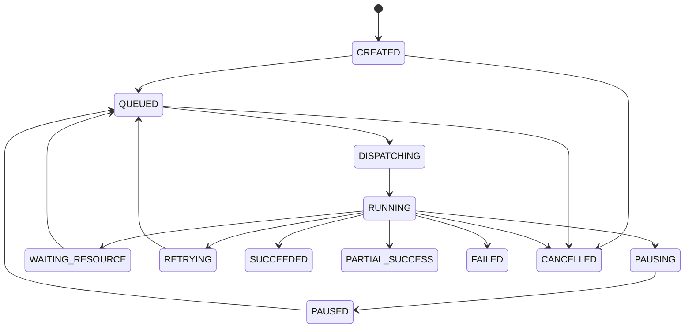

# 21. Low Level Design

## 1. 文档目的

本 LLD 将冻结的总体架构落到模块、端口、表、状态机、接口、任务和部署单元。实现过程中若出现差异，必须通过 ADR 和规格变更，不得只修改代码。

## 2. Java 工程结构

```text
backend/
├── guize-bootstrap
├── guize-common
├── guize-platform-api
├── guize-identity-access
├── guize-source-management
├── guize-asset-catalog
├── guize-storage-lifecycle
├── guize-media-control
├── guize-ai-control
├── guize-search-control
├── guize-task-workflow
├── guize-rule-policy
├── guize-configuration-center
├── guize-notification
├── guize-audit
└── guize-observability
```

每个业务模块建议采用：

```text
<module>/
├── domain/
│   ├── model/
│   ├── service/
│   ├── event/
│   └── repository/
├── application/
│   ├── command/
│   ├── query/
│   ├── service/
│   └── dto/
├── infrastructure/
│   ├── persistence/
│   ├── client/
│   └── config/
└── api/
    ├── rest/
    └── mapper/
```

## 3. 模块接口

### 3.1 IdentityAccessFacade

```java
interface IdentityAccessFacade {
    AuthorizationDecision authorize(
        SubjectRef subject,
        ResourceRef resource,
        Action action,
        RequestContext context
    );

    SignedAccessGrant issueMediaGrant(
        SubjectRef subject,
        AssetVersionRef version,
        RenditionRef rendition,
        Duration ttl
    );
}
```

### 3.2 AssetCatalogFacade

```java
interface AssetCatalogFacade {
    AssetView getAsset(AssetId id, SubjectRef subject);
    AssetVersionRef registerSourceObservation(SourceObservation observation);
    MergeCandidateResult evaluateMerge(MergeCandidate candidate);
    void confirmSourceDeletion(SourceObjectId id, SourceDeletionEvidence evidence);
}
```

### 3.3 StorageLifecycleFacade

```java
interface StorageLifecycleFacade {
    CacheDecision evaluateCache(CacheDecisionInput input);
    TaskRef requestCompleteCache(CacheRequest request);
    PromotionResult promoteReplica(PromotionCommand command);
    EvictionPlan planEviction(StoragePressure pressure);
}
```

### 3.4 TaskWorkflowFacade

```java
interface TaskWorkflowFacade {
    TaskRef create(TaskCommand command, IdempotencyKey key);
    void pause(TaskId id);
    void resume(TaskId id);
    void cancel(TaskId id);
    TaskView get(TaskId id);
}
```

## 4. 数据表

以下为概念表，字段在实现规格中进一步定义。

### iam

```text
iam_user
iam_role
iam_user_role
iam_group
iam_group_member
iam_asset_acl
iam_passkey_credential
iam_session
iam_login_event
iam_risk_event
```

### source

```text
source_data_source
source_capability
source_sync_policy
source_sync_job
source_sync_checkpoint
source_object
source_object_history
source_webhook_subscription
source_credential_reference
```

### asset

```text
asset_asset
asset_alias
asset_version
asset_content_hash
asset_duplicate_group
asset_merge_decision
asset_tag
asset_tag_assignment
```

### media/storage

```text
media_rendition
media_track
media_profile
media_quality_result
storage_backend
storage_replica
storage_retention_policy
storage_retention_hold
storage_cache_entry
storage_migration
storage_watermark_event
```

### ai/search

```text
ai_provider
ai_model
ai_prompt
ai_pipeline
ai_derived_artifact
ai_quality_evaluation
search_index_record
search_embedding_record
search_rebuild_job
```

### task/policy/config

```text
task_task
task_execution
task_worker
task_worker_capability
task_lease
policy_definition
policy_version
policy_test_case
policy_deployment
config_definition
config_version
config_approval
```

### audit/outbox

```text
audit_event
audit_security_event
outbox_event
outbox_consumer_offset
```

## 5. 关键约束

- `source_object(data_source_id, provider_object_id)` 唯一，来源无稳定 ID 时使用内部标识和路径历史；
- `asset_version(asset_id, version_number)` 唯一；
- `content_hash(algorithm, hash_value, scope)` 建索引；
- `replica(rendition_id, storage_backend_id, object_key)` 唯一；
- `task(idempotency_scope, idempotency_key)` 唯一；
- Outbox 与业务事务同事务；
- 审计事件禁止业务更新。

## 6. Source 同步算法

### 输入

- DataSource；
- SyncPolicy；
- Checkpoint；
- Provider cursor；
- Budget；
- 当前压力。

### 流程

```text
Acquire sync lease
→ Probe source health
→ Resolve cursor/checkpoint
→ Fetch page
→ Normalize objects
→ Upsert observations
→ Detect missing/changed/moved
→ Emit events
→ Save checkpoint
→ Continue or throttle
```

### 失败

- 401/403：凭据异常，停止并告警；
- 429：读取 Retry-After，降速；
- 5xx：指数退避；
- 超时：有限重试；
- 页面 Token 失效：回退到目录级重扫；
- 对象数量不一致：标记 Partial，不批量删除。

## 7. Asset 归一算法

```text
if stable provider id matches:
    same SourceObject
    if content fingerprint changed:
        create AssetVersion
elif full hash matches known version:
    propose merge/high-confidence relocation
elif sample hash + size matches:
    candidate, schedule full hash
else:
    create new Asset or low-confidence candidate
```

所有自动合并策略都可以按来源和风险级别关闭。

## 8. Cache Manager

### 获取完整文件

1. 创建任务和 CacheEntry；
2. 预留空间；
3. 获取来源 Lease；
4. 支持 Range/断点；
5. 下载临时路径；
6. 计算 BLAKE3/SHA-256；
7. 安全扫描；
8. 原子移动；
9. 标记 `COMPLETE_CACHE`；
10. 发布事件。

### 防重复下载

以：

```text
assetVersion + sourceChoice + cacheClass
```

作为幂等范围，并使用数据库唯一键/分布式锁。Redis 锁不是唯一正确性保障。

## 9. ATS 授权

控制面不直接把源站 URL 给客户端。

建议：

```text
客户端请求播放计划
→ 生成内部 resource key
→ 短期 HMAC/JWT grant
→ ATS/Gateway 验证
→ 内部 Origin Resolver 解析来源
```

授权信息包括：

- subject；
- asset/version/rendition；
- action；
- expiry；
- range policy；
- anonymous flag；
- nonce。

缓存对象不得因用户 Token 不同无限碎片化，权限和内容标识分离。

## 10. 媒体 Workflow

### `StandardizeMediaWorkflow`

Activities：

```text
ensureCompleteCache
verifyInput
probeMedia
selectProfile
reserveWorkspace
transcode
validateQuality
storeRendition
verifyReplica
publishRendition
cleanupWorkspace
```

补偿：

- 释放空间；
- 删除未发布临时副本；
- 保留诊断日志；
- 不删除已验证旧 Rendition。

### `TemporaryTranscodeSessionWorkflow`

- 在线优先；
- 心跳；
- 客户端离开后宽限；
- 可升级为正式任务；
- 分片 TTL；
- 输出不默认进入正式副本。

## 11. AI Workflow

### `EnrichAssetWorkflow`

```text
ensure cache
extract audio/frames
ASR
align
diarize
OCR
multimodal correction
translate
summarize/tag
thumbnail
embedding
quality
publish
index
```

按 Policy 跳过不需要阶段。每个阶段输出版本化 Artifact。

## 12. Task 状态机



取消不保证立刻终止外部进程；Activity 必须轮询取消并安全清理。

## 13. Replica 状态机

```text
PLANNED
COPYING
UPLOADED_UNVERIFIED
VERIFYING
VERIFIED
DEGRADED
UNAVAILABLE
CORRUPTED
REPAIRING
DELETING
DELETED
```

只有 `VERIFIED` 可计入正式恢复副本数量。

## 14. Policy 执行

执行前加载已发布不可变 `PolicyVersion`。结果记录：

```text
policyVersionId
inputSummary
matchedRules
decision
explanation
executionTime
traceId
```

历史任务重放时使用原版本，除非明确选择最新策略。

## 15. 插件 API

### Health

```http
GET /health
GET /ready
```

### Capabilities

```http
GET /api/v1/capabilities
```

### Connector

```http
POST /api/v1/probe
POST /api/v1/list
POST /api/v1/stat
POST /api/v1/read-url
POST /api/v1/changes
```

大文件不通过 JSON Base64 传输。

## 16. Worker 注册

```http
POST /api/v1/workers/register
POST /api/v1/workers/heartbeat
```

上报：

- hardware；
- GPU；
- codecs；
- models；
- disk；
- budget；
- classification；
- working hours；
- software versions。

控制面返回短期令牌和允许能力。

## 17. 配置发布

```text
Draft
→ Schema Validate
→ Semantic Validate
→ Simulation
→ Approval
→ Git Commit/PR
→ Deploy
→ Health Check
→ Observe
→ Confirm
```

配置中心保存业务状态，Git 保存期望部署状态。Secrets 仅引用。

## 18. 锁和并发

- 使用数据库唯一约束保证幂等；
- 使用 `SELECT ... FOR UPDATE` 保护关键聚合；
- Redis 用于性能和短期协调；
- Worker 任务使用 Lease；
- Lease 超时可重新调度；
- 发布动作使用乐观锁；
- 避免长事务持有文件 IO。

## 19. 一致性对账

周期任务：

- SourceObject 与来源；
- CacheEntry 与文件；
- Replica 与对象；
- Task 与 Temporal；
- Outbox；
- OpenSearch；
- Milvus；
- Backup；
- Secrets 引用。

对账只标记和修复可证明安全的问题，不自动删除未知对象。

## 20. 错误处理

每个错误定义：

- code；
- HTTP；
- retryable；
- userAction；
- adminAction；
- alert；
- i18n；
- cause exposure。

内部异常不直接返回堆栈。

## 21. 性能考虑

- 目录分页；
- 游标；
- 批量 Upsert；
- 延迟完整哈希；
- 分层索引；
- PostgreSQL 查询计划；
- 连接器并发；
- ATS；
- 任务资源队列；
- 大对象零拷贝/流式；
- 避免把正文写入数据库。

## 22. 迁移策略

V1 早期仍按生产迁移规范：

- 不修改已执行脚本；
- 每次变更新版本；
- Expand/Contract；
- 索引并发构建评估；
- 大表迁移分批；
- 回填使用任务；
- 迁移前备份；
- 验证行数、约束、样本和性能。
