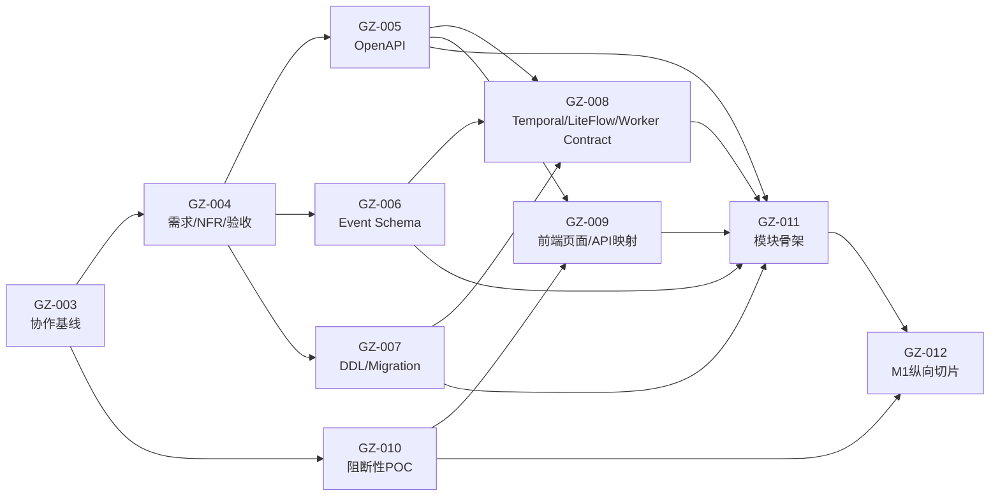

# 归泽・Guize V1——需求、设计完整性审计与多 Agent 交付基线

> 文档编号：GUIZE-DELIVERY-READINESS-V1
> 文档状态：协作与交付基线
> 任务编号：GZ-003
> 审计基线：`70984201e8d01ad75b6aa0fa0ee5ffe141087b52`
> 适用范围：GZ-003 合并后的需求、契约、POC、实现、测试、集成与发布任务
> 重要约束：V1 不设置对外 Beta；所有纳入 V1 的能力必须通过对应生产门禁后才能发布

## 1. 文档目的

GZ-001 已建立仓库 Governance/Harness，GZ-002 已建立 ePROHub 风格研发设计总基线。两项工作解决了“任务如何可追踪”和“整体方案如何统一阅读”，但尚未自动解决以下问题：

1. 设计说明是否已经细化为可执行机器契约；
2. 哪些内容允许多个 Agent 并行实现；
3. 多个 Agent 如何避免同时修改同一路径或各自发明字段；
4. 上游契约变化后，下游如何重新验证；
5. 实现、测试、审查和集成如何保持独立；
6. 什么证据可以证明交付，而不是只证明“生成过文件”。

本文的作用是完成一次整体查缺补漏，并把后续研发组织为：

```text
需求/NFR/验收冻结
→ 机器契约冻结
→ 阻断性 POC
→ 模块骨架
→ 可并行模块实现
→ 纵向集成
→ E2E/安全/性能/恢复
→ RC
→ 人工生产批准
```

## 2. 执行结论

### 2.1 已具备的基础

当前仓库已经具备：

- 冻结的 V1 产品定位、主要能力范围和非目标；
- 13 项架构 ADR，覆盖模块化单体、LiteFlow/Temporal 分工、核心资产模型、ATS/完整缓存分离、OpenBao、OpenSearch/Milvus、供应链等；
- 一份研发设计总基线，覆盖需求、模块、领域模型、概念表、接口、事件、工作流、状态机、中间件、部署、代码规划、测试、POC、WBS 和追踪矩阵；
- Task Spec、独立分支、Scope、Evidence、Secret Scan、Schema Check、Review 和 Governance Gate；
- Event Envelope、Plugin Manifest、Deployment Profile 等少量机器契约基础；
- 明确的 Agent 工程规则、Never Rules 和证据真实性要求。

### 2.2 尚不具备的基础

当前仓库仍不具备：

- 完整可执行的 `openapi.json`；
- 每个 `eventType` 对应的 Payload Schema；
- PostgreSQL DDL、Flyway Migration、字段字典和迁移恢复验证；
- Temporal Workflow/Activity 的输入输出、Retry、Timeout、Heartbeat、Cancellation 和 Compensation 契约；
- LiteFlow Node/Chain/EL/Context 的机器契约和测试样本；
- Connector/Worker SDK 与一致性测试；
- 前端页面、Action、API、权限、状态和错误的完整映射；
- 业务代码、业务单元测试、集成测试和 E2E；
- A380、ATS、TrueNAS、700TB、百度云、公网、AI 和恢复的真实 POC 结果；
- 可作为生产承诺的性能、容量、兼容性和恢复数据。

因此，当前准确状态不是“可以让多个 Agent 同时开始写全部业务代码”，而是：

> 可以让多个 Agent 按依赖并行完成需求、机器契约和 POC；业务实现必须等待其消费的契约合并后再启动。

## 3. 权威来源与冲突处理

所有 Agent 必须遵守 `AGENTS.md` 的权威顺序：

```text
1. 已批准的需求规格
→ 2. 已批准的 API、事件、数据 Schema 契约
→ 3. 已批准的 ADR
→ 4. 系统和模块设计文档
→ 5. AGENTS.md
→ 6. rules/never-rules.md
→ 7. 当前任务说明 / Task Spec
→ 8. 代码现状
→ 9. Agent 自行推断
```

本文属于“系统和模块设计文档”，不能覆盖更高优先级内容。

冲突处理：

1. 记录具体冲突路径、字段、状态或行为；
2. 停止继续实现冲突部分；
3. 由 Requirement/Contract/ADR Task 决定；
4. 决策合并后，下游任务更新 Base Commit 并重新验证；
5. 不允许实现 Agent 通过“代码已经这样写了”反向修改需求或契约。

## 4. 需求完整性审计

### 4.1 已冻结内容

当前 V1 已明确：

- 产品是统一媒体资产控制面与执行平台，不是单一网盘、播放器、转码器或 AI 工具；
- 覆盖多来源接入、Asset 治理、缓存、媒体、AI、搜索、生命周期、安全、规则、工作流、配置、运维和灾备；
- 远程数据规模约 700TB，真实文件数和变化率仍待探测；
- 本地存储需要保留至少 500GB 安全水位；
- 使用 Java 17/Spring Boot 3 控制面、Python 执行面、PostgreSQL、Redis、LiteFlow、Temporal、ATS、OpenBao、OpenSearch、Milvus；
- V1 不设置对外 Beta，范围内能力必须达到生产门禁；
- POC 前的硬件、性能和第三方兼容性不得写成生产事实。

### 4.2 需求层缺口

#### 功能验收颗粒度不足

当前文档能说明“需要什么能力”，但尚未为所有功能建立统一的：

```text
Requirement ID
Priority
User / Operator
Precondition
Trigger
Main Flow
Alternative Flow
Error Flow
Data Ownership
Permission
Idempotency
Audit
Acceptance ID
Test Type
Release Gate
```

#### 非功能需求不完整

必须补充可度量的：

- 可用性与降级；
- API 延迟、播放首帧、任务排队时间；
- 同步吞吐、目录规模和索引延迟；
- 恢复点、恢复时间和回读验证；
- 并发、容量、安全水位和预算；
- 安全、审计、日志保留和隐私；
- 可升级、可回滚和兼容窗口；
- 可观测性和错误预算。

#### 优先级与依赖未完全机器化

研发设计总基线已有 WBS，但 Requirement 还没有机器可读的优先级、依赖和状态。GZ-004 必须把需求、约束、POC 和验收建立可执行追踪关系。

## 5. 项目设计完整性审计

### 5.1 架构与模块

**状态：规划基线可用，模块契约未执行化。**

已经明确模块化单体控制面和独立 Worker，但后续仍需：

- 每个模块的公开 Facade、Command、Query 和 Event；
- 禁止依赖规则的 ArchUnit 或等价测试；
- JPA Entity、Repository 和 Migration 的模块所有权；
- 跨模块事务和最终一致性边界；
- 降级、熔断、超时和故障传播矩阵；
- 模块级配置、指标、日志和 Runbook。

### 5.2 HTTP API

**状态：原则和概念接口存在，完整 OpenAPI 未冻结。**

缺口：

- 请求、响应、分页、过滤、排序和错误 Schema；
- 资源版本、ETag、并发更新和幂等规则；
- 权限和审计行为；
- 长任务返回与任务状态；
- SSE/WebSocket 重连和游标；
- 版本兼容和弃用；
- 所有接口示例与契约测试。

### 5.3 Domain Event

**状态：Envelope 存在，Payload 与所有权未冻结。**

缺口：

- 每个 `eventType` 的 Payload Schema；
- Producer、Consumer、Partition/Ordering、Retention；
- Event Version 升级和兼容；
- Outbox 发布失败、重放、死信和对账；
- Consumer 幂等和副作用边界；
- 敏感字段和脱敏规则。

### 5.4 PostgreSQL

**状态：概念 Schema 和表清单存在，DDL 未冻结。**

缺口：

- 字段类型、长度、默认值、Null、Check、FK 和 Unique；
- 索引、冷热分区、归档和审计保留；
- 事务边界和乐观锁；
- Flyway Baseline、升级、回滚/前向修复；
- 大数据量下的查询计划和容量估算；
- 备份恢复和校验查询。

### 5.5 LiteFlow 与 Temporal

**状态：职责分离正确，执行契约不足。**

LiteFlow 需要冻结：

- Node 名称、输入、输出、Context 字段；
- Chain、EL、决策表和脚本边界；
- 异常、Fallback、Timeout 和审计；
- PolicyVersion、模拟、审批、灰度和回滚；
- 固定样本和冲突测试。

Temporal 需要冻结：

- Workflow/Activity 输入输出；
- Workflow ID 和业务幂等键；
- Retry、Schedule-to-Close、Start-to-Close、Heartbeat；
- Cancellation、Pause、Resume、Compensation；
- Worker Versioning 和 Determinism；
- 外部副作用和人工介入；
- Task 与 WorkflowExecution 状态映射。

### 5.6 Connector、Plugin 与 Worker

**状态：Manifest 基础存在，运行协议未冻结。**

缺口：

- Connector SDK、Provider Adapter 和能力探测；
- Worker 注册、心跳、Lease、短期凭据和资源报告；
- 文件、网络、Secret 和外部 API 边界；
- Provider 限流、预算、重试和封禁；
- 一致性测试包和认证流程；
- 版本兼容与滚动升级。

### 5.7 前端与播放器

**状态：页面域已规划，框架和页面契约待 POC/冻结。**

缺口：

- Vue 3 / React 决策；
- 页面、Action、API、Permission、State、Error 映射；
- SSE/WebSocket 状态恢复；
- 播放器兼容、降级和临时转码体验；
- Design Token、无障碍、国际化和浏览器矩阵；
- 前端契约测试和视觉回归。

### 5.8 安全

**状态：原则正确，控制和测试尚不完整。**

缺口：

- Threat Model 和 Abuse Case；
- 角色/资源/动作 Permission Matrix；
- Connector SSRF、DNS Rebinding 和重定向验证；
- 媒体解析器和 AI Worker 沙箱；
- Secret Rotation、Break Glass 和恢复；
- 公开内容、衍生内容和搜索结果的权限继承测试；
- 审计保留、防篡改和访问控制。

### 5.9 可观测与运维

**状态：组件和关联键已定，指标/SLO 未冻结。**

缺口：

- 指标和日志字典；
- SLI、SLO、Error Budget；
- 告警阈值、聚合、静默和升级；
- 每个高等级告警的 Runbook；
- Synthetic Probe 和恢复演练；
- 成本、流量、GPU、存储和 Provider 预算可视化。

### 5.10 部署、备份与恢复

**状态：Profile 和恢复顺序存在，实机结论不足。**

阻断项：

- Arc A380 在 ESXi 6.7 的直通和稳定性；
- AV1/H.264 的质量、并发、首分片和长任务；
- ATS Range/Slice、ETag、If-Range、权限缓存键；
- TrueNAS 吞吐、延迟和故障恢复；
- 700TB 实际文件数、目录层级和扫描成本；
- 百度云可持续生产接入；
- IPv6/TLS/Tunnel/CDN/Range；
- PostgreSQL/OpenBao/正文/Bundle 恢复回读。

## 6. 缺口分级

### Critical：实现前必须解决

- GZ-004：需求、NFR、验收和追踪；
- GZ-005：OpenAPI；
- GZ-006：Event Payload；
- GZ-007：DDL/Migration；
- GZ-008：Temporal/LiteFlow/Worker Contract；
- GZ-010：阻断性 POC。

### High：首个纵向切片前必须解决

- 前端页面/API/权限映射；
- Threat Model 和 Permission Matrix；
- Contract Fixture、Provider Simulator 和测试数据；
- SLI/SLO、告警和恢复验收；
- 模块边界自动测试。

### Medium：M1～M5 分阶段解决

- 推荐质量评估；
- 高级容量模型；
- 多站点部署；
- 更细的成本优化；
- 非核心 Connector。

## 7. 多 Agent 交付模型

### 7.1 基本原则

1. **契约优先**：多个 Agent 不根据同一段自然语言独立发明 API、字段或状态；
2. **单写者**：一个 Task 的独占路径只有一个 Owner；
3. **角色分离**：Owner 与最终 Reviewer 不同；
4. **固定基线**：Task 记录 40 位 `baseCommit`；
5. **最小共享面**：公共索引、总 Contract 和 Workflow 由 Integrator 串行处理；
6. **小批集成**：按工作包合并，不在里程碑末尾一次性大合并；
7. **真实交接**：下一 Agent 读取 Handoff、机器契约和真实 Evidence，不依赖聊天记忆；
8. **失败可见**：POC 失败、测试失败和阻断结论都是有效输出，不得美化；
9. **范围封闭**：发现邻接问题先记录 Follow-up，不直接扩大当前 PR；
10. **全量重验**：Base 或上游 Contract 变化后重新执行测试和 Evidence。

### 7.2 角色

#### Orchestrator / Integration Agent

- 选择满足依赖的工作包；
- 分配 Task ID、Base Commit、路径和集成顺序；
- 维护 Program Plan；
- 处理共享文件；
- 确认所有依赖已合并；
- 不替代独立 Reviewer。

#### Requirement Agent

- 维护需求、NFR、约束、验收和追踪；
- 不写业务实现；
- 不把设计方案直接升级为需求。

#### Contract Agent

- 维护 OpenAPI、Event、DDL、Workflow、Policy、Plugin/Worker Contract；
- 提供 Schema、示例和契约测试；
- 不用实现细节污染公共契约。

#### Implementation Agent

- 只消费已批准契约；
- 在独占路径内实现；
- 发现契约缺口时停止猜测并提 Contract Change。

#### QA Agent

- 从需求和契约派生测试；
- 独立构造负例、故障、权限和恢复场景；
- 不接受“实现能跑”替代验收。

#### Independent Reviewer

- 核对权威来源、Scope、契约、测试和 Evidence；
- 不直接作为同一任务 Owner；
- 对范围外问题建立 Follow-up。

#### Security / Operations Reviewer

- 在涉及身份、公开访问、Secret、外部连接、解析器、部署和恢复时加入；
- 检查威胁、权限、密钥、日志、告警、Runbook 和恢复证据。

### 7.3 Agent 可以复用，但角色不能混同

同一个 Agent 可以在不同 Task 中承担不同角色，但在同一 Task 中：

```text
Owner != Final Reviewer
Contract Owner != Consumer Implementation Owner（高风险契约优先分离）
POC Executor != Evidence Reviewer
Release Integrator != Production Approver
```

## 8. 路径所有权

### 8.1 独占路径

`paths.exclusive` 中的路径由一个活动 Task 独占。其他 Agent：

- 可以只读；
- 可以提出 Review；
- 不可以在另一分支同时修改；
- 需要修改时必须调整 Program Plan 或等待前序合并。

### 8.2 共享路径

典型共享路径：

- `README.md`；
- `docs/00-guize-engineering-design-baseline.md`；
- `contracts/**` 顶层索引；
- `Makefile`；
- 公共 Workflow；
- 总追踪矩阵。

处理方式：

1. 共享路径在 Descriptor 中显式声明；
2. 由 Integrator 统一修改，或按 `integration.order` 串行合并；
3. 并行任务尽量新增自己的文件，不修改同一中心文件；
4. 合并后执行全量回归和链接检查。

### 8.3 为什么不使用中央文件锁

Git 分支之间无法天然共享实时锁；一个所有 Agent 都修改的锁文件会制造冲突。Guize 使用：

```text
每 Task 一个 Descriptor
+ 计划 Descriptor 先进入 main
+ Collaboration Gate 扫描活动 Descriptor
+ Integrator 控制共享路径
```

## 9. Coordination Descriptor

每个 Task 必须声明：

```yaml
taskId: GZ-XXX
mode: multi-agent
status: active
baseCommit: 40位SHA
roles:
  owner: implementation-agent
  reviewer: independent-review-agent
  integrator: integration-agent
dependencies: [GZ-...]
paths:
  exclusive: []
  shared: []
contracts:
  inputs: []
  outputs: []
integration:
  order: 100
  mergePolicy: contract-first
  rebasePolicy: revalidate-on-base-change
handoff:
  required: true
  path: evidence/GZ-XXX/handoff.md
```

Schema：`specs/collaboration/task-coordination.schema.yaml`。

## 10. 依赖 DAG 与并行波次



### Wave A：可立即并行

- GZ-004：需求、NFR、验收和追踪；
- GZ-010：POC 环境、脚本、执行和 Evidence。

两者路径独立，可以并行。

### Wave B：机器契约并行

GZ-004 合并后：

- GZ-005 OpenAPI；
- GZ-006 Event Payload；
- GZ-007 DDL/Migration。

三者可以并行，但共同标识、错误码、枚举和 Traceability 由 Integrator 控制。

### Wave C：执行契约和前端映射

- GZ-008 消费 API/Event/Data Contract，冻结 Temporal/LiteFlow/Worker；
- GZ-009 消费 Requirements/OpenAPI/Frontend POC，冻结页面映射。

### Wave D：模块骨架

GZ-011 在机器契约全部可校验后建立可构建模块、生成 Binding、依赖边界测试和本地开发入口。

### Wave E：首个纵向切片

GZ-012 交付：

```text
WebDAV Probe/Sync
→ Asset/SourceObject/AssetVersion
→ IAM/ACL
→ Playback Plan
→ ATS Range
→ Task/Audit/Observability
→ E2E/Security/Recovery Evidence
```

## 11. Task 启动条件（Definition of Ready）

Task 只有在以下条件全部满足时才能进入 `active`：

- Issue 和 Task Spec 已建立；
- `baseCommit` 存在且可达；
- 所有 `dependencies` 已合并；
- 权威需求、Contract 和 ADR 无未决冲突；
- 独占路径未被其他活动 Task 占用；
- Shared Path 已指定 Integrator；
- Owner、Reviewer、Integrator 已声明；
- 验收和必须执行的测试可操作；
- Evidence 和 Handoff 路径已建立；
- POC 依赖已满足，或明确标记为 Blocked。

## 12. Task 完成条件（Definition of Done）

- 变更只在 Task Scope 和 Coordination Paths 内；
- 需求、契约、代码、测试和文档同步；
- 所有必须执行的命令有真实结果；
- 无未允许 Skip；
- Handoff 完整；
- Owner 自检完成；
- Independent Reviewer 无未解决阻断项；
- Governance Gate 成功；
- Collaboration Gate 成功；
- Base 未变化，或变化后已全量重验；
- Integrator 确认依赖、共享文件和回归；
- 有可执行回滚/恢复路径；
- 未把 POC 或未验证数据写成生产事实。

## 13. Handoff 标准

Handoff 必须包含：

### Baseline

- Task ID；
- Base Commit；
- Head Commit；
- 上游依赖及其合并 SHA。

### Delivered Outputs

- 文件和机器契约；
- 实现状态；
- 未交付内容。

### Validation

- 命令；
- Exit Code；
- 关键输出；
- CI Run；
- Review 状态。

### Integration Notes

- 共享路径；
- 集成顺序；
- 下游消费方式；
- 兼容性和迁移要求。

### Known Gaps

- 风险；
- POC；
- Follow-up Task；
- 阻断条件。

### Rollback

- 合并前；
- 合并后；
- 数据或外部副作用恢复。

## 14. Review 与合并规则

1. Reviewer 先验证需求和契约，再看实现；
2. 不能用单元测试通过替代契约、集成、权限或恢复测试；
3. 自动 Review 的结论必须由真实 Diff 和测试支持；
4. 共享 Contract PR 先合并，下游 PR 再重基和重验；
5. 不允许自动合并生产相关高风险 PR；
6. 一次 PR 只交付一个工作包；
7. 合并后主分支 Gate 失败时立即建立 Fix/Revert Task；
8. 不删除旧 PR、Evidence 或 ADR 来隐藏失败历史。

## 15. 冲突与失败处理

### 路径冲突

停止较晚启动的 Task，由 Integrator：

- 拆分路径；
- 串行合并；
- 抽取公共 Contract Task；
- 或重新分配 Owner。

### 契约冲突

禁止实现 Agent自行裁决。建立 Contract/ADR Task，合并后重建下游分支。

### POC 失败

记录真实失败、环境、命令、原始输出和限制。结果可以是：

- PASS；
- FAIL，需要替代设计；
- BLOCKED，缺设备/权限/数据；
- INCONCLUSIVE，需要补实验。

### CI 失败

读取失败 Job 和日志，只修复当前 Task 范围；禁止通过 Skip、`|| true` 或降低门禁伪造成功。

### Agent 中断

下一 Agent 从 Git、Task Spec、Coordination、Handoff 和 Evidence 恢复，不依赖聊天上下文。

## 16. 发布完整性

完成 GZ-012 只代表 M1 纵向切片，不代表 V1 生产完成。

V1 发布还必须完成：

- M2 缓存、Replica、生命周期和恢复；
- M3 Media/AI；
- M4 Search/Recommendation；
- M5 Configuration/Policy/Ops/Supply Chain；
- M6 全量 E2E、性能、安全、故障注入、恢复、升级和回滚；
- 人工生产批准。

以下内容禁止：

- 使用“Beta”规避生产门禁；
- 用模拟结果替代真实恢复；
- 用缓存副本冒充正式副本；
- 用搜索索引冒充权威业务数据；
- 用 Agent 总结冒充执行证据。

## 17. GZ-003 后的直接执行顺序

```text
第一组并行：GZ-004 + GZ-010
第二组并行：GZ-005 + GZ-006 + GZ-007
第三组：GZ-008 + GZ-009
第四组：GZ-011
第五组：GZ-012
```

编排时不要一次创建所有实现分支。只有依赖合并、路径所有权明确、Base SHA 固定、Contract 可验证时才启动对应 Agent。

## 18. 最终判断

Guize 当前已经具备良好的需求与架构方向，也具备可信的仓库治理基础；主要风险从“方案缺失”转变为“机器契约和实机证据不足”。

接下来多 Agent 协作的正确方式不是同时生成大量代码，而是：

```text
一个 Orchestrator 控制依赖与共享面
+ 多个 Contract/POC Agent 在独占路径并行
+ 多个 Implementation Agent 只消费已合并契约
+ 独立 QA/Review Agent 验证
+ Integration Agent 小批量合并并全量回归
```

只要严格执行 Coordination Descriptor、单写者、固定基线、契约优先、Handoff 和双门禁，后续多 Agent 可以并行推进，同时保持可追踪、可验证、可回滚。