# 归泽・Guize 完整解决方案

> V1 需求冻结版，生成日期：2026-07-21

本文件为分章节文档的合并阅读版。仓库内分文件版本是后续维护的权威版本。


---


# 00. 执行摘要 / Executive Summary

## 1. 结论

归泽 V1 是一个以**统一媒体资产控制面**为核心、以**分布式 Worker**为执行面的生产级平台。它统一管理海量远程媒体来源、本地缓存、正式副本、转码结果、AI 衍生资产、搜索索引和播放状态。

平台不试图把 700TB 级远程数据全部复制到本地，而是采用：

```text
元数据优先
+ 按需 Range 回源
+ ATS 分片缓存
+ 完整文件缓存
+ 热度驱动提升
+ 长期保留副本
+ 云端与离线备份
```

归泽的关键价值不在于“能播放一个视频”，而在于把多来源文件转化为可追踪、可搜索、可加工、可恢复、可审计的逻辑资产。

## 2. 业务闭环

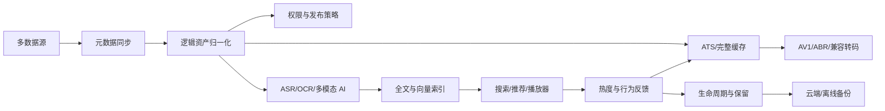

## 3. V1 核心对象

| 对象 | 含义 |
|---|---|
| `Asset` | 用户认知中的同一个逻辑内容 |
| `SourceObject` | 某数据源中的文件或对象 |
| `AssetVersion` | 内容发生变化后的版本 |
| `Rendition` | 原始、AV1、ABR、字幕、缩略图等表现 |
| `Replica` | 某版本或表现的实际物理副本 |
| `DerivedArtifact` | AI、OCR、ASR、Embedding 等衍生资产 |
| `Task` | 平台统一任务视图 |
| `WorkflowExecution` | Temporal 长任务执行实例 |
| `PolicyVersion` | 生命周期、公开、转码和 AI 规则版本 |
| `CredentialReference` | 指向 OpenBao/Vault 的凭据引用 |

## 4. 架构结论

### 控制面

采用 Java 17、Spring Boot 3 模块化单体。理由：

- 当前用户规模较小，核心复杂度来自后台任务和数据治理，而非 API 水平吞吐；
- 单人审查需要降低分布式事务和多仓库协调成本；
- 模块边界与 Schema 所有权预先建立，后续可按压力拆分；
- 核心权限、资产、策略、审计和配置需要统一事务边界。

### 执行面

采用独立 Python/FastAPI 能力服务和 Temporal Worker：

- 媒体处理；
- ASR；
- OCR；
- 多模态模型；
- Embedding/Reranker；
- 图像生成；
- 安全扫描；
- 数据源连接器。

### 边缘媒体

浪潮服务器上的 Arc A380 Media Worker 承担：

- AV1 离线编码；
- 源格式不兼容时的临时 H.264；
- 关键帧和缩略图；
- 媒体探测；
- 部分 VMAF/质量任务。

A380 与 ESXi 6.7 的直通兼容性属于阻断性 POC。

## 5. 关键非功能目标

| 项目 | 目标 |
|---|---|
| 核心恢复 | 单服务/单 VM 故障目标 1 小时内恢复 |
| 当前 HA | 单物理主机不承诺物理高可用 |
| 数据 RPO | 关键数据库尽量接近实时；按类型分级 |
| 缓存 RPO | ATS 和普通缓存可重建 |
| 安全水位 | TrueNAS 保留至少 500GB 绝对安全空间 |
| API | 版本化、幂等、契约测试、Trace ID |
| 任务 | 可暂停、恢复、取消、重试和追踪 |
| 权限 | 搜索召回前过滤，衍生资产继承 |
| 供应链 | SBOM、许可证、Digest、签名、验签 |
| 开发治理 | Agent 实现，自动化门禁，单人审查 |

## 6. V1 范围

V1 纳入：

- 8 类数据源；
- 全部配置中心页面；
- 完整播放器能力；
- 全部确认的 AI 流水线；
- OpenSearch、Milvus 和混合检索；
- LiteFlow、Temporal；
- GitOps、监控、告警、备份、恢复；
- 插件和部署 Profile；
- 中英文 API 与开发者文档。

V1 不设置对外 Beta。研发阶段可使用 POC、Alpha、RC 标签，但正式 V1 前所有能力必须通过生产门禁。

## 7. 最大风险

1. 目标范围远超单人传统开发容量；
2. ESXi 6.7 和 A380 的硬件兼容性未验证；
3. 百度云接入受官方能力、授权和配额限制；
4. 700TB 规模的文件数量可能导致元数据和扫描压力远超容量估计；
5. 所有 AI 能力生产级意味着需要长期样本集、评测和回归体系；
6. 单机 Temporal、PostgreSQL、TrueNAS 仍存在宿主机级单点；
7. 公网管理员密码登录增加安全风险；
8. 云盘不是天然可靠的备份故障域，需要验证和周期回读；
9. 全部能力一次性交付会使单人审查成为瓶颈。

## 8. 实施原则

必须按串行可验收里程碑推进：

```text
M0 POC
→ M1 资产与可播放闭环
→ M2 缓存和生命周期
→ M3 媒体与 AI
→ M4 检索与推荐
→ M5 配置中心与生产治理
→ V1 RC
→ V1 Production
```

任何后续里程碑不得以破坏前序生产闭环为代价。


---


# 01. 总体解决方案 / Overall Solution

## 1. 平台定义

归泽是一套面向海量多媒体的统一内容资产平台。它将分散在 WebDAV、本地文件系统、百度云、Google Drive、HTTP/HTTPS、S3、SMB/NFS、OneDrive 等来源中的文件，转换为统一的逻辑资产，并围绕这些资产提供：

- 多来源身份归一；
- 版本和副本管理；
- 按需播放与缓存；
- 标准化媒体编码；
- AI 内容理解；
- 统一检索和推荐；
- 权限、审计与治理；
- 生命周期、备份与恢复；
- 可视化配置和自动化部署。

## 2. 设计原则

### 2.1 元数据优先，不全量搬迁

远程内容首先建立元数据索引。只有在播放、AI、转码、固定缓存、长期保留或备份需要时，才读取完整内容。

### 2.2 逻辑身份与物理位置解耦

同一个内容可以存在多个来源、版本、表现和副本。路径、文件名和来源都不是资产唯一身份。

### 2.3 缓存与保留解耦

- ATS：可重建 HTTP 分片缓存；
- 完整文件缓存：可淘汰的完整文件；
- 正式副本：经过校验的长期保留；
- 备份：用于灾难恢复的独立故障域副本。

### 2.4 在线链路优先

用户在线播放、首帧和必要回源为最高优先级。离线 AI、索引、转码和维护不得影响在线播放。

### 2.5 AI 是可治理能力

所有 AI 结果必须关联：

- 输入资产和版本；
- 模型和模型版本；
- Prompt/处理模板；
- 参数；
- 执行节点；
- 质量指标；
- 人工修订；
- 发布时间和权限。

### 2.6 配置即受控资产

生命周期规则、公开策略、模型路由、转码参数和部署 Profile 都必须版本化、测试、审批、灰度和回滚。

## 3. 用户角色

| 角色 | 主要能力 |
|---|---|
| 匿名用户 | 访问管理员公开且符合安全策略的媒体 |
| 普通用户 | 浏览授权资产、播放、搜索、保存进度 |
| 数据源所有者 | 管理自己的私人数据源和授权 |
| 内容管理员 | 管理资产、标签、版本、公开和保留 |
| AI/媒体管理员 | 管理模型、Prompt、转码和流水线 |
| 运维管理员 | 管理 Worker、部署、监控、备份和恢复 |
| 安全管理员 | 管理权限、安全策略、Secrets 引用和审计 |
| 超级管理员 | 灾难恢复和平台根级操作 |

## 4. 端到端场景

### 4.1 数据源接入

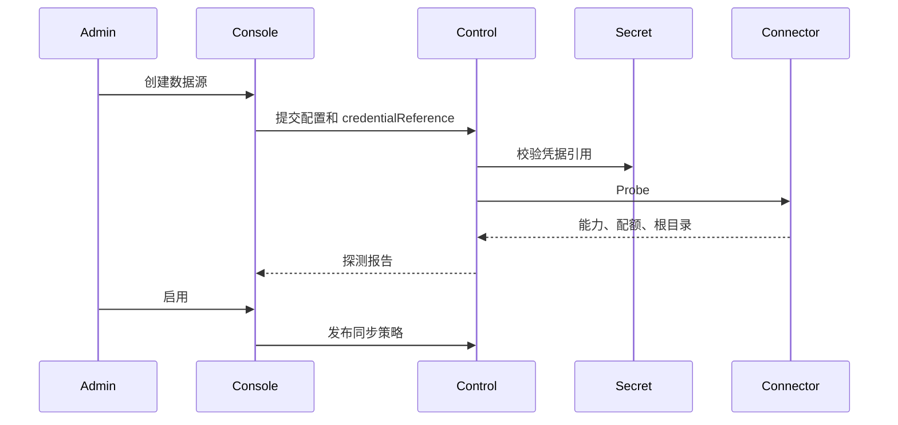

### 4.2 播放

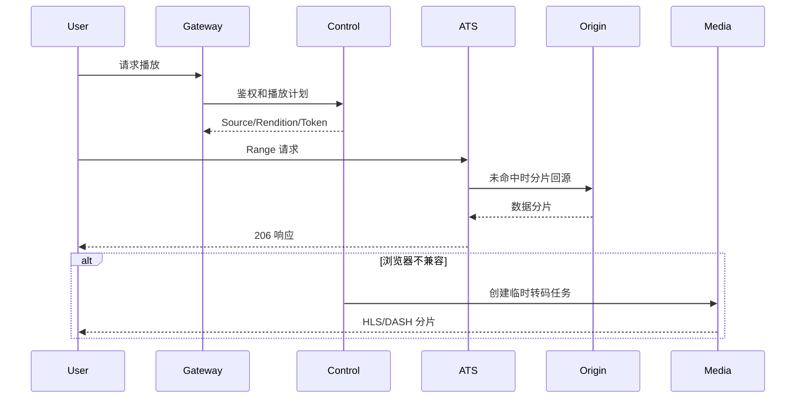

### 4.3 AI 加工

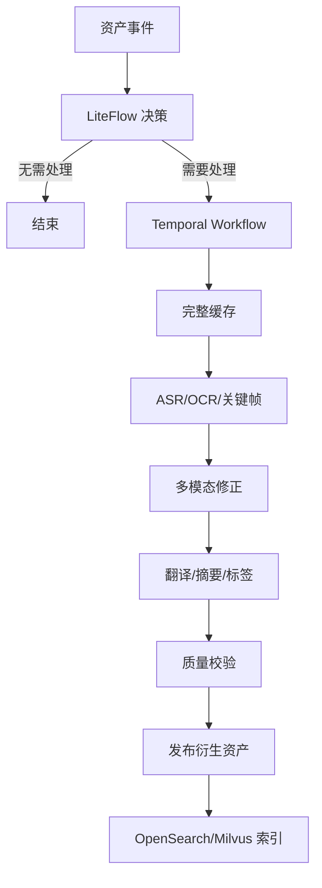

## 5. 核心能力域

### 5.1 身份与权限

- 用户、角色、组、ACL；
- 本地账号、Passkey；
- 管理员公网密码登录及补偿控制；
- 匿名与登录访问隔离；
- 高风险操作二次确认；
- 权限前置检索过滤。

### 5.2 数据源与同步

- 连接器注册；
- 凭据引用；
- 能力探测；
- 增量同步；
- Webhook/事件；
- 按需刷新；
- 自适应频率；
- 递归扫描、检查点和限速。

### 5.3 资产目录

- 资产归一；
- 来源映射；
- 内容版本；
- 重复组；
- 路径历史；
- 人工合并和拆分；
- 来源删除与可恢复状态。

### 5.4 缓存与存储

- ATS Range/Slice；
- 完整文件缓存；
- 固定缓存；
- 正式副本；
- 热温冷超冷；
- 500GB 安全水位；
- 流量预算；
- 云恢复成本控制。

### 5.5 媒体

- ffprobe；
- 源格式直接播放；
- AV1 Master；
- AV1 ABR；
- HLS/DASH；
- 临时 H.264；
- 字幕、多音轨、章节；
- 关键帧和缩略图；
- 质量验证。

### 5.6 AI

- ASR；
- WhisperX；
- 说话人分离；
- OCR；
- 多模态字幕修正；
- 翻译；
- 文件名翻译；
- 摘要和标签；
- 文本/图像/多模态 Embedding；
- 真实和生成式缩略图；
- 本地与商业 API 混合路由。

### 5.7 搜索与推荐

- PostgreSQL FTS 和 `pg_trgm`；
- OpenSearch 关键词、聚合和混合检索；
- Milvus 多向量检索；
- Reranker；
- 以文搜视频；
- 以图搜图；
- 相关内容和行为推荐。

### 5.8 规则与任务

- 决策表；
- JSON/YAML DSL；
- LiteFlow Chain；
- Temporal Workflow；
- 任务优先级 P0～P8；
- 预算、暂停、恢复、取消；
- 模拟、灰度、审批和回滚。

## 6. 系统成功标准

归泽 V1 只有在以下闭环全部成立时才能正式发布：

1. 至少全部确认数据源通过生产验收；
2. 逻辑资产模型在移动、重命名、版本和重复场景下稳定；
3. 在线观看在缓存命中、未命中和转码回退下可用；
4. 500GB 水位和流量预算可阻止后台任务；
5. AI 流水线有固定样本、指标和人工抽检；
6. 搜索权限不泄露无权资产；
7. 规则、配置和部署均可回滚；
8. PostgreSQL、Secrets、长期保留资产完成恢复演练；
9. SWR 镜像、离线包和部署过程可验签；
10. 所有 Agent 修改具备测试和证据。


---


# 02. 需求、范围与约束 / Requirements and Scope

## 1. 目标

### G-01 统一接入

统一接入异构远程、本地、对象和共享存储来源，并在不全量复制内容的前提下建立可搜索的资产目录。

### G-02 统一资产

把同一内容在不同来源、路径、文件名、编码和清晰度下的实体归并为可治理的逻辑资产。

### G-03 按需访问

通过 Range 回源、ATS 缓存、完整缓存和兼容转码，提供低等待的在线播放和预览。

### G-04 智能理解

对音视频、图片和文档生成字幕、OCR、摘要、标签、翻译、Embedding 和缩略图。

### G-05 可持续存储

通过热温冷超冷生命周期、长期保留和多故障域备份控制本地容量及恢复风险。

### G-06 生产治理

所有配置、规则、模型、任务、部署和数据变化可追溯、可验证、可审计、可回滚。

## 2. 非目标

V1 不以以下目标作为系统定位：

- 不替代底层云盘、NAS 或对象存储；
- 不把所有远程文件复制到本地；
- 不建设传统企业 BPM 审批平台；
- 不允许用户任意在线编辑 Temporal Workflow 代码；
- 不让插件直接操作核心数据库；
- 不把 AI 输出直接视为权威事实；
- 不依赖单一商业 AI 或单一云存储；
- 不承诺当前单物理宿主机实现真正高可用；
- 不通过中英文双路由、双字段制造两套机器契约；
- 不以 POC 代码直接作为 V1 生产实现。

## 3. V1 功能范围

### 数据源

按验收顺序：

1. 标准 WebDAV；
2. 本地文件系统；
3. 百度云；
4. Google Drive；
5. HTTP/HTTPS；
6. S3；
7. SMB/NFS；
8. OneDrive。

AList/OpenList 通过 WebDAV 兼容插件接入，不开发专有 API 连接器。

### 播放器

- AV1；
- 源格式兼容播放；
- A380 临时 H.264；
- HLS/DASH ABR；
- 0.5x～3x；
- 多字幕；
- 双语字幕；
- 匿名 localStorage 进度；
- 登录用户跨设备进度；
- 章节和时间轴缩略图；
- 画中画；
- 移动端适配。

### AI

全部纳入：

- ASR；
- 时间轴对齐；
- 说话人分离；
- 关键帧；
- OCR；
- 多模态字幕修正；
- 字幕翻译；
- 文件名翻译；
- 摘要；
- 标签；
- 真实关键帧缩略图；
- 生成式缩略图；
- 文本 Embedding；
- 图像/多模态 Embedding；
- OpenSearch；
- Milvus；
- 相似推荐。

### 配置中心

全部页面纳入：

- 总览；
- 数据源；
- 资产和版本；
- 缓存和生命周期；
- ATS 和公网入口；
- 媒体；
- AI；
- Prompt 和流水线；
- 搜索；
- Worker；
- 用户权限；
- 规则和流程；
- 任务；
- 监控告警；
- 配置审批；
- 备份恢复；
- Secrets；
- 审计；
- AI 配置助手。

## 4. 规模与环境约束

| 约束 | 当前基线 |
|---|---|
| 远程数据总量 | 约 700TB，实际文件数待探测 |
| 活跃用户 | 预计少于 10 人，含匿名访问 |
| 主宿主机 | 浪潮 5212 |
| 虚拟化 | ESXi 6.7 |
| 存储 | TrueNAS VM，通过 iSCSI 等方式提供数据集 |
| 边缘 GPU | Intel Arc A380，待验证直通 |
| AI GPU | 远程双 RTX 3090，另有 RTX 4060 闲时节点 |
| 公网 | IPv6/DDNS、高端口 HTTPS、可能使用 Tunnel/CDN |
| 本地空间 | 必须保留至少 500GB 安全空间 |
| 开发人员 | Agent 主开发，一人审查和发布 |

## 5. 生产级定义

每项能力必须同时满足：

1. API/事件契约稳定且版本化；
2. 权限和 Secrets 边界完整；
3. 成功和失败路径有测试；
4. 状态可观测；
5. 配置可回滚；
6. 数据迁移可验证；
7. 长任务幂等、可恢复；
8. 日志和审计完整；
9. 许可证和 SBOM 已审查；
10. 性能达到明确验收目标；
11. 备份和恢复路径存在；
12. 不影响核心浏览与播放。

## 6. 可用性和恢复

### 可用性

- 当前单宿主机不承诺硬件高可用；
- 单服务故障目标 5～15 分钟恢复；
- 单 VM 故障目标 30～60 分钟；
- 核心浏览和播放目标 1 小时内恢复；
- 物理主机和存储池故障按灾难恢复处理。

### RPO

按数据类型分级：

- 用户、权限、资产和配置：15 分钟到 1 小时；
- 数据库尽量接近实时 WAL；
- 正式副本完成确认后不允许静默丢失；
- ATS、普通缓存和临时分片可重建。

## 7. 任务优先级

```text
P0 在线播放和必要回源
P1 用户主动冷恢复
P2 用户主动转码/字幕/AI
P3 热门 AV1/ABR 预生成
P4 长期保留基础 AI
P5 索引和 Embedding
P6 普通离线 AV1
P7 批量 AI
P8 压缩、重复校验和后台维护
```

## 8. 语言要求

- URL、字段、枚举和错误码：英文机器标识；
- OpenAPI：中英文标题、说明和示例；
- 开发者文档：中英文；
- UI：V1 开始国际化；
- AI 配置解释：默认中文；
- 底层日志和错误码：英文；
- 前端错误信息：按客户端语言返回。

## 9. 强制治理

所有实现必须满足 `AGENTS.md` 和 Never Rules。V1 需求冻结后，任何范围或关键技术边界变化必须通过 ADR 和变更审批。


---


# 03. 系统架构设计 / System Architecture

## 1. 架构总览

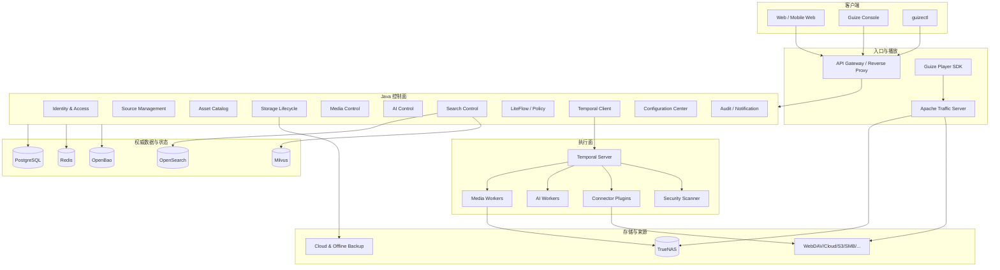

## 2. 分层

### 接入层

- API Gateway；
- Web/API 反向代理；
- 独立管理域名；
- ATS；
- 速率限制；
- WAF；
- 媒体签名 URL；
- SSE/WebSocket 入口。

### 控制层

权威业务决策，负责：

- 身份和权限；
- 资产归一；
- 版本和副本状态；
- 生命周期；
- 任务和策略；
- 配置发布；
- 审计；
- 对外 API。

### 编排层

- LiteFlow：同步决策与轻量编排；
- Temporal：长时间、可重试、可恢复 Workflow；
- PostgreSQL Outbox：业务事件可靠发布。

### 执行层

无权直接修改核心数据库，执行：

- 数据源读取；
- 下载；
- 转码；
- ASR/OCR；
- AI；
- 搜索索引；
- 安全扫描；
- 备份和恢复。

### 数据层

- PostgreSQL：权威关系和业务状态；
- Redis：短期锁、会话、限流和进度缓冲；
- OpenSearch：关键词、聚合、全文和混合搜索；
- Milvus：向量和多向量相似检索；
- OpenBao：Secrets 和密钥；
- TrueNAS：本地文件、副本、缓存和工作空间。

## 3. Java 模块化单体

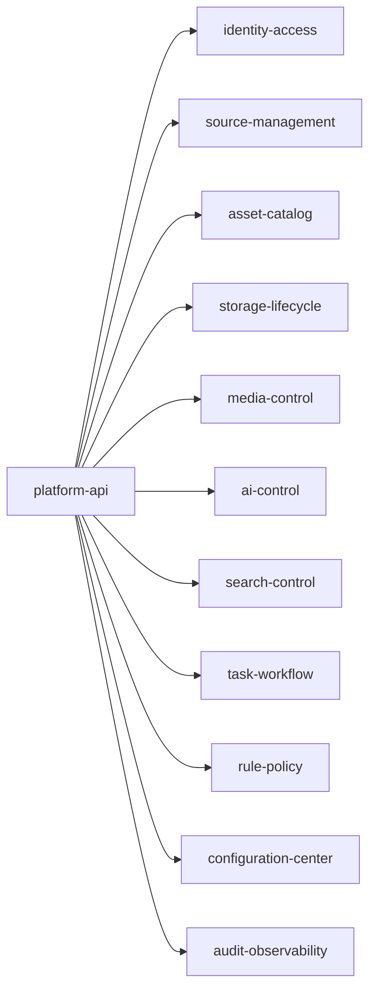

### 模块通信规则

- 只能调用公开 Application Service；
- 不能访问其他模块 Repository；
- 不能直接依赖其他模块 JPA Entity；
- 跨模块写操作通过公开命令接口或领域事件；
- 跨模块只读可使用显式 Query API；
- 每个模块拥有表、迁移和事件定义；
- 共享基础设施只提供技术能力，不承载业务规则。

## 4. Python 服务

逻辑服务：

| 服务 | 职责 |
|---|---|
| `guize-media-service` | ffprobe、FFmpeg、AV1、ABR、转码 |
| `guize-asr-service` | ASR、WhisperX、说话人分离 |
| `guize-vision-language-service` | 多模态理解、字幕修正、摘要 |
| `guize-ocr-service` | 图片、文档、帧 OCR |
| `guize-embedding-service` | 文本、图像、多模态 Embedding |
| `guize-reranker-service` | 检索重排 |
| `guize-image-service` | 真实/生成式缩略图 |
| `guize-ai-gateway` | Provider 路由、预算、协议归一 |
| `guize-worker-agent` | Worker 注册、资源和任务租约 |

部署时可根据 GPU 和依赖合并，但 API 和代码边界保持独立。

## 5. 通信

| 场景 | 协议 |
|---|---|
| 外部业务 API | REST |
| 内部同步调用 | REST |
| AI 流式输出 | SSE |
| 管理端实时状态 | WebSocket |
| 媒体数据 | HTTP Range、HLS、DASH |
| 长任务 | Temporal |
| 业务事件 | PostgreSQL Outbox |
| 监控 | Prometheus scrape / OTLP |
| Secrets | OpenBao API，经服务身份访问 |

## 6. 故障隔离

### 控制面故障

- 已签名播放 URL 在有效期内继续工作；
- ATS 已缓存内容继续服务；
- 新任务、权限变化和进度同步暂停；
- 恢复后根据任务和事件状态继续。

### Temporal 故障

- 浏览、搜索和已缓存播放不受影响；
- 新长任务暂停；
- 已登记 Workflow 在恢复后继续或重试；
- 不允许绕过 Temporal 直接运行不可追踪长任务。

### OpenSearch/Milvus 故障

- 资产目录和直接访问仍可用；
- 搜索降级到 PostgreSQL 基础检索；
- 索引通过 Outbox 和重建任务恢复。

### Worker 故障

- Lease 到期后重新调度；
- 临时文件由清理任务处理；
- 任务必须依据幂等键复用已完成产物；
- 不得因 Worker 离线把结果标记成功。

## 7. 后续拆分条件

只有当出现独立扩容、故障隔离、发布周期、合规边界或团队边界需求时，才从模块化单体拆出服务。首批候选：

- 搜索控制；
- 任务聚合；
- 公网播放授权；
- 通知；
- 数据源同步调度。

拆分前必须新增 ADR，明确数据所有权、事务、事件一致性和回滚。


---


# 04. 部署拓扑设计 / Deployment Topology

## 1. 当前物理拓扑

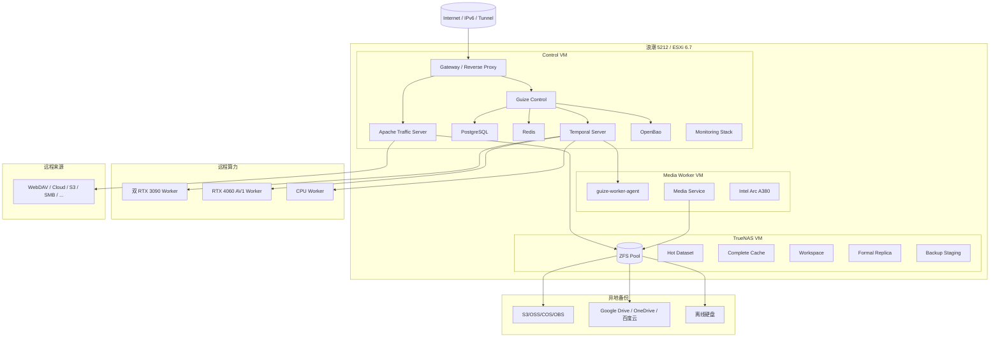

## 2. 网络分区

| 网络 | 允许内容 |
|---|---|
| Public Edge | Gateway、ATS 必需端口 |
| Management | 管理域名、SSH/Ansible、监控 |
| Control Internal | Java、PostgreSQL、Redis、Temporal、OpenBao |
| Storage | TrueNAS iSCSI/NFS/SMB，仅内部 |
| Worker Overlay | Worker 主动连接、TLS 或加密覆盖网络 |
| Backup Egress | 指定云存储和对象存储出口 |

PostgreSQL、Redis、Temporal 和 OpenBao不得暴露到公网。

## 3. VM 资源建议

以下为起始估算，必须由 POC 和实际负载修订。

### Control VM

- 8～16 vCPU；
- 24～48GB RAM；
- 系统盘与数据库盘分离；
- PostgreSQL 使用低延迟持久盘；
- ATS 缓存目录根据内存和磁盘评估；
- 预留 OpenSearch/Milvus 独立节点迁移路径。

### TrueNAS VM

- 内存优先；
- HBA/磁盘直通按 TrueNAS 推荐；
- 数据集按用途独立；
- 快照、配额和保留策略分开；
- 禁止让 ATS 原始缓存语义污染正式 ZFS 数据集。

### Media Worker VM

- 8～16 vCPU；
- 16～32GB RAM；
- A380 PCIe 直通；
- 本地临时工作盘或 TrueNAS 专用工作数据集；
- Intel 驱动、oneVPL/VAAPI/QSV 组合由 POC 固化；
- GPU 重置失败必须能重启 VM 并恢复任务。

## 4. TrueNAS 数据集

```text
guize/
├── formal/              正式副本
├── cache/complete/      普通完整缓存
├── workspace/media/     媒体临时工作区
├── workspace/ai/        AI 临时工作区
├── derivatives/         字幕、缩略图等正式衍生文件
├── database-backup/     数据库备份暂存
├── backup-staging/      云端上传暂存
└── quarantine/          安全隔离
```

### 强制水位

- 绝对安全水位：500GB；
- 预警水位：建议 1TB 或容量百分比，取更严格者；
- 达到预警：暂停 P6～P8；
- 接近绝对水位：停止非必要下载和转码；
- 低于绝对水位：只允许清理、恢复和核心播放。

## 5. 部署 Profile

| Profile | 部署位置 |
|---|---|
| `single-node-demo` | 开发/演示机 |
| `control-plane` | Control VM |
| `edge-media-a380` | Media Worker VM |
| `ai-worker-nvidia` | 双 3090 |
| `av1-worker-ada` | RTX 4060 |
| `cpu-worker` | 低成本 CPU 节点 |
| `search-node` | 后续独立搜索节点 |
| `observability-node` | 可观测性节点 |
| `single-site-full` | 单站点整合 |
| `distributed-full` | 多站点完整部署 |
| `custom` | 配置中心生成 |

## 6. 一键部署

`guizectl` 和 Guize Console 共用 Profile Schema：

```text
配置选择
→ 主机探测
→ 依赖检查
→ 风险解释
→ Bundle 生成
→ 签名和哈希验证
→ Ansible 部署或仅导出
→ 健康检查
→ 观察窗口
→ 确认或回滚
```

部署前检查：

- CPU、内存、磁盘；
- GPU、驱动和编码能力；
- 网络、DNS、端口；
- TrueNAS/iSCSI；
- Secrets；
- 镜像 Digest 和签名；
- PostgreSQL/Flyway；
- 许可证和 SBOM；
- 资源估算；
- AI 中文修复建议。

## 7. 当前单点

V1 当前存在：

- 浪潮物理主机；
- TrueNAS 存储池；
- Control VM；
- 单节点 PostgreSQL；
- 单节点 Temporal；
- OpenBao；
- 主公网链路。

这些单点通过自动恢复、备份和恢复手册治理，不伪装为高可用。后续新增第二宿主机后，再规划：

- PostgreSQL 主备；
- Temporal 多服务节点；
- OpenBao HA；
- ATS 多节点；
- TrueNAS 复制；
- Gateway 浮动入口。


---


# 05. 领域与数据模型 / Domain and Data Model

## 1. 模型目标

数据模型必须支持：

- 同一内容分布在多个来源；
- 路径移动和重命名；
- 内容变更形成版本；
- 不同编码和清晰度属于不同 Rendition；
- 同一 Rendition 存在多个物理副本；
- 来源删除不等于资产删除；
- 缓存、保留和备份状态分离；
- 权限、审计和 AI 结果可追溯；
- 700TB 级远程数据只保存元数据也能运行。

## 2. 资产聚合模型

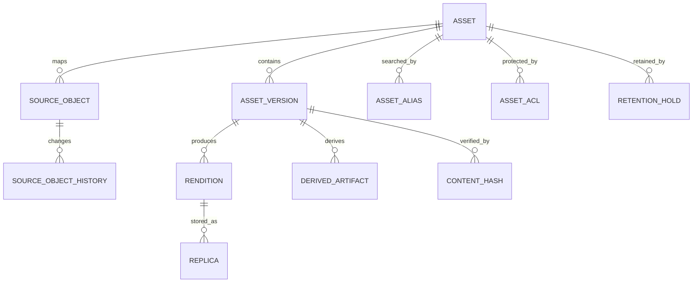

## 3. 核心实体

### 3.1 Asset

表示用户认知中的同一内容。

关键字段：

```text
id
asset_type
canonical_title
description
current_version_id
duplicate_group_id
visibility_status
lifecycle_status
security_status
created_at
updated_at
version
```

`Asset` 不保存某个来源的路径作为身份。

### 3.2 SourceObject

表示数据源中的实际对象。

```text
id
asset_id
data_source_id
provider_object_id
parent_provider_object_id
current_path
current_filename
size_bytes
mime_declared
mime_detected
etag
provider_hash
modified_at
last_seen_at
sync_status
availability_status
metadata_json
```

唯一约束优先使用：

```text
(data_source_id, provider_object_id)
```

当来源不提供稳定 ID 时，使用内部生成 ID，并通过路径、元数据、抽样哈希和完整哈希推断变化。

### 3.3 SourceObjectHistory

记录：

- 创建；
- 重命名；
- 移动；
- 内容更新；
- 删除；
- 恢复；
- 合并；
- 拆分。

历史名称和路径进入搜索别名，但不作为当前展示名称。

### 3.4 AssetVersion

内容实际发生变化时创建。

```text
id
asset_id
version_number
origin_source_object_id
content_length
mime_type
hash_status
created_reason
supersedes_version_id
created_at
published_at
```

只移动或改名不创建新内容版本。

### 3.5 ContentHash

支持多个算法：

```text
id
asset_version_id
algorithm       SHA256 / BLAKE3 / SAMPLE_V1 / PROVIDER
hash_value
scope           FULL / SAMPLE / PROVIDER
verified_at
verified_by
```

完整哈希必须用于：

- 长期保留；
- 正式备份；
- 合并确认；
- 源文件删除前；
- 完整缓存后；
- 转码输入和输出确认。

### 3.6 Rendition

媒体或文档表现。

```text
id
asset_version_id
rendition_type
container
video_codec
audio_codec
width
height
bitrate
duration_ms
language
channel_layout
generation_profile_id
quality_status
publication_status
metadata_json
```

`rendition_type` 示例：

```text
SOURCE_ORIGINAL
AV1_MASTER
AV1_ABR
H264_TEMPORARY
AUDIO_TRACK
SUBTITLE
BILINGUAL_SUBTITLE
DOCUMENT_PREVIEW
THUMBNAIL_REAL
THUMBNAIL_GENERATED
```

### 3.7 Replica

表示某 Rendition 的物理副本。

```text
id
rendition_id
storage_backend_id
object_key
replica_class
replica_status
size_bytes
hash_algorithm
hash_value
verified_at
retention_until
last_accessed_at
```

分类：

```text
SOURCE
COMPLETE_CACHE
PINNED_CACHE
HOT_FORMAL
COLD_CLOUD
ARCHIVE
OFFLINE_BACKUP
QUARANTINE
```

### 3.8 DerivedArtifact

用于结构化 AI 结果。

```text
id
asset_version_id
artifact_type
model_id
model_version
prompt_version
pipeline_version
language
confidence
quality_status
publication_status
content_reference
structured_payload
created_at
```

人工修订必须创建修订版本，不覆盖原始 AI 输出。

## 4. 其他实体

### DataSource

- 类型；
- 所有者；
- 公共/私人；
- CredentialReference；
- 同步策略；
- 能力；
- 限流和预算；
- 健康状态。

### StorageBackend

- TrueNAS 数据集；
- S3/OSS/COS/OBS；
- Google Drive；
- OneDrive；
- 百度云；
- 离线介质；
- 存储等级；
- 成本和恢复特征。

### RetentionPolicy / RetentionHold

策略决定自动生命周期，Hold 是高优先级人工或合规固定。Hold 不被普通淘汰策略覆盖。

### Task / WorkflowExecution

`Task` 是用户和控制面的统一状态；`WorkflowExecution` 保存 Temporal 标识和运行历史映射。

### PolicyDefinition / PolicyVersion

规则定义和发布版本分离。执行结果记录使用的具体版本。

## 5. 资产归一化

### 候选生成

```text
相同提供方 ID
或
相同完整哈希
或
大小 + MIME + 文件名 + 时间相似
或
相同抽样哈希
```

### 合并规则

完整哈希相同仅证明内容一致，不自动覆盖：

- 来源；
- 路径；
- 名称；
- ACL；
- 标签；
- 生命周期；
- 所有者。

用户可以拒绝逻辑合并，但系统保留 `duplicate_group_id` 以复用存储和加工结果。

### 移动/重命名置信度

| 条件 | 置信度 |
|---|---|
| 稳定 ID 相同、哈希相同 | 高 |
| 完整哈希相同、旧对象消失、新对象出现 | 高 |
| 抽样哈希相同、大小相同 | 中 |
| 名称和大小相似 | 低，人工确认 |

## 6. 删除状态

```text
SOURCE_OBJECT_DELETED
ALL_SOURCES_UNAVAILABLE
SOURCE_DELETED_BUT_RECOVERABLE
METADATA_ONLY_LOST_CONTENT
```

只有所有来源和所有正式副本均不可用时，才可判定正文无法恢复。

## 7. Schema 所有权

建议按 PostgreSQL Schema 划分：

```text
iam
source
asset
storage
media
ai
search
task
policy
config
audit
outbox
```

模块只拥有自己的表和迁移。跨域外键可谨慎使用；跨域行为必须经过模块接口。

## 8. 乐观锁与审计

关键聚合使用版本号：

```text
version bigint
```

所有高风险变化写入不可变审计：

- 操作者；
- 请求来源；
- 旧值摘要；
- 新值摘要；
- 原因；
- Trace ID；
- 关联任务；
- 审批记录。

## 9. 索引策略

必须索引：

- 来源稳定 ID；
- 当前路径；
- 文件名；
- 哈希；
- `asset_id`；
- `current_version_id`；
- 副本状态；
- 生命周期状态；
- `last_seen_at`；
- 任务状态和优先级；
- ACL 主体。

大表按实际规模评估时间或来源分区，不能在未测量文件数量前过早固定分区方案。


---


# 06. API 与事件契约 / API and Event Contracts

## 1. 契约原则

- 外部和内部 API 均版本化；
- URL 使用 `/api/v1`；
- 字段、枚举和错误码使用英文唯一机器标识；
- 所有 OpenAPI 内容提供中英文说明；
- 长任务立即返回 `taskId`；
- 每个写操作支持幂等；
- 每个响应包含 `traceId`；
- 破坏性变更增加主版本或兼容层；
- 契约文件进入 Git 并执行兼容性测试。

## 2. 通用响应

成功：

```json
{
  "code": "SUCCESS",
  "message": "操作成功。",
  "data": {},
  "traceId": "01J..."
}
```

失败：

```json
{
  "code": "ASSET_ACCESS_DENIED",
  "message": "无权访问该资产。",
  "details": {
    "assetId": "ast_..."
  },
  "traceId": "01J..."
}
```

客户端通过 `Accept-Language` 选择 `message`，不得依赖 `message` 判断错误类型。

## 3. 资源命名

示例：

```text
/api/v1/data-sources
/api/v1/assets
/api/v1/assets/{assetId}/versions
/api/v1/assets/{assetId}/renditions
/api/v1/tasks
/api/v1/policies
/api/v1/workers
/api/v1/deployment-profiles
```

## 4. 长任务

创建：

```http
POST /api/v1/assets/{assetId}/transcode
Idempotency-Key: 77a...
```

响应：

```json
{
  "code": "ACCEPTED",
  "message": "任务已创建。",
  "data": {
    "taskId": "tsk_...",
    "status": "QUEUED",
    "statusUrl": "/api/v1/tasks/tsk_..."
  },
  "traceId": "01J..."
}
```

任务操作：

```text
POST /api/v1/tasks/{id}:pause
POST /api/v1/tasks/{id}:resume
POST /api/v1/tasks/{id}:cancel
POST /api/v1/tasks/{id}:retry
PATCH /api/v1/tasks/{id}/priority
GET /api/v1/tasks/{id}/events
```

## 5. 任务状态

```text
CREATED
QUEUED
DISPATCHING
RUNNING
PAUSING
PAUSED
WAITING_RESOURCE
WAITING_BUDGET
WAITING_APPROVAL
RETRYING
SUCCEEDED
PARTIAL_SUCCESS
FAILED
CANCELLED
```

状态变更必须符合状态机，禁止任意跳转。

## 6. SSE

用于：

- AI 流式结果；
- ASR 分段结果；
- 任务事件；
- 配置助手；
- 只读日志流。

事件格式：

```text
event: task.progress
id: 284
data: {"taskId":"tsk_...","progress":42,"stage":"TRANSCODING"}
```

支持 `Last-Event-ID` 恢复。SSE 仅传递状态和小型结果，不传递媒体正文。

## 7. WebSocket

用于：

- 管理端实时任务；
- Worker 在线状态；
- 告警推送；
- 播放质量指标；
- 临时转码会话。

WebSocket 会话必须鉴权、限流、心跳和断线恢复。

## 8. Webhook

Webhook 配置包括：

```text
endpoint
secretReference
eventTypes
retryPolicy
timeout
enabled
```

发送内容必须签名，消费者必须幂等。失败进入重试和死信视图。

## 9. 事件 Envelope

```json
{
  "eventId": "evt_...",
  "eventType": "asset.version.created",
  "eventVersion": 1,
  "aggregateType": "Asset",
  "aggregateId": "ast_...",
  "occurredAt": "2026-07-21T00:00:00Z",
  "producer": "guize-control",
  "traceId": "01J...",
  "payload": {}
}
```

## 10. Outbox

业务事务中同时写入：

- 业务表；
- Outbox 记录。

Dispatcher 读取后发布给：

- OpenSearch 索引器；
- Milvus 索引器；
- 通知服务；
- 审计派生处理；
- 推荐特征处理。

消费者按 `eventId` 去重，不能假设 exactly-once。

## 11. API 双语扩展

OpenAPI 使用：

```yaml
title: Asset ID
description: Unique identifier of the logical asset.
x-i18n:
  zh-CN:
    title: 资产 ID
    description: 逻辑资产的唯一标识。
  en-US:
    title: Asset ID
    description: Unique identifier of the logical asset.
```

开发者门户展示双语，不生成中文字段副本。

## 12. 兼容策略

- 新增可选字段：兼容；
- 新增枚举：客户端必须容忍未知枚举；
- 删除/重命名字段：破坏性；
- 改变字段语义：破坏性；
- 调整错误码：破坏性；
- 改变默认行为：需弃用通知和兼容期；
- Event payload 变化：增加 `eventVersion`。

## 13. 错误码域

```text
AUTH_*
ACCESS_*
SOURCE_*
ASSET_*
CACHE_*
STORAGE_*
MEDIA_*
AI_*
SEARCH_*
TASK_*
POLICY_*
DEPLOYMENT_*
SECURITY_*
BACKUP_*
INTERNAL_*
```

错误码必须有：

- 中英文说明；
- HTTP 状态；
- 是否可重试；
- 建议动作；
- 告警级别；
- 文档链接。

## 14. 契约门禁

每个 PR 检查：

- OpenAPI 语法；
- 破坏性变化；
- 示例可执行；
- 中英文说明完整；
- DTO 与 Schema 一致；
- Consumer-driven contract；
- Event Schema；
- 幂等和错误码；
- Trace ID；
- 权限声明。


---


# 07. 数据源连接器设计 / Source Connectors

## 1. 目标

连接器将不同来源归一为统一的只读或受控写入能力，不把提供方差异泄露到资产核心。

统一能力：

```text
probe
authenticate
list
stat
readRange
readFull
getDownloadUrl
getChangeCursor
listChanges
subscribeEvents
getProviderHash
getVersion
```

## 2. 插件模型

所有连接器使用独立插件 Manifest：

```yaml
apiVersion: guize.plugin/v1
kind: SourceConnector
metadata:
  id: source-webdav
  version: 1.0.0
spec:
  capabilities:
    - LIST
    - STAT
    - RANGE_READ
    - FULL_READ
  credentialTypes:
    - BASIC
    - BEARER
  runtime:
    mode: EXTERNAL_SERVICE
    healthEndpoint: /health
```

连接器不得：

- 直连核心数据库；
- 自行改变资产身份；
- 自行公开文件；
- 保存凭据明文；
- 无限重试；
- 忽略数据源预算。

## 3. 验收顺序

1. 标准 WebDAV；
2. 本地文件系统；
3. 百度云；
4. Google Drive；
5. HTTP/HTTPS；
6. S3；
7. SMB/NFS；
8. OneDrive。

## 4. 标准 WebDAV

必须验证：

- PROPFIND 分页或大目录行为；
- Range；
- 重定向；
- ETag；
- Unicode 文件名；
- 路径编码；
- 认证；
- 超时；
- 大文件；
- 移动和重命名识别。

AList/OpenList 仅通过 WebDAV 兼容插件接入。兼容插件处理版本差异，但对核心暴露标准接口。

## 5. 本地文件系统

必须限制根目录，防止路径穿越和软链接逃逸。

支持：

- 文件监听作为优化；
- 定期扫描作为最终一致性保障；
- inode/文件 ID 辅助识别；
- Range；
- 原子读取；
- 网络挂载异常处理。

不得让连接器拥有任意系统路径访问权限。

## 6. 百度云

最终技术路径由 POC 决定，候选包括：

- 官方开放平台/API；
- 受支持的第三方授权方式；
- 通过 WebDAV 聚合层；
- 作为冷存储的受控外部上传。

POC 必须验证：

- 合法授权；
- API 稳定性；
- 文件列表；
- 大文件读取；
- Range 或临时 URL；
- 配额和限流；
- 版本和删除；
- 商业/个人使用条款；
- 可持续维护性。

若无法满足生产级条件，V1 不得用不稳定私有接口冒充正式连接器；必须调整产品接入方式并新增 ADR。

## 7. Google Drive

重点：

- OAuth；
- Refresh Token；
- 稳定文件 ID；
- Change API；
- Shortcut；
- Shared Drive；
- 下载限制；
- Google 文档原生格式导出；
- API 配额；
- 版本历史；
- 权限和用户撤销。

## 8. HTTP/HTTPS

分为：

- 直接 URL；
- 可解析目录；
- Manifest；
- 受认证 URL。

安全要求：

- 防止 SSRF；
- 禁止访问受限内部网段，除非显式批准；
- 限制重定向；
- 限制协议；
- DNS 重绑定防护；
- Content-Length 和 Range 探测；
- URL Token 脱敏。

HTTP 目录不是统一标准，需要插件化解析器。

## 9. S3

支持：

- AWS S3；
- S3 兼容接口；
- 分页；
- ETag；
- Versioning；
- Range；
- Multipart；
- Glacier 类恢复状态；
- Prefix；
- 临时签名 URL；
- 对象锁和保留。

OSS/COS/OBS 可先使用兼容接口，厂商扩展后续独立 Adapter。

## 10. SMB/NFS

SMB/NFS 连接器运行在隔离容器或 Worker：

- 只挂载允许路径；
- 映射统一 UID/GID；
- 处理断开和重连；
- 避免阻塞控制面；
- 限制并发；
- 支持大目录检查点；
- 防止符号链接和路径逃逸。

## 11. OneDrive

重点：

- Microsoft OAuth；
- DriveItem ID；
- Delta Query；
- Shared Folder；
- 临时下载 URL；
- 限流；
- 版本；
- 用户撤销和租户策略。

## 12. 同步策略

默认：

```text
每日基线检查
+ 热门目录高频
+ 浏览时刷新
+ Webhook/Change 优先
+ AI/规则动态调整
```

递归扫描：

- 限速；
- 限并发；
- 可暂停；
- 检查点；
- 源站压力升高自动降速；
- 搜索可触发后台深层扫描；
- 管理员可手动完整扫描。

## 13. 能力探测

每个数据源启用前生成报告：

```text
认证状态
稳定 ID
列表能力
分页
Range
完整读取
变更游标
Webhook
提供方哈希
版本
限流
预计扫描成本
已知限制
```

平台根据能力选择策略，不假设所有来源一致。

## 14. 连接器生产验收

- Mock 测试；
- 真实账号集成；
- 大目录；
- 大文件；
- Unicode；
- 限流；
- 5xx；
- Token 失效；
- 删除和恢复；
- 路径移动；
- 断点；
- 权限；
- 流量统计；
- 长时间稳定性。


---


# 08. 缓存、存储与生命周期 / Cache and Storage Lifecycle

## 1. 四类存储语义

| 类型 | 是否完整 | 可淘汰 | 是否备份 | 责任 |
|---|---:|---:|---:|---|
| ATS 缓存 | 不保证 | 是 | 否 | HTTP/Range 加速 |
| 完整文件缓存 | 是 | 是 | 否 | 转码、AI、重复访问 |
| 正式副本 | 是 | 受策略控制 | 是/可 | 长期保留 |
| 灾备副本 | 是 | 严格控制 | 本身即备份 | 故障恢复 |

## 2. ATS

ATS 缓存：

- 视频 Range/Slice；
- 图片；
- 字幕；
- 文档预览；
- 公共静态结果。

ATS 状态不进入 Replica 的正式保留语义。缓存命中不表示拥有完整文件。

### 缓存键

必须包含影响正文的稳定因素：

```text
assetVersion / sourceVersion
rendition
range/slice
authorization scope
content negotiation
```

私人内容不能因错误缓存键泄露给其他用户。优先使用内部签名资源标识，而非直接把用户 Token 放入缓存键。

## 3. 完整缓存

状态：

```text
REMOTE_ONLY
DOWNLOAD_QUEUED
DOWNLOADING
COMPLETE_CACHE
PINNED_CACHE
VALIDATING
PROMOTING
FORMAL_REPLICA
EVICTING
EVICTED
```

默认 TTL：7 天，动态调整：

```text
基础 TTL
+ 热度
+ 回源成本
+ AI/转码复用价值
- 文件大小
- 存储压力
```

## 4. 热温冷超冷

### 热

- 高频播放；
- 本地正式副本；
- 已生成常用 ABR；
- 低延迟访问。

### 温

- 最近访问；
- 完整缓存；
- 可较快恢复；
- 部分 Rendition。

### 冷

- 云端完整副本；
- 本地只保留元数据和关键衍生物；
- 恢复需要时间和流量。

### 超冷

- 高压缩或归档；
- 离线硬盘；
- 对象归档层；
- 需要管理员恢复流程。

## 5. 提升为正式副本

触发：

- 用户固定；
- 长期保留策略；
- 源站不稳定；
- 热度持续；
- 回源成本高；
- AI/转码成本高；
- 来源准备删除。

流程：

```text
完整缓存
→ 完整哈希
→ 安全扫描
→ 存储空间预留
→ 复制到正式数据集
→ 回读/哈希验证
→ 创建 Replica
→ 事务发布
```

## 6. 淘汰

淘汰候选评分：

- 最近访问；
- 访问次数；
- 大小；
- 回源速度；
- 回源费用；
- 是否有其他可用副本；
- 是否有未完成任务；
- 是否处于删除保护期；
- 是否被固定；
- 存储水位。

淘汰服务只能操作缓存级副本，不能拥有正式副本删除权限。

## 7. 500GB 安全水位

建议水位：

```text
NORMAL
WARNING
CRITICAL
SAFETY_FLOOR
```

动作：

| 状态 | 行为 |
|---|---|
| NORMAL | 正常调度 |
| WARNING | 减少预热和 P6～P8 |
| CRITICAL | 停止普通离线任务，积极淘汰 |
| SAFETY_FLOOR | 只允许核心播放、清理和恢复 |

硬水位不可由 AI 自行突破。

## 8. 流量预算

对象：

- 数据源；
- 用户；
- 匿名池；
- Worker；
- FRP/Tunnel；
- 商业 API；
- 冷恢复；
- 云备份。

阈值：

- 软阈值：降速；
- 高阈值：停止后台任务；
- 硬阈值：只保留必要任务；
- 管理员可追加一次性额度；
- AI 只能建议，不突破硬限制。

## 9. 来源删除保护

来源对象删除时：

1. 标记来源不可用；
2. 检查其他来源；
3. 检查完整缓存；
4. 检查正式和备份副本；
5. 进入保护期；
6. 只有策略和审批允许时清理。

不得因同步发现“源站不存在”立即级联删除本地内容。

## 10. 多云备份

长期保留源文件目标：

- Google Drive；
- OneDrive；
- 百度云。

关键数据库、Secrets、AI 结果和 TrueNAS 关键数据：

- 后续 S3/OSS/COS/OBS；
- 离线硬盘。

每个副本必须有：

```text
UPLOADING
UPLOADED_UNVERIFIED
VERIFIED
DEGRADED
UNAVAILABLE
CORRUPTED
REPAIRING
```

上传成功不等于验证成功。必须进行大小校验、哈希或抽样回读。

## 11. 客户端加密

首期：

- 单一主密钥；
- 离线恢复副本；
- 分片；
- 断点续传；
- 内容哈希。

后续：

- 信封加密；
- 每对象/备份集 DEK；
- KEK 轮换；
- 主密钥和备份分离。

## 12. 生命周期决策

LiteFlow/决策表输入：

```text
asset type
size
heat
source cost
source reliability
available replicas
storage pressure
user hold
AI value
budget
security status
```

输出：

```text
cache TTL
download priority
transcode profile
formal retention
backup targets
migration action
deletion protection
```

所有决定记录策略版本和解释。


---


# 09. 媒体、AV1 与在线播放 / Media, AV1 and Streaming

## 1. 播放策略

播放计划按顺序选择：

```text
浏览器直接支持的已有 Rendition
→ AV1 直接播放
→ 已有 HLS/DASH ABR
→ A380 临时 H.264
→ 其他可用 Worker
→ 明确失败和修复建议
```

不为所有文件预先生成所有格式。

## 2. 媒体探测

`ffprobe` 结果记录：

- 容器；
- 视频/音频/字幕流；
- 编解码；
- Profile/Level；
- 分辨率；
- 帧率；
- 时长；
- HDR；
- 色彩；
- 音轨；
- 字幕；
- 旋转；
- 关键帧信息；
- 异常和可播放性。

探测结果关联源版本和工具版本。

## 3. AV1 标准化

### AV1 Master

目标：

- 长期存储；
- 高质量；
- 保留关键音轨和字幕；
- 作为后续 ABR 输入；
- 记录编码器、参数和质量。

### AV1 ABR

按实际内容和设备生成 Ladder，不固定所有档位。输入考虑：

- 源分辨率；
- 帧率；
- 内容复杂度；
- HDR；
- 目标设备；
- 带宽；
- 转码成本。

## 4. A380 角色

Arc A380 用于：

- AV1 硬件编码；
- H.264 兼容编码；
- 解码加速；
- 关键帧；
- 缩略图；
- 媒体预处理。

必须通过 POC 测试：

- ESXi 6.7 直通；
- 驱动；
- QSV/VAAPI/oneVPL；
- AV1 质量；
- 多并发；
- 首分片时间；
- GPU 重置；
- 长任务稳定性；
- 功耗和温度。

未通过 POC 前，不在文档中承诺性能数字。

## 5. 临时 H.264

只在客户端不支持现有 Rendition 时启用。

特点：

- P0/P2 高优先级；
- 边转边播；
- 临时分片；
- 任务结束后按 TTL 清理；
- 热度足够时可触发正式兼容 Rendition；
- 不自动作为长期保留。

## 6. HLS/DASH

Guize Player 支持：

- HLS；
- DASH；
- ABR；
- 多音轨；
- 多字幕；
- 双语字幕；
- 章节；
- 画中画；
- 移动端。

播放 Manifest 使用短期签名，避免暴露源站凭据。

## 7. ATS Range/Slice

ATS 负责：

- 缓存块对齐 Range；
- 减少重复回源；
- 热门片段加速；
- 分散大文件 IO；
- 统计字节命中率。

必须测试：

- 206；
- 200 回退；
- If-Range；
- ETag；
- 源内容变化；
- 缓存污染；
- 不同权限；
- 超大对象；
- 中断恢复。

## 8. 播放进度

匿名：

- localStorage；
- 不跨设备；
- 资产公开标识变更时迁移策略。

登录用户：

- PostgreSQL 权威；
- Redis 短期缓冲；
- 跨设备；
- 冲突按时间和播放位置策略合并。

记录：

```text
assetId
versionId
positionMs
durationMs
completed
lastPlayedAt
deviceId
```

## 9. 字幕

类型：

- 原始字幕；
- ASR 字幕；
- 对齐字幕；
- 修订字幕；
- 翻译字幕；
- 双语字幕。

每个字幕轨记录：

- 语言；
- 来源；
- 模型；
- 版本；
- 人工修订；
- 质量；
- 权限；
- 默认状态。

## 10. 缩略图和章节

真实缩略图来自源帧。生成式缩略图必须标注 `THUMBNAIL_GENERATED`，不可伪装为真实画面。

章节可以来自：

- 原字幕；
- ASR；
- 场景切分；
- 多模态模型；
- 人工修订。

## 11. 质量验证

媒体 Golden Sample：

- 不同容器；
- AV1/H.264/H.265；
- 可变帧率；
- HDR；
- 多音轨；
- 内挂字幕；
- 损坏文件；
- 超长视频；
- 竖屏；
- 高分辨率；
- 音频-only。

指标：

- VMAF/SSIM/PSNR 作为参考；
- 音画同步；
- 首帧；
- 缓冲；
- 编码速度；
- 文件大小；
- 浏览器兼容；
- 主观抽检。

## 12. 安全

- 限制 FFmpeg 协议；
- 禁止任意 URL；
- 受控临时目录；
- 资源限制；
- 超时；
- 恶意媒体和解析器隔离；
- 原始文件公开前执行类型和安全策略；
- 对匿名用户禁用高成本任务。


---


# 10. AI 与多模态流水线 / AI and Multimodal Pipeline

## 1. 总体原则

AI 能力全部纳入 V1，但不意味着每个资产执行全部模型。通过策略选择 Pipeline，并记录完整可追溯信息。

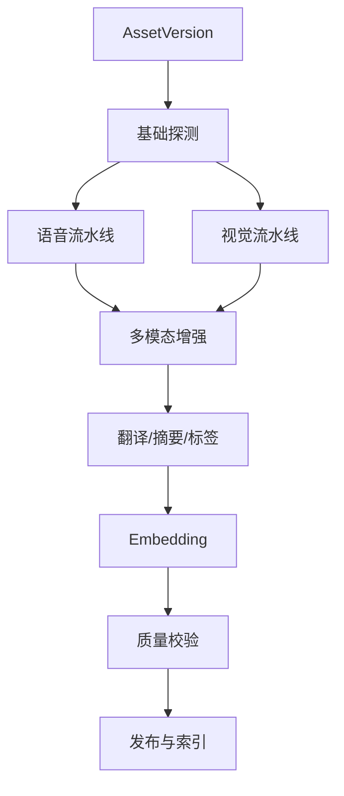

## 2. 统一 AI Provider

`guize-ai-gateway` 统一：

- 本地 OpenAI-compatible；
- 专用 FastAPI 服务；
- 商业 OpenAI-compatible；
- Provider 能力探测；
- 模型路由；
- Token/费用；
- 数据策略；
- 限流；
- 回退；
- 审计。

## 3. 语音流水线

### ASR

输出：

- 文字；
- 时间段；
- 语言；
- 置信度；
- 模型；
- 音频版本。

### WhisperX/对齐

修正词级或句级时间轴，保存原 ASR 与对齐结果。

### 说话人分离

输出 Speaker Segment，不直接把说话人身份写成真实姓名，除非有经过授权的身份映射。

## 4. 视觉流水线

- 场景切分；
- 关键帧；
- OCR；
- 人物/物体/场景描述；
- 真实缩略图评分；
- 多模态章节。

OCR 结果保留坐标、帧时间、置信度和模型版本。

## 5. 多模态字幕修正

输入：

- ASR；
- 关键帧；
- OCR；
- 文件名；
-已有标签；
- 专有词典。

输出必须区分：

- 原始识别；
- 模型建议；
- 已发布修订；
- 人工修订。

禁止无版本覆盖。

## 6. 翻译

- 文件名翻译；
- 字幕翻译；
- 双语字幕；
- 摘要翻译；
- 标签本地化。

翻译保留源语言、目标语言、模型、术语表、分段和版本。

## 7. 摘要和标签

摘要类型：

- 一句话；
- 短摘要；
- 长摘要；
- 章节摘要；
- 时间轴摘要。

标签来源：

- 规则；
- AI；
- 文件名；
- OCR；
- 人工。

标签必须标识来源和置信度，避免把推测当成事实。

## 8. 缩略图

### 真实关键帧

依据：

- 清晰度；
- 人脸/主体；
- 场景代表性；
- 文本遮挡；
- 重复度；
- 安全策略。

### 生成式

用于封面设计，不得替代真实缩略图。UI 必须明确“AI 生成”。

## 9. Embedding

类型：

- 文本；
- 字幕分块；
- 图片；
- 视频关键帧；
- 多模态；
- 标签/摘要。

记录：

```text
embeddingModel
modelVersion
dimension
normalization
chunkStrategy
sourceArtifactVersion
createdAt
```

模型版本不同的向量不应无标识混用。

## 10. AI 路由

决策输入：

- 内容类型；
- 语言；
-时长；
- 敏感级别；
- 本地资源；
- 队列；
- 预算；
-质量要求；
-数据能否外发。

输出：

- Provider；
- 模型；
- 参数；
- 并发；
-回退；
-是否人工抽检。

## 11. 任务幂等

AI 结果唯一键建议：

```text
assetVersion
artifactType
pipelineVersion
modelVersion
promptVersion
language
parameterHash
```

相同输入和配置不得重复产生昂贵任务，除非显式强制重跑。

## 12. 质量门禁

| 能力 | 指标 |
|---|---|
| ASR | WER、CER、时间轴偏移 |
| 分离 | DER |
| 翻译 | COMET、BLEU、人工评分 |
| OCR | 字符/字段准确率 |
| 摘要 | 事实一致性、覆盖率 |
| 标签 | Precision、Recall、F1 |
| Embedding | Recall@K、MRR、NDCG |
| Reranker | NDCG、MRR |
| 缩略图 | 代表性、清晰度、选择率 |
| 多模态修正 | 修正准确率、错误引入率 |

固定样本按语言、媒体类型和质量分层。模型、Prompt、分块或参数变更必须回归。

## 13. 人工修订

人工修订：

- 新建版本；
- 记录操作者；
- 记录差异；
- 防止 AI 自动覆盖；
- 可回退；
- 作为后续评测样本。

## 14. 安全和预算

- 商业 API 前执行数据策略；
- Token 和费用硬预算；
- 敏感资产默认本地处理；
- AI 不得扩大公开范围；
- 低置信度标记；
- 模型许可证审查；
- Prompt 注入和内容攻击防护；
- 输出 Schema 校验；
- 日志脱敏。


---


# 11. 搜索与推荐设计 / Search and Recommendation

## 1. 目标

归泽需要同时满足：

- 精确文件名和路径搜索；
- 模糊匹配；
- 字幕全文；
- OCR 文本；
- 标签和摘要；
- 条件筛选和聚合；
- 语义搜索；
- 以图搜图；
- 多模态相似；
- 相关内容推荐；
- 权限安全。

## 2. 三层检索

### PostgreSQL

承担：

- 权威资产查询；
- 精确 ID；
- 基础文件名；
- `pg_trgm` 模糊；
- 系统降级搜索；
- 权限关联。

### OpenSearch

承担：

- 多字段全文；
- 中文/英文分析；
- 路径和别名；
- 字幕、OCR、摘要；
- 标签；
- 聚合；
- 高亮；
- 关键词与语义混合搜索。

### Milvus

承担：

- 文本向量；
- 关键帧向量；
- 图像向量；
- 多模态向量；
- 多向量混合和相似度搜索。

## 3. 统一搜索流程

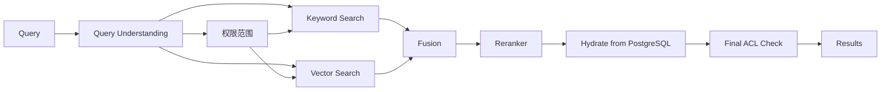

权限过滤尽可能在召回前生效，最终返回前再次校验。不得先返回无权资产标题或缩略图。

## 4. 索引文档

OpenSearch 文档示例：

```json
{
  "assetId": "ast_...",
  "versionId": "ver_...",
  "title": "...",
  "aliases": [],
  "paths": [],
  "description": "...",
  "subtitles": "...",
  "ocr": "...",
  "summary": "...",
  "tags": [],
  "languages": [],
  "media": {},
  "visibilityScope": [],
  "updatedAt": "..."
}
```

权威数据仍在 PostgreSQL。索引文档可重建。

## 5. 向量模型

每条向量必须记录：

```text
assetId
versionId
artifactId
vectorType
embeddingModel
modelVersion
dimension
chunkId/frameTime
permissionScopeVersion
```

模型升级时建立新索引/Collection 或显式版本字段，不能静默混合。

## 6. 混合检索

候选来源：

- BM25/关键词；
- dense vector；
- sparse vector；
- 图像向量；
- 标签；
- 行为热门；
- 最近访问。

融合：

- 加权归一；
- RRF；
- Reranker；
- 业务规则调整。

最终权重通过固定评测集和在线指标调整，不由 AI 未审批地直接发布。

## 7. Query Understanding

支持：

- 中英文；
- 文件类型；
- 时间；
- 分辨率；
- 人物/场景；
- 语言；
- 来源；
- 路径；
- 标签；
- “类似这个”；
- 图片查询。

LLM 可生成结构化查询草案，但必须经过 Schema 校验，不得直接拼接底层查询 DSL。

## 8. 索引同步

```text
业务事务
→ Outbox
→ 索引任务
→ OpenSearch/Milvus
→ 写入索引状态
```

状态：

```text
PENDING
INDEXING
INDEXED
STALE
FAILED
REBUILD_REQUIRED
```

删除资产访问权时，权限索引更新必须高优先级；必要时查询层回到 PostgreSQL 实时鉴权。

## 9. 重建

OpenSearch/Milvus 可重建。重建流程：

1. 创建新版本索引；
2. 从 PostgreSQL 和衍生资产读取；
3. 批量写入；
4. 运行完整性和权限抽检；
5. 切换 Alias；
6. 保留旧索引回滚；
7. 延迟删除。

## 10. 推荐

候选：

- 内容相似；
- 同目录/同系列；
- 标签；
- 用户历史；
- 热门；
- 未完成；
- 章节相关；
- 人工精选。

约束：

- 匿名与登录行为分离；
- 权限前置；
- 可关闭个性化；
- 不把敏感资产行为用于不当推断；
- 推荐解释可展示“相似内容”“同系列”等；
- 推荐失败不影响搜索和播放。

## 11. 评估

离线指标：

- Recall@K；
- Precision@K；
- MRR；
- NDCG；
- 权限泄漏率必须为 0；
- 无结果率；
- 查询延迟。

在线指标：

- 点击；
- 播放开始；
- 完成率；
- 搜索后退出；
- 结果改写；
- 推荐跳过。

所有质量趋势按模型、索引和权重版本保存。


---


# 12. 安全、身份与权限 / Security, Identity and Permissions

## 1. 安全原则

- 默认拒绝；
- 最小权限；
- 机器身份；
- Secrets 引用；
- 权限前置过滤；
- 衍生资产继承；
- 公网入口收敛；
- 高风险操作再次认证；
- 完整审计；
- 安全策略可版本化和回滚。

## 2. 身份认证

### 普通用户

- 用户名和密码；
- Passkey/WebAuthn；
- 可按策略选择登录方式。

### 管理员

已确认允许公网密码单独登录，但必须增加：

- 强密码；
- Argon2id；
- 新设备通知；
- 异常登录检测；
- 登录失败锁定；
- 短会话；
- 高风险操作再次认证；
- 可在配置中心完全关闭管理员密码登录。

Passkey 可用于无密码登录。

### 超级管理员

离线恢复密钥只用于灾难恢复：

- 不可日常登录；
- 使用后强制轮换；
- 使用全审计；
- 离线保管；
- 恢复后重新建立 Passkey。

## 3. 授权

模型：

```text
用户/组
+ 平台角色
+ 数据源所有权
+ 资产 ACL
+ 目录 ACL
+ 发布状态
+ 操作风险
= 最终权限
```

建议角色只授予能力，资产范围由 ACL 或 Scope 决定。

## 4. 数据源权限

### 管理员公共源

使用平台 ACL，不把服务账号的全部能力直接传递给普通用户。

### 用户私人源

- 默认仅本人；
- 用户显式共享；
- 撤销授权后停止同步；
- 管理员不能查看 Token 明文；
- 管理代理操作必须审计。

## 5. 衍生内容

以下继承原资产权限：

- 字幕；
- 翻译；
- 缩略图；
- 摘要；
- 标签；
- OCR；
- Embedding；
- 推荐关系；
- 搜索索引。

公开资产的部分衍生物可单独发布，但需要明确策略和审计。

## 6. 匿名访问

允许的前提：

- 管理员明确公开；
- 数据源可信；
- 媒体类型探测；
- 安全状态允许；
- 短期签名 URL；
- 限流和防盗链；
- 不触发冷恢复、转码、AI 或商业 API；
- 不泄露来源凭据和路径。

图片优先公开重新编码预览；文档优先公开安全预览；压缩包和可执行文件禁止匿名。

## 7. Secrets

业务数据库仅保存：

```text
credentialReference
provider
owner
scope
expiresAt
status
```

OpenBao/Vault 保存：

- 密码；
- OAuth Access/Refresh Token；
- 云密钥；
- Webhook Secret；
- 签名密钥；
- 备份密钥；
- 证书。

访问事件：

- 创建；
- 读取；
- 刷新；
- 撤销；
- 轮换；
- 管理代理；
- 失败。

## 8. 公网安全

- 统一 Gateway；
- WAF；
- IP/用户/Token 限流；
- 登录失败锁定；
- 短期媒体 URL；
- 防盗链；
- 管理域名独立；
- 管理入口不缓存媒体；
- 服务端口最小化；
- 漏洞扫描；
- 异常下载/扫描封禁；
- TLS；
- 安全 Header；
- CSRF/CORS 策略。

## 9. 文件安全

状态：

```text
SCAN_PENDING
SCAN_CLEAN
MIME_MISMATCH
MALWARE_SUSPECTED
MALWARE_CONFIRMED
ARCHIVE_UNSAFE
QUARANTINED
ADMIN_RELEASED
```

处理：

- 扩展名/MIME/魔数；
- 恶意软件；
- 解压大小；
- 递归；
- 路径穿越；
- 像素炸弹；
- 解析器超时；
- 隔离；
- 管理员释放。

默认不自动删除恶意内容，保留隔离、标记和审计。

## 10. SSRF 与连接器安全

HTTP/HTTPS Connector 必须：

- 阻止未授权内网地址；
- 限制重定向；
- DNS 重绑定防护；
- 协议白名单；
- 响应大小限制；
- 超时；
- 代理隔离；
- 凭据脱敏。

## 11. 高风险操作

必须再次认证、审批或明确确认：

- 修改管理员；
- 修改 ACL；
- 公开私人资产；
- 查看/修改 Secrets 引用；
- 删除正式副本；
- 修改安全水位；
- 关闭安全扫描；
- 数据库恢复；
- 导出敏感数据；
- 大规模冷恢复；
- 商业 API 批量外发。

## 12. 审计

审计记录不可由普通业务用户修改。记录：

- 谁；
- 何时；
- 从哪里；
- 对什么；
- 做了什么；
- 原因；
- 旧值/新值摘要；
- 结果；
- Trace ID；
- 审批；
- 关联任务。

长期审计可使用 append-only、哈希链或 WORM 备份增强防篡改。

## 13. 安全测试

- 越权；
- IDOR；
- 多租户/用户边界；
- 搜索泄漏；
- 签名 URL；
- SSRF；
- 路径穿越；
- 压缩炸弹；
- 恶意媒体；
- OAuth 撤销；
- Token 日志；
- 管理员密码攻击；
- Passkey 恢复；
- 插件逃逸；
- 备份解密；
- 镜像供应链。


---


# 13. 配置中心信息架构 / Configuration Center

## 1. 定位

Guize Console 不是单纯后台 CRUD，而是平台的：

- 资源管理面；
- 策略控制面；
- 任务和运行观测面；
- 变更审批面；
- 部署和恢复入口；
- AI 配置助手入口。

所有配置必须具备：

```text
Schema
草稿
验证
模拟
审批
灰度
发布
观察
回滚
审计
```

## 2. 导航结构

### 2.1 总览

- 系统健康；
- 存储水位；
- 数据源；
- ATS；
- 播放质量；
- Worker；
- 队列；
- AI 成本；
- 安全告警；
- 备份状态。

### 2.2 内容和数据源

- 数据源；
- 连接探测；
- 同步策略；
- 目录；
- 资产；
- 来源；
- 版本；
- 重复；
- 副本；
- 删除保护；
- 保留。

### 2.3 缓存和存储

- ATS；
- 完整缓存；
- 正式副本；
- TrueNAS；
- 热温冷超冷；
- 云存储；
- 水位；
- 淘汰；
- 恢复。

### 2.4 媒体

- FFmpeg；
- A380；
- AV1 Profile；
- ABR；
- 临时 H.264；
- 播放协议；
- 字幕；
- 音轨；
- 质量。

### 2.5 AI

- Provider；
- 模型；
- 路由；
- Prompt；
- ASR；
- OCR；
- 多模态；
- 翻译；
- 摘要；
- 标签；
- 缩略图；
- Embedding；
- 费用。

### 2.6 搜索

- PostgreSQL FTS；
- OpenSearch；
- Milvus；
- Reranker；
- 索引状态；
- 权重；
- 重建；
- 评测。

### 2.7 编排和任务

- LiteFlow Node；
- Chain；
- EL；
- 决策表；
- Temporal Workflow；
- 任务；
- 队列；
- Worker；
- 优先级；
- 预算；
- 模拟和灰度。

### 2.8 安全和治理

- 用户；
- 角色；
- ACL；
- Passkey；
- 密码策略；
- 公开策略；
- Secrets 引用；
- 文件安全；
- 审计；
- 审批；
- GitOps；
- 回滚。

### 2.9 运维

- 指标；
- 日志；
- Trace；
- 告警；
- 备份；
- 恢复；
- 演练；
- 升级；
- Deployment Profile；
- AI 运维助手。

## 3. 页面交互原则

### 复杂配置

- 表单由 JSON Schema/配置 Schema 驱动；
- 实时校验；
- 显示默认值来源；
- 显示影响范围；
- 显示预计资源和费用；
- 支持 YAML/JSON 高级视图；
- 支持 Diff；
- 不允许无确认覆盖。

### 高风险操作

- 二次认证；
- 影响预览；
- 审批；
- 延迟执行；
- 取消窗口；
- 回滚计划；
- 证据。

## 4. LiteFlow 页面

需要同时展示：

- 流程图；
- EL；
- Node 配置；
- Chain 版本；
- 输入/输出 Schema；
- 样本；
- 模拟；
- 执行轨迹；
- 冲突；
- 影响评估。

图形编辑与 EL 必须双向一致。高级用户可查看 EL，发布前必须解析、验证和测试。

## 5. Temporal 页面

允许：

- 查看 Workflow 类型；
- 创建；
- 查看历史；
- 暂停/恢复/取消；
- 重试；
- Activity；
- 超时；
- Search Attributes；
- 执行节点；
- 错误。

不允许网页任意修改 Workflow 实现代码。

## 6. 部署向导

流程：

```text
选择 Profile
→ 选择主机
→ 填写引用和网络
→ 运行探测
→ 查看 WARN/BLOCK
→ AI 中文解释
→ 生成 Bundle
→ 导出或 Ansible
→ 验证
→ 观察
→ 确认/回滚
```

## 7. 国际化

UI 从 V1 支持 i18n：

- 中文默认；
- 英文；
- 错误码映射；
- 枚举标签；
- OpenAPI 中英文；
- 时间、数字和容量本地化；
- 不能把中文作为持久化枚举值。

## 8. 前端 POC

Vue 3 和 React 使用同一场景比较：

- 百万级虚拟列表；
- 动态表单；
- 流程图；
- 决策表；
- 监控；
- SSE/WebSocket；
- 播放器；
- 移动端；
- 权限；
- 设计 Token。

最终只选一个主框架，管理端和用户端优先复用。播放器独立 SDK/Web Component。

## 9. AI 配置助手

可执行：

- 解释配置；
- 生成草案；
- 检查冲突；
- 估算容量；
- 生成验证步骤；
- 生成回滚；
- 分析异常。

不得直接：

- 发布高风险配置；
- 修改 Secrets；
- 删除数据；
- 扩大权限；
- 突破预算；
- 跳过审批。


---


# 14. 规则、LiteFlow 与 Temporal / Rules and Workflows

## 1. 职责分离

### LiteFlow

负责同步、快速、可解释的业务决策：

- 是否缓存；
- 缓存 TTL；
- 是否 AV1；
- Profile；
- 是否长期保留；
- AI 模型路由；
- 商业 API 允许；
- 优先级；
- 扫描频率；
- 流量策略；
- 公开策略。

### Temporal

负责长时间、可重试、可恢复执行：

- 下载；
- 冷恢复；
- 转码；
- ASR；
- OCR；
- 多模态；
- 翻译；
- Embedding；
- 索引；
- 备份；
- 哈希；
- 生命周期迁移；
- 灾难恢复操作。

LiteFlow 不直接运行长任务，Temporal 不替代业务决策表。

## 2. 规则定义

支持：

- JSON/YAML DSL；
- 决策表；
- LiteFlow EL；
- 可视化流程图；
- AI 草案。

规则对象：

```text
PolicyDefinition
PolicyVersion
PolicyTestCase
PolicyApproval
PolicyDeployment
PolicyExecutionTrace
```

## 3. 发布状态

```text
DRAFT
VALIDATING
TESTED
APPROVED
CANARY
PUBLISHED
DEPRECATED
ROLLED_BACK
```

## 4. 模拟

模拟不产生真实副作用，输出：

- 匹配资产数；
- 下载量；
- AV1 容量；
- GPU 时间；
- Token；
- 源站流量；
- 迁移；
- 删除候选；
- 权限变化；
- 冲突；
- 风险。

## 5. 灰度

维度：

- 数据源；
- 目录；
- 用户；
- 角色；
- 文件类型；
- 大小；
- 热度；
- Worker；
- 时间；
- 百分比。

## 6. 高风险规则

必须审批：

- 删除；
- 修改长期保留；
- 公开私人内容；
- 商业 API；
- 大规模恢复；
- 修改水位；
- 批量转码；
- 重建索引；
- 匿名访问。

## 7. LiteFlow 模型

### Node

单一、可测试、同步组件。输入输出明确，不保存隐式全局状态。

### Chain

由 EL 编排 Node 的可执行规则链。

### EL

描述执行关系，不承载 Node 内部业务实现。

配置中心以“Node 资源、Chain 资源、EL 版本、测试样本、发布状态”管理。

## 8. Temporal Workflow

示例：媒体标准化

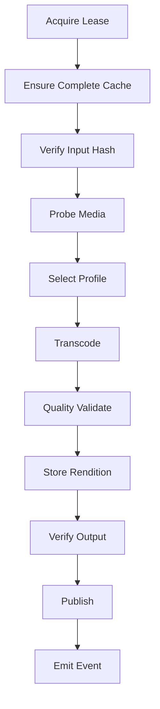

### Workflow 规则

- 确定性；
- 外部调用放 Activity；
- Activity 幂等；
- 心跳；
- 超时；
- 重试；
- 取消；
- 补偿；
- Search Attributes；
- 版本升级策略。

## 9. Task 与 Workflow

用户看到 `Task`，Temporal 是执行细节。

```text
Task
├── taskId
├── type
├── owner
├── priority
├── budget
├── status
└── workflowExecutionId
```

Temporal 故障时 Task 保持等待/未知执行状态，不伪造失败或成功。

## 10. Worker

Worker 主动拉取/连接：

- 独立身份；
- 短期令牌；
- TLS 可配置但公网强制；
- 能力；
- 时间窗口；
- 流量预算；
- 数据敏感级别；
- 资源；
- 租约。

普通用户只看到抽象执行位置；运维权限可查看具体节点。

## 11. Outbox 与 Workflow

领域事件可以触发 Workflow，但必须防止：

- 同一事件重复启动；
- Workflow 成功但业务发布失败；
- 业务已取消仍继续外部副作用。

使用业务幂等键、Workflow ID、状态对账任务和补偿策略。

## 12. 规则冲突

冲突类型：

- 同一条件不同动作；
- 生命周期与 Hold；
- 公共和私人策略；
- 预算与强制任务；
- 删除与备份；
- AI 路由与数据外发限制；
- 优先级循环。

冲突检测必须在发布前执行，并提供规则来源、优先级和解决建议。


---


# 15. 可观测性与运维 / Observability and Operations

## 1. 技术栈

- Prometheus；
- Grafana；
- Loki；
- OpenTelemetry Collector；
- Alertmanager；
- Node Exporter；
- cAdvisor；
- PostgreSQL Exporter；
- Blackbox Exporter；
- ATS 指标适配；
- Worker 指标。

## 2. 统一关联

所有请求、任务、事件和 Workflow 关联：

```text
traceId
requestId
taskId
workflowId
assetId
versionId
workerId
```

日志不得输出 Secret、Token、签名 URL 全文或敏感内容。

## 3. 指标域

### 平台

- API RPS；
- 延迟；
- 错误率；
- 活跃用户；
- 认证失败；
- DB 连接；
- Outbox 积压。

### 数据源

- 健康；
- 请求；
- 延迟；
- 429；
- 5xx；
- 配额；
- 扫描进度；
- 变化数量；
- 回源字节。

### ATS

- 对象命中率；
- 字节命中率；
- Range/Slice；
- 回源；
- 源站延迟；
- 淘汰；
- 磁盘；
- 错误。

### 存储

- ZFS 健康；
- 数据集容量；
- 500GB 水位；
- 增长；
- 预计写满时间；
- 缓存；
- 正式副本；
- 备份；
- SMART。

### 播放

- 首帧；
- 缓冲；
- 码率；
- ABR 切换；
- 失败；
- 临时转码等待；
- 匿名流量；
- 完成率。

### 媒体/AI

- 队列；
- 等待时间；
- FPS；
- GPU；
- 显存；
- ASR 实时倍率；
- Token；
- 费用；
- 质量；
- 人工退回；
- 低置信度。

## 4. 日志

结构化 JSON：

```json
{
  "timestamp": "...",
  "level": "INFO",
  "service": "guize-control",
  "traceId": "...",
  "taskId": "...",
  "message": "Task dispatched",
  "fields": {}
}
```

底层英文日志，Console 提供中文解释。

## 5. Trace

OpenTelemetry 覆盖：

- Gateway；
- Java 控制面；
- Connector；
- Python 能力；
- Temporal Activity；
- OpenSearch/Milvus；
- 对象存储。

大文件字节流不做逐块高开销 Trace，采用采样和指标。

## 6. 告警渠道

- 配置中心；
- Email；
- Telegram；
- 企业微信；
- Critical 多渠道。

## 7. 告警分级

| 级别 | 示例 | 动作 |
|---|---|---|
| Info | 扫描完成 | Console |
| Warning | 水位 80%、源站慢 | Console + Email |
| High | 备份失败、数据库异常 | Email + IM |
| Critical | 水位接近 500GB、存储降级 | 多渠道 |
| Emergency | 数据丢失/入侵 | 持续提醒直至确认 |

## 8. 告警治理

- 聚合；
- 去重；
- 静默；
- 维护窗口；
- 抑制；
- 根因关联；
- 升级；
- 确认；
- 处理记录；
- Runbook。

避免对无行动价值的指标告警。

## 9. AI 运维助手

输入：

- 指标；
- 日志；
- Trace；
- 配置版本；
- 最近发布；
- 容量趋势。

输出：

- 现象；
- 影响；
- 原因候选；
- 证据；
- 风险；
- 建议；
- 验证；
- 回滚。

AI 只能执行只读检查和低风险验证，不自动执行生产高风险修改。

## 10. SLO

初期建立：

- 核心 API；
- 播放授权；
- ATS；
- 首帧；
- 数据源同步；
- 任务排队；
- 数据库备份；
- 安全扫描。

物理单点导致的长时间故障必须在 SLO 报告中明确，不通过排除统计掩盖。

## 11. 容量预测

至少预测：

- ZFS；
- 缓存；
- 正式副本；
- 衍生物；
- PostgreSQL；
- OpenSearch；
- Milvus；
- 日志；
- 备份；
- 月度流量；
- GPU 队列；
- AI 费用。


---


# 16. 备份与灾难恢复 / Backup and Disaster Recovery

## 1. 目标

- 核心浏览和播放故障目标 1 小时恢复；
- 当前单物理主机不承诺硬件高可用；
- 数据按类型设定 RPO；
- ATS、普通缓存和索引可重建；
- 权威数据、Secrets、正式副本和人工修订必须恢复。

## 2. RPO

| 数据 | 目标 |
|---|---|
| 用户、角色、ACL | ≤15 分钟 |
| 资产和来源 | 15 分钟～1 小时 |
| 配置和审批 | 每次变更 |
| Secrets | 每次变更 |
| 播放进度 | ≤15 分钟 |
| 长期保留元数据 | ≤15 分钟 |
| 正式正文 | 副本确认后不可静默丢失 |
| AI/人工修订 | ≤1 小时 |
| OpenSearch/Milvus | 可重建 |
| ATS/普通缓存 | 可重建 |

## 3. 备份落点

| 数据 | 目标 |
|---|---|
| PostgreSQL/WAL | 后续 S3/OSS/COS/OBS + 离线硬盘 |
| 配置和 Git | 公网云服务器 + GitHub 私有仓库 + 加密 git bundle |
| Secrets | 后续对象存储 + 离线硬盘 |
| 长期保留源文件 | Google Drive + OneDrive + 百度云 |
| AI 字幕/摘要/人工修订 | 对象存储 + 离线硬盘 |
| TrueNAS 关键数据集 | 对象存储 + 离线硬盘 |

离线硬盘平时不持续连接。

## 4. PostgreSQL

- WAL 持续归档；
- 基础备份；
- 每日逻辑备份；
- 校验；
- PITR 演练；
- Flyway 版本记录；
- 备份前后一致性；
- 加密；
- 保留策略。

Temporal 使用独立数据库/用户，纳入备份。

## 5. Secrets

备份必须客户端加密。首期：

- 单一主密钥；
- 离线恢复副本；
- 与备份文件不只存于同一位置；
- 使用恢复演练确认可解密；
- 访问严格审计。

后续升级信封加密和密钥轮换。

## 6. 文件副本

长期文件不能只看“上传成功”。验证：

- 远端 ID；
- 大小；
- 哈希；
- 抽样回读；
- 周期复查；
- 故障域独立性。

同一聚合 WebDAV 下多个路径不等于多个故障域。

## 7. 恢复顺序

```text
R0 基础设施
R1 PostgreSQL、Secrets、配置、用户和资产
R2 Gateway、目录、ATS、基础搜索和播放
R3 Media Worker、转码和缩略图
R4 AI
R5 OpenSearch、Milvus、推荐
R6 后台扫描和维护
```

## 8. 故障类型

### 服务/容器

自动重启，目标 5～15 分钟。

### VM

重建或恢复，目标 30～60 分钟。

### 数据库逻辑故障

停止写入，选择 PITR 时间点，恢复、验证、切换。

### ESXi 故障

在新宿主恢复 VM 或通过部署 Bundle 重建。

### TrueNAS 池故障

从对象存储、云盘和离线介质恢复正式副本。恢复时间可能数小时到数天。

## 9. 恢复手册

必须包含：

1. 依赖清单；
2. 备份目录；
3. 密钥恢复；
4. PostgreSQL PITR；
5. TrueNAS；
6. Control VM；
7. A380 Worker；
8. OpenSearch/Milvus；
9. Worker 注册；
10. 证书和公网入口；
11. 验证清单；
12. 回滚；
13. 证据。

## 10. 演练

至少每季度：

- 随机 PostgreSQL 恢复；
- Secrets 恢复；
- 单文件云副本回读；
- Control Plane 重建；
- 索引重建；
- Worker 重注册；
- 签名和证书恢复。

每年或重大变更后进行完整站点恢复演练。

## 11. 恢复验证

恢复后必须验证：

- 用户和权限；
- 资产数量；
- 来源映射；
- 正式副本；
- 保留；
- 审计；
- 播放；
- AI 人工修订；
- Outbox；
- 任务；
- 索引一致性；
- Secrets 可用；
- 镜像签名。


---


# 17. DevOps、GitOps 与软件供应链 / DevOps, GitOps and Supply Chain

## 1. 仓库策略

- GitHub 私有仓库；
- 核心平台 Monorepo；
- 大型模型服务和特殊 Worker 可独立仓库；
- 统一模板、CI、版本和发布策略；
- 定期生成加密 `git bundle`；
- 上传云存储并写入离线硬盘；
- Git 中禁止任何 Secrets 明文。

## 2. 三态模型

```text
Git Desired State
配置中心审批状态
Runtime Observed State
```

任何漂移必须可见。运行时修改不得长期脱离 Git。

## 3. 变更流程

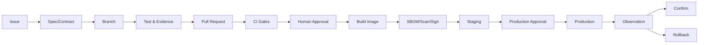

## 4. 环境

- Local；
- Staging：测试与预发布共享基础设施但逻辑隔离；
- Production。

同一发布候选从 Staging 晋升生产，不重新构建。

## 5. SWR

华为云 SWR 为主仓库。

生产部署依据：

```text
repository
tag for display
digest for identity
signature
SBOM
vulnerability result
```

固定 Digest，不依赖可变 Tag。

## 6. Cosign/签名

流程：

- CI 构建；
- 生成 SBOM；
- 漏洞扫描；
- 推送 SWR；
- 获取 Digest；
- 签名；
- 生成 `images.lock`；
- 发布审批；
- 部署验签；
- 离线包携带签名和哈希。

高危漏洞阻止生产部署，例外必须审批、限定期限和补偿措施。

## 7. SBOM 和许可证

每个版本记录：

- 组件；
- 版本；
- 许可证；
- 来源；
- 哈希；
- 漏洞；
- 模型许可证；
- 数据集许可证；
- 商业 API 条款；
- 容器基础镜像。

允许优先使用 Apache-2.0、MIT、BSD。未来可能商业化，所有依赖必须审查。

## 8. 发布审批

分别审批：

- 代码；
- 配置；
- 数据库迁移；
- 高风险插件；
- 权限策略；
- Secrets；
- 模型；
- Prompt；
- 部署 Profile。

CI 构建镜像，生产发布人工审批。

## 9. 数据库发布

- 迁移前备份；
- Flyway 校验；
- 在 Staging 执行；
- 回滚/恢复演练；
- Expand/Migrate/Contract；
- 应用与 Schema 兼容窗口；
- 观察指标；
- 失败自动停止发布。

## 10. Bundle Builder

`guizectl` 和 Console 生成：

```text
docker-compose.yml
Ansible
configs
schemas
migration
health-check
rollback
images.lock
SBOM
licenses
checksums
install scripts
```

支持离线包和远程 Ansible。

## 11. 升级

- 只提示，不自动升级所有组件；
- 固定版本；
- 测试环境验证；
- 蓝绿或滚动；
- 数据库备份；
- 自动回滚；
- AI 解释版本变化和风险；
- Temporal 升级遵循官方兼容和 Schema 顺序；
- 组件升级必须查看 ADR 和兼容矩阵。

## 12. 证据

每次发布保留：

- Git SHA；
- PR；
- Issue；
- 镜像 Digest；
- 签名验证；
- SBOM；
- 漏洞报告；
- 测试；
- 迁移；
- 配置 Diff；
- 审批；
- 观察；
- 回滚验证。

## 13. 供应链风险

- 依赖投毒；
- 被接管镜像；
- 可变 Tag；
- 未审查模型；
- 非商业许可证；
- 外部脚本；
- GitHub Action；
- 基础镜像；
- 插件；
- AI 生成依赖。

控制：

- 依赖锁；
- Digest；
- 签名；
- 最小权限 CI；
- Renovate/Dependabot 仅生成 PR；
- 可信构建；
- Secrets 隔离；
- 审批。


---


# 18. 测试与验收 / Testing and Acceptance

## 1. 原则

- 测试覆盖行为，不仅覆盖代码行；
- 成功和失败路径同等重要；
- 权限和数据完整性优先；
- POC 数据不能替代生产验收；
- Agent 说明不能替代证据；
- 主分支和发布必须通过门禁。

## 2. 测试层级

### 单元

- 领域规则；
- 状态机；
- 哈希和归一化；
- TTL；
- 权限；
- 预算；
- LiteFlow Node；
- DTO/Schema。

### 集成

- PostgreSQL；
- Flyway；
- Redis；
- OpenBao Stub/测试实例；
- Connector Mock；
- Temporal Test Server；
- ATS；
- OpenSearch；
- Milvus；
- 文件系统。

### 契约

- OpenAPI；
- Event Schema；
- Plugin Manifest；
- Deployment Profile；
- Provider API；
- Webhook。

### 端到端

- 数据源→资产→播放；
- 数据源→缓存→AI→搜索；
- 删除→保护→恢复；
- 规则→Workflow→副本；
- 权限→搜索→播放；
- 部署→升级→回滚。

## 3. PR 门禁

- 单元测试；
- 静态分析；
- 格式；
- Flyway 校验；
- OpenAPI 兼容；
- Event Schema；
- Manifest；
- Secrets 扫描；
- SBOM；
- 许可证；
- 关键权限；
- 文档链接。

## 4. 主分支门禁

增加：

- PostgreSQL 集成；
- Connector 模拟；
- Temporal；
- LiteFlow；
- 缓存一致性；
- 媒体 Golden Sample；
- AI 固定样本；
- 容器漏洞。

## 5. 发布候选

- E2E；
- 性能；
- 压力；
- 故障注入；
- 数据恢复；
- 数据库迁移/回滚；
- GPU；
- 云盘限流；
- 安全；
- 签名；
- 离线部署；
- 恢复演练。

## 6. 关键验收矩阵

| 能力 | 验收 |
|---|---|
| 资产归一 | 移动、改名、版本、重复、合并、拆分 |
| 权限 | 无标题/摘要/缩略图泄漏 |
| ATS | Range 命中、源更新、权限隔离 |
| 完整缓存 | 断点、哈希、水位、淘汰 |
| AV1 | 兼容、质量、重试、产物追踪 |
| 临时转码 | 首分片、取消、清理、抢占 |
| AI | 固定样本、指标、人工抽检 |
| 搜索 | 相关性、权限、重建、降级 |
| 规则 | 模拟、冲突、灰度、回滚 |
| Temporal | 幂等、重试、取消、Worker 离线 |
| 备份 | 实际恢复，不只检查文件存在 |
| 部署 | Bundle、验签、回滚、离线 |

## 7. AI 质量

按能力使用：

- WER/CER；
- DER；
- COMET/BLEU；
- OCR 字符/字段准确率；
- 摘要事实一致性；
- 标签 F1；
- Recall@K/MRR/NDCG；
- 缩略图人工选择率；
- 多模态修正错误引入率。

必须按语言、媒体质量、时长、场景分层。

## 8. 性能测试

### API

- 并发；
- P95/P99；
- 大分页；
- 权限过滤；
- Outbox。

### 元数据

- 100万/1000万级模拟对象；
- 目录深度；
- 扫描检查点；
- 增量；
- 数据库增长。

### 播放

- 首帧；
- Range；
- 热/冷；
- 多用户；
- 源站慢；
- A380。

### 搜索

- 索引规模；
- Query 延迟；
- 混合；
- 权限；
- 重建。

### AI

- 队列；
- GPU；
- 批处理；
- Token；
- 超时；
- 回退。

不在实测前填写承诺性数字。

## 9. 故障注入

- Connector 429/5xx；
- 网络中断；
- Worker 消失；
- Temporal 重启；
- PostgreSQL 主动终止连接；
- Redis 清空；
- OpenSearch/Milvus 不可用；
- ATS 磁盘满；
- TrueNAS 水位；
- GPU OOM/重置；
- 云备份失败。

## 10. 安全测试

- SAST；
- DAST；
- 依赖漏洞；
- 容器；
- Secrets；
- SSRF；
- 路径；
- 压缩；
- IDOR；
- ACL；
- 签名 URL；
- OAuth；
- Webhook；
- 镜像签名；
- 备份解密。

## 11. V1 退出标准

全部成立：

1. 所有范围能力通过验收；
2. 无 Critical/High 未处理漏洞，或有批准例外；
3. 数据库和 Secrets 恢复成功；
4. 关键文件副本回读；
5. 核心播放链路稳定；
6. 权限泄漏率 0；
7. AI 指标达到已批准阈值；
8. 文档和 Runbook 完整；
9. 镜像和 Bundle 可验证；
10. 单人审查者签署发布。


---


# 19. 风险、假设与 POC / Risks, Assumptions and POC

## 1. 阻断性 POC

### POC-01 A380 直通

验证：

- 浪潮 5212 BIOS；
- IOMMU Group；
- Above 4G；
- Resizable BAR；
- ESXi 6.7 PCI Passthrough；
- VM 启动；
- 驱动；
- GPU 重置；
- 宿主重启；
- 多日稳定。

失败替代：

- 裸机 Media Worker；
- 升级虚拟化；
- 更换 GPU；
- 独立小型媒体主机。

### POC-02 编码

验证：

- AV1；
- H.264；
- 解码；
- 并发；
- 首分片；
- 质量；
- 稳定；
- 功耗；
- 长视频；
- 错误恢复。

### POC-03 ATS

验证：

- Slice；
- Range；
- ETag；
- If-Range；
- 超大对象；
- 源更新；
- 权限缓存键；
- 断流；
- 命中率；
- 磁盘。

### POC-04 TrueNAS

验证：

- iSCSI；
- VM 吞吐；
- 延迟；
- ZFS；
- 快照；
- 多任务；
- 水位；
- 断开；
- 恢复。

### POC-05 700TB 元数据

必须先探测：

- 文件数；
- 目录数；
- 深度；
- 平均文件大小；
- 名称；
- 变更频率；
- 提供方；
- Range；
- ETag；
- API 配额。

### POC-06 百度云

确定合法、稳定、可维护的生产接入方式。

### POC-07 公网

- IPv6；
- 高端口；
- TLS；
- DDNS；
- Tunnel/CDN；
- Range；
- 大文件；
- 匿名；
- 限流。

### POC-08 前端

Vue/React 对比。

### POC-09 AI

质量、成本、隐私、模型许可证和硬件吞吐。

### POC-10 恢复

PostgreSQL、OpenBao、文件和部署 Bundle。

## 2. 主要风险

| 风险 | 影响 | 缓解 |
|---|---|---|
| 范围过大 | 交付失败 | 串行里程碑、严格门禁 |
| 单人审查 | 瓶颈 | 自动化证据、限制并行 |
| A380 不兼容 | 媒体方案阻断 | POC、替代拓扑 |
| 百度云不稳定 | 连接器不达标 | 官方方式/调整接入 |
| 文件数巨大 | 数据库和扫描压力 | 探测、分区、增量 |
| 单宿主机 | 长停机 | 备份、Bundle、恢复 |
| 公网密码管理员 | 攻击面 | 异常检测、二次认证 |
| 云盘备份 | 故障域不独立 | 多云、离线、回读 |
| AI 全能力生产级 | 质量成本高 | 样本集、分层、路由 |
| ATS 权限缓存 | 数据泄漏 | 内部资源 ID、测试 |
| Temporal 单节点 | 后台暂停 | 核心播放解耦、恢复 |
| OpenSearch/Milvus | 资源重 | 延迟启用、独立 Profile |

## 3. 假设

- 活跃用户少于 10；
- 在线播放并发较低；
- 700TB 多数内容为冷数据；
- 远程来源允许合法读取；
- TrueNAS 有足够独立数据集；
- 远程 Worker 能主动连接；
- GitHub 和 SWR 可用；
- 一人能持续审查；
- V1 周期未固定，以门禁而非日期发布。

假设变化必须更新设计。

## 4. 风险登记

每项风险记录：

```text
ID
描述
概率
影响
触发器
负责人
缓解
应急
状态
证据
```

## 5. POC 输出

每个 POC 必须输出：

- 环境；
- 配置；
- 样本；
- 命令；
- 原始数据；
- 结果；
-限制；
- 失败；
- 结论；
- 推荐；
- ADR；
- 可复现脚本。

不得只输出截图或口头结论。


---


# 20. 路线图与 WBS / Roadmap and Work Breakdown Structure

## 1. 实施模式

开发由 Codex、Trae Solo/Work 等 Agent 完成，一人审查、部署和发布。必须限制同时进行的工作包。

建议：

- 同时最多 1 个高风险工作包；
- 或最多 2～3 个完全独立低风险工作包；
- 每个工作包 1～5 天内形成可审查增量；
- 不以日期替代门禁；
- 未完成前序基础设施，不并行铺开上层能力。

## 2. 阶段

### M0 规格、Harness 与 POC

交付：

- 仓库；
- AGENTS；
- Never Rules；
- CI；
- 契约校验；
- Testcontainers；
- POC；
- ADR；
- 样本和证据框架。

退出条件：

- A380、ATS、TrueNAS、百度云路径有明确结论；
- 核心契约可生成；
- Agent 任务模板可运行；
- CI 门禁可阻止违规。

### M1 资产与可播放闭环

工作包：

1. IAM；
2. Source Connector SDK；
3. WebDAV；
4. Asset/Source/Version；
5. 权限；
6. ATS；
7. 播放授权；
8. Guize Player 原型；
9. 任务；
10. 审计。

退出：

```text
接入 WebDAV
→ 浏览
→ 资产归一
→ 鉴权
→ Range 播放
→ 进度
→ 监控
```

### M2 缓存和生命周期

- 完整缓存；
- 哈希；
- Replica；
- 水位；
- 淘汰；
- 保留；
- 多云副本；
- 删除保护；
- 流量预算；
- 本地/S3/HTTP Connector。

### M3 媒体与 AI

- Media Service；
- A380；
- AV1；
- ABR；
- 临时 H.264；
- ASR；
- WhisperX；
- 分离；
- OCR；
- 关键帧；
- 多模态；
- 翻译；
- 摘要；
- 标签；
- 缩略图。

### M4 搜索与推荐

- PostgreSQL FTS；
- OpenSearch；
- Milvus；
- Embedding；
- Reranker；
- 混合；
- 权限；
- 推荐；
- 评测；
- 重建。

### M5 完整控制面和运维

- 全配置中心；
- LiteFlow；
- Temporal UI；
- Deployment Builder；
- Worker；
- GitOps；
- 可观测性；
- 告警；
- Secrets；
- 备份；
- 恢复；
- 供应链；
- 全连接器。

### M6 RC 与生产

- 全量回归；
- 性能；
- 故障；
- 安全；
- 恢复；
- 文档；
- 培训；
- 运行观察；
- 发布签署。

## 3. 关键依赖

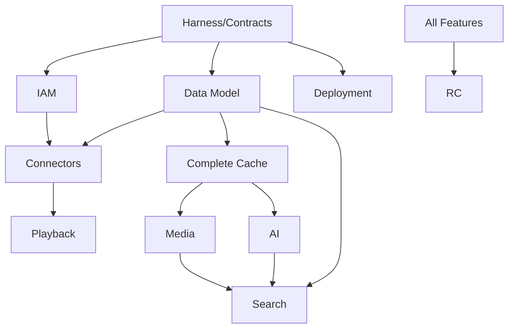

## 4. WBS 示例

| WBS | 工作包 | 输出 | 依赖 |
|---|---|---|---|
| 0.1 | 仓库初始化 | Monorepo、模板 | 无 |
| 0.2 | Harness | 测试/证据框架 | 0.1 |
| 0.3 | API/事件基线 | Schema | 0.1 |
| 0.4 | A380 POC | ADR | 无 |
| 0.5 | ATS POC | 配置/结果 | 无 |
| 1.1 | IAM | 用户、角色、ACL | 0.2 |
| 1.2 | Asset 模型 | 表、迁移、服务 | 0.3 |
| 1.3 | Connector SDK | Manifest/API | 0.3 |
| 1.4 | WebDAV | 生产连接器 | 1.3 |
| 1.5 | 同步器 | 增量/检查点 | 1.2/1.4 |
| 1.6 | 播放授权 | 签名 URL | 1.1/1.2 |
| 1.7 | ATS 集成 | Range/Slice | 0.5/1.6 |
| 2.1 | Cache Manager | 状态机 | 1.2 |
| 2.2 | Hash | BLAKE3/SHA | 2.1 |
| 2.3 | Replica | 正式副本 | 2.1 |
| 2.4 | 水位 | 调度阻断 | 2.1 |
| 3.1 | Media Service | API | 0.4/2.1 |
| 3.2 | AV1 | Profile/Workflow | 3.1 |
| 3.3 | Temporary H264 | 在线回退 | 3.1 |
| 3.4 | ASR | Service/Workflow | 2.1 |
| 4.1 | OpenSearch | 索引 | 1.2 |
| 4.2 | Milvus | 向量 | 3.4 |
| 4.3 | Unified Search | 融合/Rerank | 4.1/4.2 |
| 5.1 | Config Center | 页面框架 | 1.x |
| 5.2 | LiteFlow | 规则 | 2.x |
| 5.3 | Temporal Ops | 任务管理 | 3.x |
| 5.4 | guizectl | Bundle | 0.2 |
| 5.5 | Backup/DR | 演练 | 2.x/5.4 |

## 5. Agent 任务循环

```text
Issue
→ Spec
→ Contract
→ Branch
→ Implement
→ Test
→ Evidence
→ Agent self-review
→ Human review
→ Merge
→ Staging
```

## 6. 审查容量控制

单人审查应重点检查：

- 规格和契约；
- 领域边界；
- 安全；
- 迁移；
- 测试；
- 证据；
- 回滚。

避免让 Agent 一次生成跨 10 个模块的大 PR。

## 7. 计划度量

- Lead Time；
- PR 大小；
- 审查等待；
- 门禁失败；
- 回滚；
- 缺陷逃逸；
- Never Rule 新增；
- POC 假设推翻；
- 自动测试覆盖的验收标准比例；
- 人工审查时间。

## 8. 发布原则

无固定截止日期时，V1 以生产门禁为准。若必须限制周期，应先削减范围或改变“全部生产级”，不得通过跳过测试和恢复来压缩。


---


# 21. Low Level Design

## 1. 文档目的

本 LLD 将冻结的总体架构落到模块、端口、表、状态机、接口、任务和部署单元。实现过程中若出现差异，必须通过 ADR 和规格变更，不得只修改代码。

## 2. Java 工程结构

```text
backend/
├── guize-bootstrap
├── guize-common
├── guize-platform-api
├── guize-identity-access
├── guize-source-management
├── guize-asset-catalog
├── guize-storage-lifecycle
├── guize-media-control
├── guize-ai-control
├── guize-search-control
├── guize-task-workflow
├── guize-rule-policy
├── guize-configuration-center
├── guize-notification
├── guize-audit
└── guize-observability
```

每个业务模块建议采用：

```text
<module>/
├── domain/
│   ├── model/
│   ├── service/
│   ├── event/
│   └── repository/
├── application/
│   ├── command/
│   ├── query/
│   ├── service/
│   └── dto/
├── infrastructure/
│   ├── persistence/
│   ├── client/
│   └── config/
└── api/
    ├── rest/
    └── mapper/
```

## 3. 模块接口

### 3.1 IdentityAccessFacade

```java
interface IdentityAccessFacade {
    AuthorizationDecision authorize(
        SubjectRef subject,
        ResourceRef resource,
        Action action,
        RequestContext context
    );

    SignedAccessGrant issueMediaGrant(
        SubjectRef subject,
        AssetVersionRef version,
        RenditionRef rendition,
        Duration ttl
    );
}
```

### 3.2 AssetCatalogFacade

```java
interface AssetCatalogFacade {
    AssetView getAsset(AssetId id, SubjectRef subject);
    AssetVersionRef registerSourceObservation(SourceObservation observation);
    MergeCandidateResult evaluateMerge(MergeCandidate candidate);
    void confirmSourceDeletion(SourceObjectId id, SourceDeletionEvidence evidence);
}
```

### 3.3 StorageLifecycleFacade

```java
interface StorageLifecycleFacade {
    CacheDecision evaluateCache(CacheDecisionInput input);
    TaskRef requestCompleteCache(CacheRequest request);
    PromotionResult promoteReplica(PromotionCommand command);
    EvictionPlan planEviction(StoragePressure pressure);
}
```

### 3.4 TaskWorkflowFacade

```java
interface TaskWorkflowFacade {
    TaskRef create(TaskCommand command, IdempotencyKey key);
    void pause(TaskId id);
    void resume(TaskId id);
    void cancel(TaskId id);
    TaskView get(TaskId id);
}
```

## 4. 数据表

以下为概念表，字段在实现规格中进一步定义。

### iam

```text
iam_user
iam_role
iam_user_role
iam_group
iam_group_member
iam_asset_acl
iam_passkey_credential
iam_session
iam_login_event
iam_risk_event
```

### source

```text
source_data_source
source_capability
source_sync_policy
source_sync_job
source_sync_checkpoint
source_object
source_object_history
source_webhook_subscription
source_credential_reference
```

### asset

```text
asset_asset
asset_alias
asset_version
asset_content_hash
asset_duplicate_group
asset_merge_decision
asset_tag
asset_tag_assignment
```

### media/storage

```text
media_rendition
media_track
media_profile
media_quality_result
storage_backend
storage_replica
storage_retention_policy
storage_retention_hold
storage_cache_entry
storage_migration
storage_watermark_event
```

### ai/search

```text
ai_provider
ai_model
ai_prompt
ai_pipeline
ai_derived_artifact
ai_quality_evaluation
search_index_record
search_embedding_record
search_rebuild_job
```

### task/policy/config

```text
task_task
task_execution
task_worker
task_worker_capability
task_lease
policy_definition
policy_version
policy_test_case
policy_deployment
config_definition
config_version
config_approval
```

### audit/outbox

```text
audit_event
audit_security_event
outbox_event
outbox_consumer_offset
```

## 5. 关键约束

- `source_object(data_source_id, provider_object_id)` 唯一，来源无稳定 ID 时使用内部标识和路径历史；
- `asset_version(asset_id, version_number)` 唯一；
- `content_hash(algorithm, hash_value, scope)` 建索引；
- `replica(rendition_id, storage_backend_id, object_key)` 唯一；
- `task(idempotency_scope, idempotency_key)` 唯一；
- Outbox 与业务事务同事务；
- 审计事件禁止业务更新。

## 6. Source 同步算法

### 输入

- DataSource；
- SyncPolicy；
- Checkpoint；
- Provider cursor；
- Budget；
- 当前压力。

### 流程

```text
Acquire sync lease
→ Probe source health
→ Resolve cursor/checkpoint
→ Fetch page
→ Normalize objects
→ Upsert observations
→ Detect missing/changed/moved
→ Emit events
→ Save checkpoint
→ Continue or throttle
```

### 失败

- 401/403：凭据异常，停止并告警；
- 429：读取 Retry-After，降速；
- 5xx：指数退避；
- 超时：有限重试；
- 页面 Token 失效：回退到目录级重扫；
- 对象数量不一致：标记 Partial，不批量删除。

## 7. Asset 归一算法

```text
if stable provider id matches:
    same SourceObject
    if content fingerprint changed:
        create AssetVersion
elif full hash matches known version:
    propose merge/high-confidence relocation
elif sample hash + size matches:
    candidate, schedule full hash
else:
    create new Asset or low-confidence candidate
```

所有自动合并策略都可以按来源和风险级别关闭。

## 8. Cache Manager

### 获取完整文件

1. 创建任务和 CacheEntry；
2. 预留空间；
3. 获取来源 Lease；
4. 支持 Range/断点；
5. 下载临时路径；
6. 计算 BLAKE3/SHA-256；
7. 安全扫描；
8. 原子移动；
9. 标记 `COMPLETE_CACHE`；
10. 发布事件。

### 防重复下载

以：

```text
assetVersion + sourceChoice + cacheClass
```

作为幂等范围，并使用数据库唯一键/分布式锁。Redis 锁不是唯一正确性保障。

## 9. ATS 授权

控制面不直接把源站 URL 给客户端。

建议：

```text
客户端请求播放计划
→ 生成内部 resource key
→ 短期 HMAC/JWT grant
→ ATS/Gateway 验证
→ 内部 Origin Resolver 解析来源
```

授权信息包括：

- subject；
- asset/version/rendition；
- action；
- expiry；
- range policy；
- anonymous flag；
- nonce。

缓存对象不得因用户 Token 不同无限碎片化，权限和内容标识分离。

## 10. 媒体 Workflow

### `StandardizeMediaWorkflow`

Activities：

```text
ensureCompleteCache
verifyInput
probeMedia
selectProfile
reserveWorkspace
transcode
validateQuality
storeRendition
verifyReplica
publishRendition
cleanupWorkspace
```

补偿：

- 释放空间；
- 删除未发布临时副本；
- 保留诊断日志；
- 不删除已验证旧 Rendition。

### `TemporaryTranscodeSessionWorkflow`

- 在线优先；
- 心跳；
- 客户端离开后宽限；
- 可升级为正式任务；
- 分片 TTL；
- 输出不默认进入正式副本。

## 11. AI Workflow

### `EnrichAssetWorkflow`

```text
ensure cache
extract audio/frames
ASR
align
diarize
OCR
multimodal correction
translate
summarize/tag
thumbnail
embedding
quality
publish
index
```

按 Policy 跳过不需要阶段。每个阶段输出版本化 Artifact。

## 12. Task 状态机

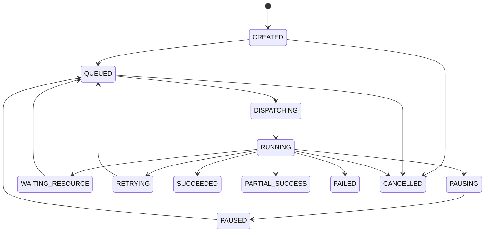

取消不保证立刻终止外部进程；Activity 必须轮询取消并安全清理。

## 13. Replica 状态机

```text
PLANNED
COPYING
UPLOADED_UNVERIFIED
VERIFYING
VERIFIED
DEGRADED
UNAVAILABLE
CORRUPTED
REPAIRING
DELETING
DELETED
```

只有 `VERIFIED` 可计入正式恢复副本数量。

## 14. Policy 执行

执行前加载已发布不可变 `PolicyVersion`。结果记录：

```text
policyVersionId
inputSummary
matchedRules
decision
explanation
executionTime
traceId
```

历史任务重放时使用原版本，除非明确选择最新策略。

## 15. 插件 API

### Health

```http
GET /health
GET /ready
```

### Capabilities

```http
GET /api/v1/capabilities
```

### Connector

```http
POST /api/v1/probe
POST /api/v1/list
POST /api/v1/stat
POST /api/v1/read-url
POST /api/v1/changes
```

大文件不通过 JSON Base64 传输。

## 16. Worker 注册

```http
POST /api/v1/workers/register
POST /api/v1/workers/heartbeat
```

上报：

- hardware；
- GPU；
- codecs；
- models；
- disk；
- budget；
- classification；
- working hours；
- software versions。

控制面返回短期令牌和允许能力。

## 17. 配置发布

```text
Draft
→ Schema Validate
→ Semantic Validate
→ Simulation
→ Approval
→ Git Commit/PR
→ Deploy
→ Health Check
→ Observe
→ Confirm
```

配置中心保存业务状态，Git 保存期望部署状态。Secrets 仅引用。

## 18. 锁和并发

- 使用数据库唯一约束保证幂等；
- 使用 `SELECT ... FOR UPDATE` 保护关键聚合；
- Redis 用于性能和短期协调；
- Worker 任务使用 Lease；
- Lease 超时可重新调度；
- 发布动作使用乐观锁；
- 避免长事务持有文件 IO。

## 19. 一致性对账

周期任务：

- SourceObject 与来源；
- CacheEntry 与文件；
- Replica 与对象；
- Task 与 Temporal；
- Outbox；
- OpenSearch；
- Milvus；
- Backup；
- Secrets 引用。

对账只标记和修复可证明安全的问题，不自动删除未知对象。

## 20. 错误处理

每个错误定义：

- code；
- HTTP；
- retryable；
- userAction；
- adminAction；
- alert；
- i18n；
- cause exposure。

内部异常不直接返回堆栈。

## 21. 性能考虑

- 目录分页；
- 游标；
- 批量 Upsert；
- 延迟完整哈希；
- 分层索引；
- PostgreSQL 查询计划；
- 连接器并发；
- ATS；
- 任务资源队列；
- 大对象零拷贝/流式；
- 避免把正文写入数据库。

## 22. 迁移策略

V1 早期仍按生产迁移规范：

- 不修改已执行脚本；
- 每次变更新版本；
- Expand/Contract；
- 索引并发构建评估；
- 大表迁移分批；
- 回填使用任务；
- 迁移前备份；
- 验证行数、约束、样本和性能。


---


# 22. 仓库与目录规划 / Repository and Directory Plan

## 1. GitHub 组织

建议：

```text
guize-platform          核心 Monorepo
guize-media-worker      媒体能力
guize-ai-services       AI 能力集合或模板
guize-model-deployments 大模型部署定义
guize-infrastructure    可选的跨仓库基础设施
guize-docs              如需公开开发者文档
```

初期应尽量减少仓库数量。只有大型依赖、独立发布和硬件边界明确时分仓。

## 2. Monorepo

```text
guize-platform/
├── AGENTS.md
├── README.md
├── backend/
├── frontend/
├── player/
├── plugins/
│   ├── sdk/
│   ├── source-webdav/
│   ├── source-local/
│   └── compatibility-alist-openlist/
├── guizectl/
├── contracts/
│   ├── openapi/
│   ├── events/
│   ├── plugins/
│   └── deployment/
├── deployment/
│   ├── compose/
│   ├── ansible/
│   ├── profiles/
│   └── offline/
├── docs/
├── specs/
├── adr/
├── rules/
├── tests/
│   ├── contract/
│   ├── integration/
│   ├── e2e/
│   ├── performance/
│   ├── security/
│   └── golden/
├── evidence/
└── .github/
```

## 3. 分支

- `main`：可发布；
- 短生命周期任务分支；
- 不建立长期 develop 分支作为集成垃圾场；
- 发布使用 Tag 和不可变制品；
- Hotfix 仍从已发布基线建立。

## 4. Issue

Issue 必须包含：

```text
背景
目标
非目标
规格链接
契约链接
验收标准
风险
测试
证据
回滚
```

## 5. PR

PR 模板要求：

- 关联 Issue；
- 变更类型；
- 范围；
- 契约；
- 迁移；
- 权限；
- 安全；
- 测试；
- 证据；
- 回滚；
- 文档；
- Never Rules。

## 6. Specs

```text
specs/requirements/GUIZE-xxx.md
specs/designs/GUIZE-xxx.md
specs/contracts/GUIZE-xxx/
specs/tasks/GUIZE-xxx.md
```

规格状态：

```text
DRAFT
REVIEWED
APPROVED
IMPLEMENTED
VERIFIED
SUPERSEDED
```

## 7. ADR

格式：

```text
Context
Decision
Alternatives
Consequences
Security
Migration
Validation
Status
```

关键技术、数据所有权、外部协议和生产假设必须 ADR。

## 8. Evidence

证据不应无限提交大文件到 Git。小型结果直接保存，大型产物保存外部位置并在 `summary.md` 记录哈希和引用。

## 9. 版本

- 平台语义化版本；
- API 主版本；
- Event 版本；
- Plugin API 版本；
- Deployment Profile 版本；
- Model/Prompt/Pipeline 独立版本；
- 数据库 Flyway 版本。

## 10. CI 模板

统一：

- Java；
- Python；
- Go；
- Frontend；
- Container；
- Contract；
- Security；
- Release。

独立仓库必须复用可版本化 Workflow，不能复制后长期漂移。

## 11. 代码所有权

即使只有一名人工审查者，也建议 CODEOWNERS 按领域定义，便于未来扩展：

```text
/backend/ @guize/core
/plugins/ @guize/connectors
/deployment/ @guize/ops
/contracts/ @guize/architecture
```

## 12. 文档同步

行为变化对应：

| 变化 | 必须更新 |
|---|---|
| API | OpenAPI、示例、SDK、契约测试 |
| Event | Schema、消费者测试 |
| DB | Flyway、数据模型、恢复 |
| Policy | DSL、测试、说明 |
| Plugin | Manifest、兼容矩阵 |
| Deployment | Profile、Bundle、Runbook |
| Security | 威胁模型、测试、审计 |


---


# 23. 官方资料核验 / Official Source References

核验日期：2026-07-21。以下资料用于确认方案中主要组件的能力边界。具体生产版本必须在实施时重新核验、固定并通过兼容测试。

## Spring

- Spring Boot System Requirements  
  https://docs.spring.io/spring-boot/system-requirements.html
- Spring Framework Reference  
  https://docs.spring.io/spring-framework/reference/index.html

说明：当前官方 Spring Boot 文档仍以 Java 17 作为最低 Java 基线之一。归泽冻结 Java 17 + Spring Boot 3，但具体 3.x 版本需在实施阶段按支持周期选择。

## Temporal

- Self-hosted guide  
  https://docs.temporal.io/self-hosted-guide
- Deployment guidance  
  https://docs.temporal.io/self-hosted-guide/deployment
- Persistence  
  https://docs.temporal.io/temporal-service/persistence
- Visibility  
  https://docs.temporal.io/visibility
- Server upgrade  
  https://docs.temporal.io/self-hosted-guide/upgrade-server
- Archival  
  https://docs.temporal.io/self-hosted-guide/archival

说明：

- 自托管 Temporal 是关键控制与持久化组件，不应暴露公网；
- PostgreSQL 可作为持久化和 Visibility 的选项，实际版本需匹配 Temporal；
- Server 与数据库 Schema 升级必须按官方顺序执行；
- 本地开发可使用开发服务器，但生产不得使用嵌入式/开发模式替代正式部署。

## LiteFlow

- 官方站点  
  https://liteflow.cc/

说明：LiteFlow 官方定位为组件式规则引擎。归泽只用于同步决策和轻量编排，不用于 FFmpeg、ASR、备份等长时间任务。

## Apache Traffic Server

- Cache Range Requests  
  https://docs.trafficserver.apache.org/en/latest/admin-guide/plugins/cache_range_requests.en.html
- Slice Plugin  
  https://docs.trafficserver.apache.org/en/latest/admin-guide/plugins/slice.en.html
- Cache Storage  
  https://docs.trafficserver.apache.org/en/latest/admin-guide/storage/index.en.html
- Plugins  
  https://docs.trafficserver.apache.org/admin-guide/plugins/index.en.html

说明：ATS 提供 HTTP 缓存、Range 缓存和 Slice 插件能力。归泽仍需通过 POC 验证大文件、权限缓存键、源版本变化和磁盘行为。

## OpenSearch

- Hybrid Search  
  https://docs.opensearch.org/latest/vector-search/ai-search/hybrid-search/index/
- Vector Search  
  https://docs.opensearch.org/latest/vector-search/
- Concepts  
  https://docs.opensearch.org/latest/vector-search/getting-started/concepts/

说明：OpenSearch 支持关键词、向量及混合搜索。归泽仍将 PostgreSQL 作为权威数据源，OpenSearch 索引可重建。

## Milvus

- Overview  
  https://milvus.io/docs/overview.md
- Hybrid Search  
  https://milvus.io/docs/hybrid_search_with_milvus.md
- Reranking  
  https://milvus.io/docs/reranking.md

说明：Milvus 支持密集、稀疏、多向量和混合搜索及重排。归泽主要用其保存文本、图像和多模态向量。

## OpenBao

- What is OpenBao  
  https://openbao.org/docs/what-is-openbao/
- Secrets Engines  
  https://openbao.org/docs/secrets/
- KV v2  
  https://openbao.org/docs/secrets/kv/kv-v2/

说明：OpenBao 提供身份驱动的 Secrets 和加密管理。归泽通过抽象接口接入 OpenBao/Vault，业务数据库只保存引用。

## Shaka Player

- API Documentation  
  https://shaka-player-demo.appspot.com/docs/api/
- Manifest Parser  
  https://shaka-player-demo.appspot.com/docs/api/shaka.extern.ManifestParser.html

说明：官方 API 包含 DASH 和 HLS 解析器。归泽播放器仍需通过 Vue/React POC 和浏览器兼容测试决定最终封装。

## Sigstore / Cosign

- Signing Containers  
  https://docs.sigstore.dev/cosign/signing/signing_with_containers/
- Verifying Signatures  
  https://docs.sigstore.dev/cosign/verifying/verify/
- CI Quickstart  
  https://docs.sigstore.dev/quickstart/quickstart-ci/
- SBOM Signing  
  https://docs.sigstore.dev/cosign/signing/other_types/

说明：Cosign 可签名并验证容器和其他制品。归泽将镜像 Digest、签名、SBOM 和部署验签作为生产门禁。

## Prometheus / Alertmanager

- Prometheus Overview  
  https://prometheus.io/docs/introduction/overview/
- Alertmanager  
  https://prometheus.io/docs/alerting/latest/alertmanager/
- Alerting Overview  
  https://prometheus.io/docs/alerting/latest/overview/
- Alerting Practices  
  https://prometheus.io/docs/practices/alerting/

说明：Alertmanager 提供聚合、路由、静默和抑制。归泽使用多渠道告警并要求每个高等级告警有可操作 Runbook。

## 华为云 SWR

华为云官方文档入口需在账号区域和部署区域确定后重新核验。实施阶段必须验证：

- 私有仓库；
- OCI Digest；
- 漏洞扫描能力；
- Cosign/OCI Artifact 兼容；
- 跨区域恢复；
- 权限和审计；
- 离线导出。

本方案不把仓库提供方的权限等同于制品完整性，仍强制 Digest 和签名校验。
